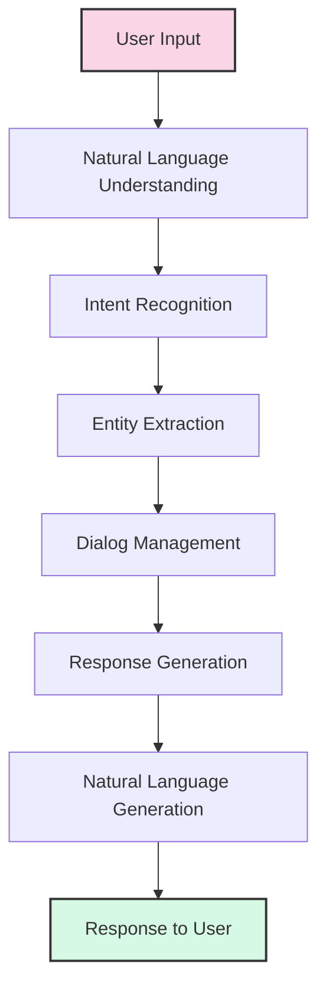
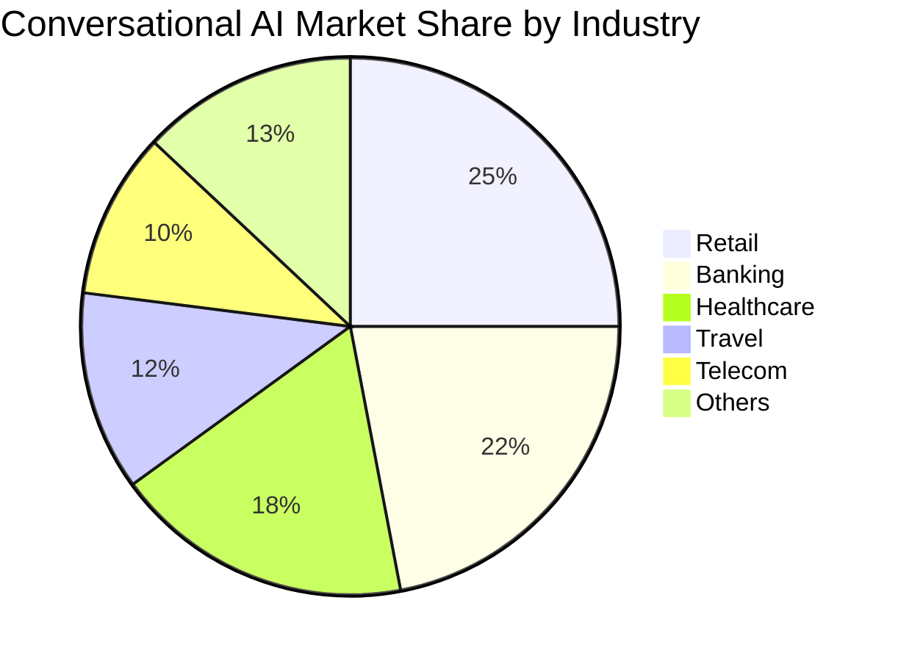

# Introduction to Conversational AI

Welcome to the first lesson of the AI Bot Builder course! In this lesson, we'll explore what conversational AI is, how it works, and why it's becoming a crucial technology for businesses and organizations.

## What is Conversational AI?

Conversational AI refers to technologies that enable computers to understand, process, and respond to voice or text inputs in natural ways, simulating human conversation. Unlike traditional interfaces where users have to adapt to computers, conversational AI allows computers to adapt to human communication methods.

## Key Components of Conversational AI

### 1. Natural Language Understanding (NLU)
NLU is the ability of a machine to understand human language as it is spoken or written. This involves:
- Interpreting the user's input
- Determining the user's intent
- Identifying key information (entities) in the input

### 2. Dialog Management
This component maintains the state of the conversation and determines what should happen next based on:
- The current context
- The user's input
- The system's goals

### 3. Natural Language Generation (NLG)
NLG is responsible for formulating a response that:
- Answers the user's query
- Sounds natural and human-like
- Maintains consistency with previous responses

## Types of Conversational AI

| Type | Description | Use Cases |
|------|-------------|-----------|
| Rule-based Chatbots | Follow predefined paths based on keywords | FAQs, Simple Customer Service |
| AI-powered Chatbots | Use machine learning to understand intent | Customer Support, Sales |
| Virtual Assistants | More advanced AI with broader capabilities | Siri, Alexa, Google Assistant |
| Voice Bots | Specifically designed for voice interaction | Call Centers, IVR Systems |

## Business Applications of Conversational AI

Conversational AI is transforming how businesses interact with their customers:

1. **Customer Service**: 24/7 support, faster response times, consistent answers
2. **Sales & Marketing**: Lead qualification, product recommendations, engagement
3. **HR & Internal Support**: Employee onboarding, IT helpdesk, benefits inquiries
4. **Healthcare**: Patient screening, appointment scheduling, medication reminders
5. **Banking & Finance**: Account inquiries, transaction history, fraud alerts

## Conversational AI Market Growth

The market for conversational AI solutions is growing rapidly:

## Benefits of Implementing Conversational AI

- **Cost Reduction**: Automating repetitive tasks and reducing support costs
- **Scalability**: Handling thousands of conversations simultaneously
- **Consistency**: Delivering uniform information across all interactions
- **Data Collection**: Gathering valuable insights from customer interactions
- **Personalization**: Tailoring experiences based on user preferences and history

## Challenges in Conversational AI

Despite its benefits, conversational AI faces several challenges:

- **Understanding Context**: Maintaining context over long conversations
- **Handling Ambiguity**: Interpreting vague or unclear requests
- **Language Nuances**: Understanding slang, idioms, and cultural references
- **Privacy Concerns**: Managing sensitive user information appropriately
- **User Acceptance**: Overcoming resistance to AI-driven interactions

## Conclusion

Conversational AI represents a fundamental shift in how humans interact with technology. As businesses strive to provide better customer experiences while controlling costs, conversational AI offers a compelling solution. Throughout this course, you'll learn how to design, build, and optimize conversational AI systems that deliver real value to users and organizations.

## Exercise

Before our next lesson, take some time to identify three examples of conversational AI that you've interacted with recently. For each example:

1. What was the use case?
2. How natural did the conversation feel?
3. What aspects of the interaction could be improved?

*Last updated: May 2024* 