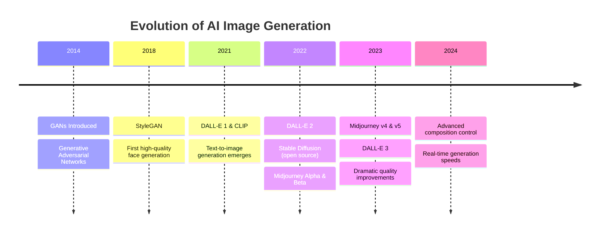
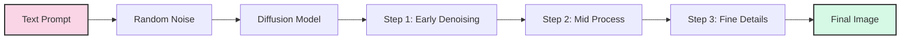
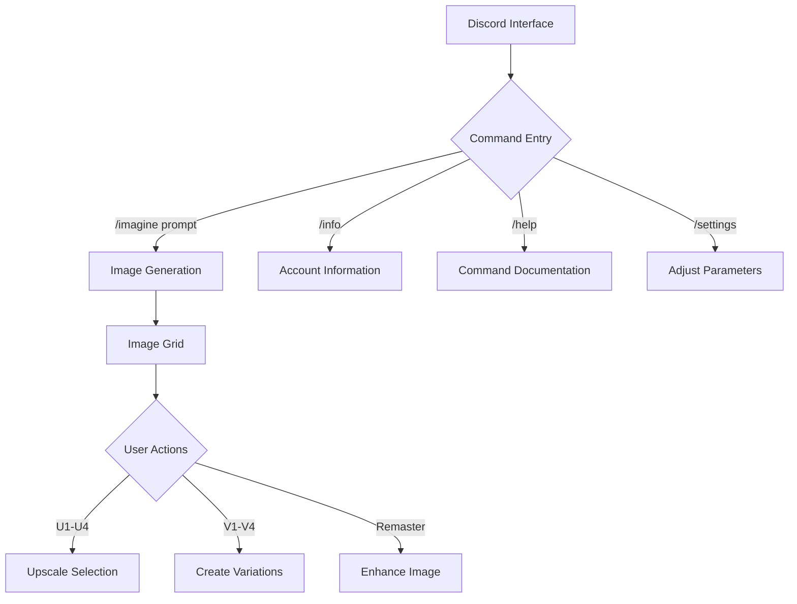

# Introduction to AI Image Generation

Welcome to the first lesson of our Midjourney Image Generation Mastery course! Today, we'll explore the fascinating world of AI image generation, understanding the core technologies, major platforms, and the revolution these tools are bringing to visual creativity.

## The AI Image Revolution

Artificial Intelligence has transformed how we create visual content. In just a few years, we've moved from basic style transfers to photorealistic image generation from text descriptions. This revolution is democratizing visual creation, allowing anyone with an idea to generate stunning imagery without traditional artistic training.



## Understanding Diffusion Models

Most modern AI image generators, including Midjourney, use a technology called "diffusion models." To understand how they work:

1. **Training Phase**: The AI learns by studying millions of images and their text descriptions
2. **Noise Addition**: The model learns to gradually add random noise to images until they become pure static
3. **Denoising Process**: When generating, it starts with random noise and gradually removes it based on your text prompt
4. **Guidance**: Your prompt "guides" how the noise is removed to create the image you described



## Major AI Image Generation Platforms

Several platforms offer AI image generation capabilities, each with distinct approaches and strengths:

| Platform | Access | Notable Features | Best For |
|----------|--------|-----------------|----------|
| Midjourney | Discord, API | Artistic quality, strong aesthetics | Creative projects, concept art |
| DALL-E 3 | OpenAI, Bing | Accurate prompt following, text rendering | Commercial work, precise requirements |
| Stable Diffusion | Open source | Customization, local running, NSFW options | Technical users, specific styles |
| Firefly | Adobe Creative Cloud | Clean commercial rights, Photoshop integration | Professional designers |
| Imagen | Google | Photorealism, text accuracy | Research, commercial work |

## Why Midjourney Stands Out

Midjourney has become one of the leading platforms for several reasons:

1. **Aesthetic Quality**: Consistently produces visually pleasing results with strong artistic sensibility
2. **Community Focus**: Built around Discord communities, fostering learning and sharing
3. **Rapid Iteration**: Frequent updates and quality improvements
4. **Accessible Interface**: Simple enough for beginners, yet powerful for experts
5. **Commercial Usage**: Clear terms for commercial applications

## The Midjourney Interface

Unlike most AI tools, Midjourney operates primarily through Discord:



## Understanding Resolution and Aspect Ratio

One of the first technical concepts to understand in Midjourney is how image dimensions work:

- **Default**: Square 1:1 ratio (1024×1024 pixels)
- **Custom Ratios**: Specified with `--ar width:height` (e.g., `--ar 16:9`)
- **Maximum Dimensions**: Depend on your subscription level
- **Upscaling**: Increases detail and resolution after initial generation

| Common Aspect Ratios | Use Cases | Example Parameter |
|----------------------|-----------|------------------|
| 1:1 (Square) | Instagram, profile pictures | (default) |
| 16:9 | YouTube thumbnails, presentations | `--ar 16:9` |
| 9:16 | Social media stories, mobile | `--ar 9:16` |
| 3:2 | Traditional photography | `--ar 3:2` |
| 2:3 | Book covers, posters | `--ar 2:3` |

## The Ethical Landscape

AI image generation raises important ethical considerations:

- **Copyright Questions**: AI models trained on copyrighted works
- **Artist Livelihoods**: Impact on traditional artists and designers
- **Misinformation Potential**: Creating fake but convincing imagery
- **Bias Issues**: Reflecting or amplifying social biases

Responsible use involves:
- Respecting attribution when appropriate
- Being transparent about AI-generated content
- Avoiding harmful or deceptive applications
- Understanding the limitations of the technology

## Your First Midjourney Image

Let's break down the basic process for creating your first image:

1. **Access Discord**: Join the Midjourney server or a server with the bot
2. **Find Bot Channels**: Look for channels where the bot is active
3. **Enter Command**: Type `/imagine prompt: [your description]`
4. **Wait for Generation**: The bot will create an initial grid of options
5. **Choose Version**: Select U1-U4 to upscale one of the options
6. **Save Image**: Right-click and save or use the download button

## Prompt Basics

Your prompt is the most important factor in getting great results. Good prompts typically include:

- **Subject**: What you want to see
- **Medium**: Painting, photograph, 3D render, etc.
- **Style**: Artistic influence or aesthetic
- **Lighting**: How the scene is illuminated
- **Composition**: How elements are arranged
- **Color Palette**: Dominant colors or mood

## Example Prompts

Here are a few example prompts to get you started:

```
/imagine prompt: A serene lake at sunset, mountains in the background, watercolor painting, soft pastel colors, mist rising from the water

/imagine prompt: Cyberpunk street market, neon lights, rain, detailed, cinematic lighting, 4K, ultra-detailed

/imagine prompt: Professional portrait of a female entrepreneur, home office background, soft natural lighting, shallow depth of field, professional photography
```

## Conclusion

AI image generation is transforming visual creativity, and Midjourney stands at the forefront of this revolution. Throughout this course, you'll learn to master Midjourney's capabilities, creating stunning visuals for personal and professional projects. In our next lesson, we'll dive into creating your first Midjourney images and understanding the essential commands.

## Exercise

Before our next lesson:
1. Join the Midjourney Discord (if you haven't already)
2. Generate 3-5 images with different basic prompts
3. Note which results you like best and why
4. Try modifying one prompt several times to see how small changes affect the output

*Last updated: May 2024* 