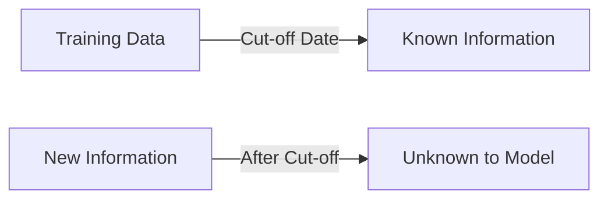

# Understanding ChatGPT: Capabilities and Limitations

## What ChatGPT Can Do

ChatGPT has an impressive range of capabilities that make it valuable for many applications:

### Content Creation
- Write articles, blog posts, and marketing copy
- Generate creative content like stories and poems
- Create outlines and drafts for various content types
- Rewrite and refine existing text

### Information and Assistance
- Answer questions on a wide range of topics
- Explain complex concepts in simple terms
- Provide step-by-step instructions
- Offer recommendations and suggestions

### Language Processing
- Translate between languages
- Summarize long text
- Extract key information from documents
- Edit and proofread content

### Problem Solving
- Debug and write code
- Develop logical arguments
- Analyze scenarios and offer solutions
- Generate ideas and brainstorm options

## Limitations of ChatGPT

Despite its impressive capabilities, ChatGPT has several important limitations to be aware of:

### Knowledge Cutoff
ChatGPT's knowledge has a cutoff date, meaning it doesn't know about events or developments after its last training data. For current information, you'll need other sources.

### Factual Accuracy
While often correct, ChatGPT can sometimes provide inaccurate information or "hallucinate" facts that sound plausible but are incorrect. Always verify important information.

> **Warning**: Never use ChatGPT as the sole source for critical information without verification.

### Contextual Understanding
Though quite good at maintaining context, ChatGPT may sometimes misinterpret complex queries or lose track in very long conversations.

### Reasoning Limitations
ChatGPT can struggle with complex logical reasoning, advanced mathematics, and tasks requiring deep critical thinking.

### Bias
Like any AI trained on human-generated content, ChatGPT can reflect biases present in its training data, though efforts have been made to minimize this.

## When to Use ChatGPT

| Task | Effectiveness | Verification Needed |
|------|---------------|---------------------|
| Creative writing | Excellent | Low |
| Factual research | Good | High |
| Code generation | Very good | Medium |
| Mathematical calculations | Limited | High |
| Logical reasoning | Good for simple cases | Medium |
| Current events | Poor (due to cutoff) | Very high |

## Best Practices for Working with ChatGPT

1. **Be specific in your requests** - Clear instructions yield better results
2. **Verify factual information** - Cross-check important facts from reliable sources
3. **Iterate on responses** - Refine prompts based on initial outputs
4. **Provide context** - More background information leads to more relevant responses
5. **Set expectations appropriately** - Understand the tool's strengths and limitations

Understanding these limitations is crucial for using ChatGPT effectively in business contexts. 