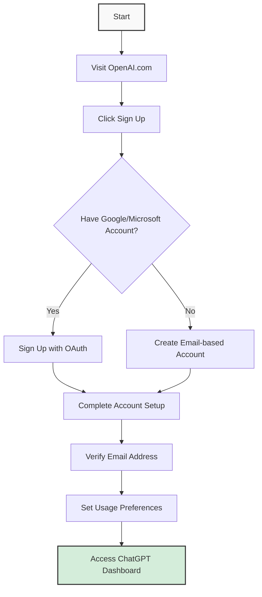
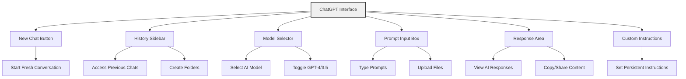
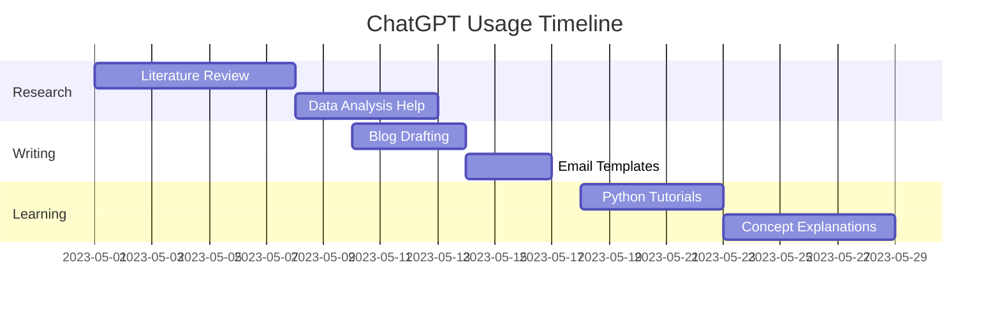

# ChatGPT Workspace Setup Guide

## Creating Your Optimal ChatGPT Environment

<div class="learning-objectives">
  <h3>In this lesson you will learn:</h3>
  <ul>
    <li>How to create and set up your ChatGPT account</li>
    <li>The key differences between free and paid tiers</li>
    <li>Workspace optimization techniques for productive sessions</li>
    <li>Best practices for organizing your conversations</li>
    <li>Security considerations for your ChatGPT account</li>
  </ul>
</div>

## Getting Started with ChatGPT



### Creating Your ChatGPT Account

1. Navigate to [OpenAI's ChatGPT website](https://chat.openai.com/)
2. Click on "Sign up" to create a new account
3. Choose between email registration or OAuth (Google/Microsoft)
4. Complete the verification process
5. Accept the terms of service and privacy policy
6. Set your initial preferences

<div class="tip-box">
  <h3>💡 Pro Tip</h3>
  <p>Use a secure, unique password for your ChatGPT account, especially if you plan to use it for professional purposes or to handle sensitive information.</p>
</div>

## Free Tier vs. ChatGPT Plus: Making the Right Choice

### Comparison Table

| Feature | Free Tier | ChatGPT Plus |
|---------|-----------|--------------|
| Cost | $0 | $20/month |
| Access during high demand | Limited | Priority access |
| Response speed | Standard | Faster responses |
| Model access | Limited to older models | GPT-4o and other advanced models |
| Usage limits | Rate limited | Higher usage cap |
| New feature availability | Delayed | Early access |
| API access | Not included | Not included (separate) |

### What's Best for You?

The decision depends on your specific needs:

- **Choose Free Tier if you are:**
  - A casual user with occasional needs
  - A student learning the basics
  - Using ChatGPT for non-time-sensitive tasks
  - On a limited budget

- **Choose ChatGPT Plus if you are:**
  - A professional using ChatGPT daily
  - Working with complex tasks requiring GPT-4o
  - Frequently hitting usage limits
  - Needing faster responses for workflow efficiency

## Understanding the ChatGPT Interface



## Optimizing Your Workspace

### Browser Setup

1. **Bookmark ChatGPT** for quick access
2. **Create a dedicated browser profile** to separate work/personal use
3. **Install helpful extensions:**
   - Text Blaze or similar for prompt templates
   - Clipboard extensions for easier copy/paste
   - Dark mode extensions for reduced eye strain

### Custom Instructions

Set up your custom instructions for consistent interactions:

```
As a user with expertise in [YOUR FIELD], please:
1. Format responses with markdown for readability
2. Keep explanations concise unless I ask for details
3. Include code examples when relevant
4. Suggest follow-up questions after your responses
5. Always note limitations or uncertainties in your answers
```

### API Usage (For Developers)

If you plan to build with the API, here's a simple Python example to get started:

```python
import openai

# Set your API key
openai.api_key = "your-api-key"

# Create a simple chat completion
response = openai.ChatCompletion.create(
    model="gpt-4o",
    messages=[
        {"role": "system", "content": "You are a helpful assistant."},
        {"role": "user", "content": "Explain the benefits of AI in healthcare briefly."}
    ]
)

print(response.choices[0].message.content)
```

<div class="callout warning">
  <h3>⚠️ Security Note</h3>
  <p>Never share your API key publicly or commit it to version control. Use environment variables or secure vaults instead.</p>
</div>

## Keyboard Shortcuts for Power Users

| Shortcut | Function |
|----------|----------|
| `Ctrl/Cmd + /` | View all shortcuts |
| `Ctrl/Cmd + Shift + N` | New conversation |
| `Ctrl/Cmd + Shift + P` | Switch model (GPT-4/3.5) |
| `Ctrl/Cmd + Up Arrow` | Navigate to previous prompt |
| `Ctrl/Cmd + Down Arrow` | Navigate to next prompt |
| `Alt + Up/Down` | Navigate conversation history |
| `Shift + Enter` | Add a line break in prompt |
| `Ctrl/Cmd + K` | Search across your conversations |

## Organizing Your Conversations



### Conversation Management

1. **Create folders** organized by:
   - Project name
   - Topic area
   - Time period
   - Importance/priority

2. **Name your conversations** descriptively:
   - "Marketing Campaign Brainstorm - May 2024"
   - "Python Debugging - Authentication Module"
   - "Research Summary - Climate Technology"

3. **Develop a prompt template library** for recurring tasks:
   - Summarization templates
   - Code review templates
   - Creative writing templates

## Advanced GPT-4 Features

<div class="feature-cards">
  <div class="card">
    <h3>DALL-E Integration</h3>
    <p>Generate images based on your descriptions directly within the chat interface.</p>
    <p><strong>Try it with:</strong> "Generate an image of a modern workspace with a computer showing ChatGPT"</p>
  </div>
  
  <div class="card">
    <h3>Web Browsing</h3>
    <p>Allow ChatGPT to search the web for current information (Plus subscription).</p>
    <p><strong>Enable in:</strong> Settings → Beta features → Web browsing</p>
  </div>
  
  <div class="card">
    <h3>File Upload & Analysis</h3>
    <p>Upload documents for ChatGPT to analyze or reference.</p>
    <p><strong>Supported formats:</strong> PDF, DOCX, CSV, TXT, and more</p>
  </div>
</div>

## Security Best Practices

1. **Enable Two-Factor Authentication (2FA)**
2. **Regularly review your conversation history**
3. **Be mindful of sensitive information shared in prompts**
4. **Use the "Delete Conversation" feature for sensitive discussions**
5. **Log out when using shared devices**
6. **Check privacy settings regularly for updates**

## Additional Resources

- [OpenAI Documentation](https://platform.openai.com/docs)
- [OpenAI Cookbook](https://cookbook.openai.com/)
- [ChatGPT Prompt Engineering Guide](https://platform.openai.com/docs/guides/prompt-engineering)
- [OpenAI Community Forum](https://community.openai.com/)

## Next Steps

Now that you've set up your ChatGPT workspace, you're ready to explore advanced prompting techniques in our next lesson!

---

*Last updated: May 2024* 