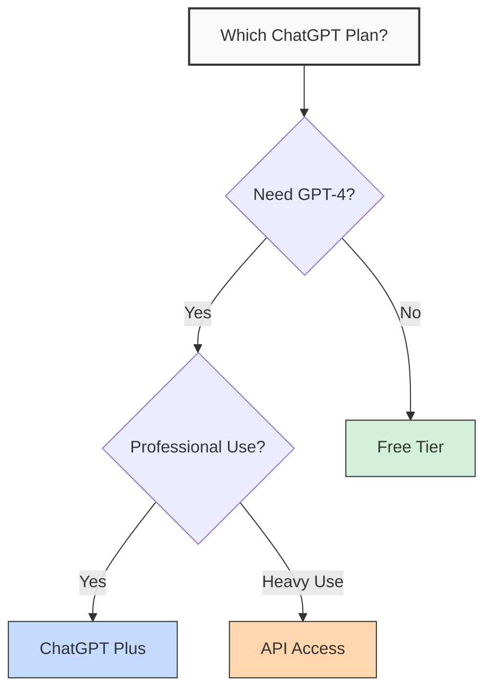
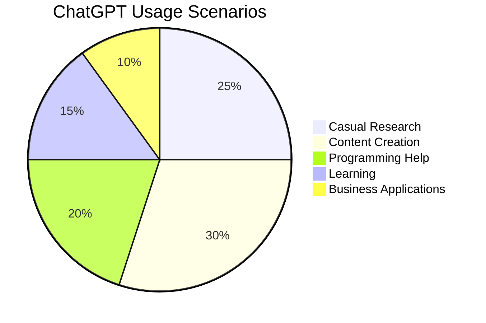
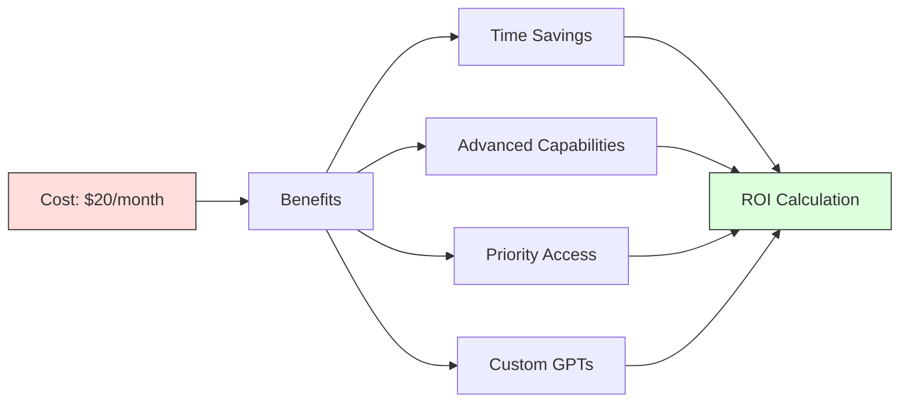
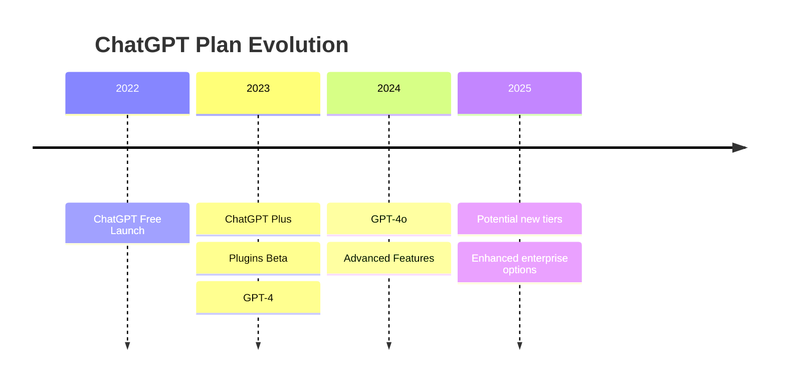

# Free vs Paid: Which Plan Is Right For You?

## Comparing ChatGPT Plans



## Plan Feature Comparison

| Feature | Free | ChatGPT Plus | Teams | Enterprise |
|---------|------|--------------|-------|------------|
| Price | $0 | $20/month | $30/user/month | Custom |
| Base Model | GPT-3.5 | GPT-4o | GPT-4o | GPT-4o |
| Advanced Models | ❌ | ✅ | ✅ | ✅ |
| Usage Limits | Strict | Higher | Team Pooled | Custom |
| Plugins/Tools | Limited | ✅ | ✅ | ✅ |
| Priority Access | ❌ | ✅ | ✅ | ✅ |
| Custom GPTs | ❌ | ✅ | ✅ | ✅ |
| Team Admin | ❌ | ❌ | ✅ | ✅ |
| Data Privacy | Standard | Standard | Enhanced | Maximum |
| SLA | ❌ | ❌ | ❌ | ✅ |

## Value Analysis

<div class="callout info">
  <h3>Value Calculation</h3>
  <p>To determine if ChatGPT Plus is worth it for you, calculate:</p>
  <ul>
    <li>Time saved per month × Your hourly rate</li>
    <li>Additional capabilities value</li>
    <li>Compare total to the $20 monthly subscription</li>
  </ul>
</div>

## Usage Patterns



## Decision Framework

### When to Choose Free Tier
- Occasional, non-urgent usage
- Basic research and assistance needs
- Budget constraints
- GPT-3.5 capabilities sufficient for your tasks

### When to Upgrade to ChatGPT Plus
- Daily professional use
- Need for GPT-4's advanced capabilities
- Work requiring plugins and tools
- Custom GPT creation needs
- Priority access during high-traffic periods

## Cost-Benefit Analysis



## Productivity Gains by Tier

| Task Type | Free Tier | ChatGPT Plus | Improvement |
|-----------|-----------|--------------|-------------|
| Complex Research | 30 min | 15 min | 50% faster |
| Code Assistance | Basic help | Advanced debugging | Significant |
| Content Creation | Good | Excellent | 30-40% better |
| Data Analysis | Limited | Advanced | Major upgrade |
| Learning | Effective | More comprehensive | 25% better |

## Enterprise Features

<div style="display: grid; grid-template-columns: repeat(3, 1fr); gap: 15px; margin: 20px 0;">
    <div style="border: 1px solid #ddd; border-radius: 8px; padding: 15px; background-color: #f8f9fa;">
        <h4 style="color: #0066cc;">Admin Controls</h4>
        <p>Centralized user management and permissions</p>
    </div>
    <div style="border: 1px solid #ddd; border-radius: 8px; padding: 15px; background-color: #f8f9fa;">
        <h4 style="color: #0066cc;">SSO Integration</h4>
        <p>Secure authentication with existing systems</p>
    </div>
    <div style="border: 1px solid #ddd; border-radius: 8px; padding: 15px; background-color: #f8f9fa;">
        <h4 style="color: #0066cc;">Usage Analytics</h4>
        <p>Track and optimize team usage patterns</p>
    </div>
    <div style="border: 1px solid #ddd; border-radius: 8px; padding: 15px; background-color: #f8f9fa;">
        <h4 style="color: #0066cc;">Data Privacy</h4>
        <p>Enhanced control over data retention</p>
    </div>
    <div style="border: 1px solid #ddd; border-radius: 8px; padding: 15px; background-color: #f8f9fa;">
        <h4 style="color: #0066cc;">Domain Verification</h4>
        <p>Restrict access to verified email domains</p>
    </div>
    <div style="border: 1px solid #ddd; border-radius: 8px; padding: 15px; background-color: #f8f9fa;">
        <h4 style="color: #0066cc;">Priority Support</h4>
        <p>Dedicated support channels</p>
    </div>
</div>

## API Usage Considerations

```python
# Cost comparison example for API vs Plus subscription
import matplotlib.pyplot as plt
import numpy as np

# Usage levels
usage = np.array([100, 500, 1000, 2000, 5000])  # in tokens per day
api_cost = usage * 30 * 0.00002  # $0.02 per 1K tokens, 30 days
plus_cost = np.ones_like(usage) * 20  # $20 flat fee

plt.figure(figsize=(10, 6))
plt.plot(usage, api_cost, label='API Cost')
plt.plot(usage, plus_cost, label='ChatGPT Plus')
plt.xlabel('Daily Token Usage')
plt.ylabel('Monthly Cost ($)')
plt.title('API vs ChatGPT Plus Cost Comparison')
plt.legend()
plt.grid(True)
plt.savefig('cost_comparison.png')
```

## Real User Testimonials

> "As a developer, upgrading to ChatGPT Plus has saved me at least 5 hours per week in debugging and research time. The ROI is obvious for me." — **Sarah T., Software Engineer**

> "I stayed with the free tier for 3 months before upgrading. For occasional use, free is perfect, but once I started using it for content creation, Plus became essential." — **Mark R., Content Creator**

> "Our team switched to Enterprise for the admin controls and data privacy features. The collaboration tools have transformed our workflow." — **Jennifer K., Project Manager**

## Decision Checklist

- [ ] Do you use ChatGPT daily?
- [ ] Is speed of response important to you?
- [ ] Do you need access to GPT-4 capabilities?
- [ ] Would plugins enhance your workflow?
- [ ] Do you create custom GPTs?
- [ ] Is your usage professional/revenue-generating?
- [ ] Does your budget allow for a subscription?

*If you checked 3 or more boxes, ChatGPT Plus likely offers good value for you.*

## Subscription Management

### How to Subscribe
1. Log in to your ChatGPT account
2. Click on your profile icon
3. Select "Settings"
4. Choose "Upgrade to Plus"
5. Enter payment details
6. Confirm subscription

### How to Cancel
1. Log in to your ChatGPT account
2. Click on your profile icon
3. Select "Settings"
4. Choose "Manage my subscription"
5. Select "Cancel subscription"

## Future Considerations



---

*Information current as of May 2024. Pricing and features subject to change.* 