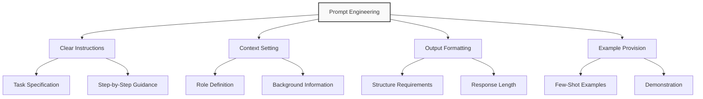
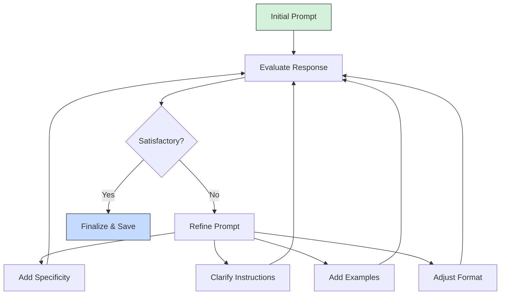

# Advanced Prompting Techniques for ChatGPT

## The Art of Effective Prompting

<div class="tabset">
  <input type="radio" name="tabset" id="tab1" checked>
  <label for="tab1">Basics</label>
  <input type="radio" name="tabset" id="tab2">
  <label for="tab2">Intermediate</label>
  <input type="radio" name="tabset" id="tab3">
  <label for="tab3">Advanced</label>
  
  <div class="tab-panels">
    <section id="basics-panel" class="tab-panel">
      <h3>Prompt Structure Fundamentals</h3>
      <p>Effective prompts generally follow this structure:</p>
      <ol>
        <li><strong>Context</strong>: Background information and setting</li>
        <li><strong>Instruction</strong>: Clear, specific request</li>
        <li><strong>Examples</strong>: Demonstrations of desired output</li>
        <li><strong>Format</strong>: Requested output structure</li>
      </ol>
    </section>
    
    <section id="intermediate-panel" class="tab-panel">
      <h3>Context Optimization</h3>
      <p>Intermediate prompting leverages:</p>
      <ul>
        <li>Role assignment ("Act as a...")</li>
        <li>Chain-of-thought reasoning</li>
        <li>Temperature adjustment for creativity vs precision</li>
        <li>Few-shot learning with examples</li>
      </ul>
    </section>
    
    <section id="advanced-panel" class="tab-panel">
      <h3>Cognitive Enhancement</h3>
      <p>Advanced prompting includes:</p>
      <ul>
        <li>System-level instructions</li>
        <li>Multi-step reasoning frameworks</li>
        <li>Self-evaluation loops</li>
        <li>Mental model simulation</li>
        <li>Iterative refinement patterns</li>
      </ul>
    </section>
  </div>
</div>

## Prompt Engineering Patterns



## Examples of Effective Prompts

<div class="callout example">
  <h3>Basic Prompt</h3>
  <pre><code>Write a short blog post about artificial intelligence.</code></pre>
  <p>Issues: Vague, lacks specifics on tone, length, audience, or focus area.</p>
</div>

<div class="callout example">
  <h3>Improved Prompt</h3>
  <pre><code>Act as a tech journalist writing for a general audience blog. 
Write a 300-word blog post about how artificial intelligence is changing healthcare. 
Include 3 specific examples of current applications and end with a brief look at future implications. 
Use an informative yet conversational tone.</code></pre>
  <p>Improvements: Clear role, specific topic, length guidance, structural elements, and tone specification.</p>
</div>

## The CRISPE Framework

| Component | Purpose | Example |
|-----------|---------|---------|
| **C**apacity & Role | Define ChatGPT's persona | "Act as an experienced data scientist" |
| **R**equirement | Specify the exact task | "Create a data analysis plan for..." |
| **I**nsight Level | Set depth and complexity | "Explain at an advanced technical level" |
| **S**pecifics | Provide details and parameters | "Focus on Python libraries, include code examples" |
| **P**urpose | State the goal and audience | "To help junior analysts understand best practices" |
| **E**xtra Info | Add constraints or examples | "Limit to methods compatible with scikit-learn 1.0+" |

## Side-by-Side Comparison

<div style="display: grid; grid-template-columns: 1fr 1fr; gap: 20px;">
    <div style="border: 1px solid #ddd; border-radius: 8px; padding: 15px; background-color: #f8f9fa;">
        <h4 style="color: #dd0000;">❌ Ineffective Prompt</h4>
        <pre>Tell me about machine learning.</pre>
        <p><strong>Issues:</strong></p>
        <ul>
            <li>Too vague</li>
            <li>No specific focus</li>
            <li>Doesn't specify depth</li>
            <li>No output format</li>
        </ul>
    </div>
    <div style="border: 1px solid #ddd; border-radius: 8px; padding: 15px; background-color: #f8f9fa;">
        <h4 style="color: #00aa00;">✅ Effective Prompt</h4>
        <pre>Act as a machine learning instructor for graduate students.
Explain supervised learning algorithms with a focus on random forests.
Include mathematical notation where appropriate, and provide a Python code example showing implementation.
Structure your response with headings for Theory, Mathematics, Implementation, and Limitations.</pre>
        <p><strong>Strengths:</strong></p>
        <ul>
            <li>Clear role assignment</li>
            <li>Specific topic focus</li>
            <li>Format instructions</li>
            <li>Content requirements</li>
        </ul>
    </div>
</div>

## Real-World Application Examples

### Example 1: Content Creation

```markdown
# Prompt:
Act as an experienced content marketer specializing in SaaS products. 
Create an outline for a comprehensive white paper titled "The Future of 
Customer Service Automation: Beyond Chatbots." 

The white paper should:
- Target mid-level operations managers in retail and e-commerce
- Be structured for approximately 8-10 pages
- Include sections for introduction, current landscape, emerging technologies, 
  implementation strategies, ROI analysis, and future outlook
- Incorporate places for 2-3 case studies and relevant statistics
- Maintain a professional but accessible tone that avoids excessive jargon

# Response:
[ChatGPT would provide a detailed outline with all requested elements]
```

### Example 2: Technical Problem-Solving

```markdown
# Prompt:
You are a senior Python developer specializing in data processing. 
I have a large CSV dataset (approximately 2GB, 10 million rows) with 
customer transaction data that I need to process more efficiently.

Currently, my code reads the entire file into memory using pandas and 
then performs filtering and aggregation, but it's causing memory issues 
on my 16GB RAM machine.

Please suggest 3 different approaches to optimize this process, with sample 
code for each approach. Consider:
1. Memory efficiency as the highest priority
2. Processing speed as secondary concern
3. Maintainability of code

The CSV has 20 columns including customer_id, transaction_date, product_id, 
quantity, and price. I primarily need to aggregate total sales by customer 
and product category per month.

# Response:
[ChatGPT would provide three optimized approaches with code examples]
```

## Advanced Techniques

### Chain-of-Thought Prompting

<div class="callout technique">
  <h3>The Technique</h3>
  <p>Ask ChatGPT to reason through a problem step by step before providing the final answer.</p>
  
  <h4>Example Prompt:</h4>
  <pre><code>A rope weighs 0.1 kg per meter. If I have a rope that's 15 meters long, and I cut off 1/3 of it, then use 20% of the remaining rope, how many kg of rope do I have left? Think through this step by step.</code></pre>
</div>

### Zero-Shot Chain-of-Thought

Add "Let's think about this step by step" to encourage detailed reasoning.

### Few-Shot Learning with Examples

```markdown
I need to classify customer feedback into categories.

Examples:
Input: "The shipping was fast but the product arrived damaged."
Output: Category: Product Quality, Sentiment: Mixed

Input: "I couldn't figure out how to use your website."
Output: Category: Website Usability, Sentiment: Negative

Input: "The customer service rep was very helpful and solved my problem quickly."
Output: Category: Customer Service, Sentiment: Positive

Now classify this feedback:
"I love the product features but it's more expensive than competitors."
```

### Self-Consistency Technique

<div class="callout advanced">
  <h3>Self-Consistency Approach</h3>
  <p>Generate multiple solutions to a problem and then identify the most consistent answer.</p>
  
  <h4>Implementation:</h4>
  <ol>
    <li>Ask ChatGPT to solve a problem multiple times using different approaches</li>
    <li>Request it to evaluate the different solutions</li>
    <li>Ask it to determine the most reliable answer based on consistency across methods</li>
  </ol>
</div>

## Prompt Templates for Different Use Cases

<details>
<summary><strong>Content Creation Template</strong></summary>

```
Act as a {type_of_writer} creating content for {target_audience}.

Write a {content_type} about {specific_topic} that is approximately {length} {units}.

The content should include:
- {element_1}
- {element_2}
- {element_3}

Use a {tone_descriptor} tone and optimize for {purpose}.

Additional requirements:
- {requirement_1}
- {requirement_2}
```

</details>

<details>
<summary><strong>Data Analysis Template</strong></summary>

```
Act as a data analyst with expertise in {specific_domain}.

I have a dataset with the following characteristics:
- Source: {data_source}
- Size: {data_size}
- Key variables: {list_of_variables}
- Time period: {time_range}

I need to {specific_analysis_goal}.

Please provide:
1. A step-by-step approach to analyze this data
2. Key statistical methods I should apply
3. Potential insights I should look for
4. Visualization recommendations
5. Common pitfalls to avoid

Technical level: {beginner/intermediate/advanced}
```

</details>

<details>
<summary><strong>Programming Assistant Template</strong></summary>

```
Act as an experienced {language/framework} developer.

I need help with building a {type_of_application} that needs to {main_functionality}.

Technical requirements:
- {requirement_1}
- {requirement_2}
- {requirement_3}

Current challenges:
- {challenge_1}
- {challenge_2}

Please provide:
- A high-level architecture approach
- Key components/libraries to consider
- Sample code for the most critical function(s)
- Best practices for implementation
- Testing strategy recommendations
```

</details>

## Prompt Optimization Process



## Best Practices Reference

| Technique | Description | When to Use |
|-----------|-------------|------------|
| Zero-shot | Direct instruction without examples | Simple, straightforward tasks |
| Few-shot | Providing examples of desired inputs/outputs | Complex formats, specific styles |
| Chain-of-thought | Requesting step-by-step reasoning | Complex reasoning, math problems |
| Role assignment | "Act as a..." instructions | Specialized knowledge areas |
| Format specification | Explicitly defining output format | Structured data, specific layouts |
| System instructions | Setting persistent behavioral guidelines | Consistent interaction patterns |
| Temperature adjustment | Controlling randomness (0.0-1.0) | Creative (higher) vs factual (lower) tasks |

## Exercise: Prompt Rewriting

<div class="exercise">
  <h3>Practice: Transform these weak prompts into strong ones</h3>
  
  <p><strong>Weak prompt 1:</strong> "Write some marketing copy."</p>
  <div class="solution-space" style="min-height: 100px; border: 1px dashed #ccc; padding: 10px; margin-bottom: 20px;">
    Write your improved version here...
  </div>
  
  <p><strong>Weak prompt 2:</strong> "Help me with Python."</p>
  <div class="solution-space" style="min-height: 100px; border: 1px dashed #ccc; padding: 10px; margin-bottom: 20px;">
    Write your improved version here...
  </div>
  
  <p><strong>Weak prompt 3:</strong> "Give me ideas for my business."</p>
  <div class="solution-space" style="min-height: 100px; border: 1px dashed #ccc; padding: 10px;">
    Write your improved version here...
  </div>
</div>

## Debugging Prompts

When responses aren't satisfactory, try these approaches:

1. **Add specificity** - Detail exactly what you want
2. **Break into steps** - Use multiple prompts for complex tasks
3. **Provide examples** - Show the format and style you expect
4. **Change perspective** - Modify the assigned role
5. **Explicitly state constraints** - Set clear boundaries
6. **Request alternative approaches** - Ask for multiple solutions

## Conclusion: The Prompting Mindset

```python
# Conceptual framework for prompt improvement
def improve_prompt(initial_prompt):
    # Analysis phase
    clarity_score = assess_clarity(initial_prompt)
    specificity_score = assess_specificity(initial_prompt)
    structure_score = assess_structure(initial_prompt)
    
    # Enhancement phase
    enhanced_prompt = initial_prompt
    
    if clarity_score < threshold:
        enhanced_prompt = add_clear_instructions(enhanced_prompt)
    
    if specificity_score < threshold:
        enhanced_prompt = add_specific_details(enhanced_prompt)
    
    if structure_score < threshold:
        enhanced_prompt = add_structural_elements(enhanced_prompt)
    
    # Validation
    expected_outcomes = define_success_criteria()
    test_response = simulate_response(enhanced_prompt)
    
    if meets_criteria(test_response, expected_outcomes):
        return enhanced_prompt
    else:
        return iterative_refinement(enhanced_prompt)
```

---

*Keep this guide handy as you work with ChatGPT. With practice, crafting effective prompts will become second nature.* 