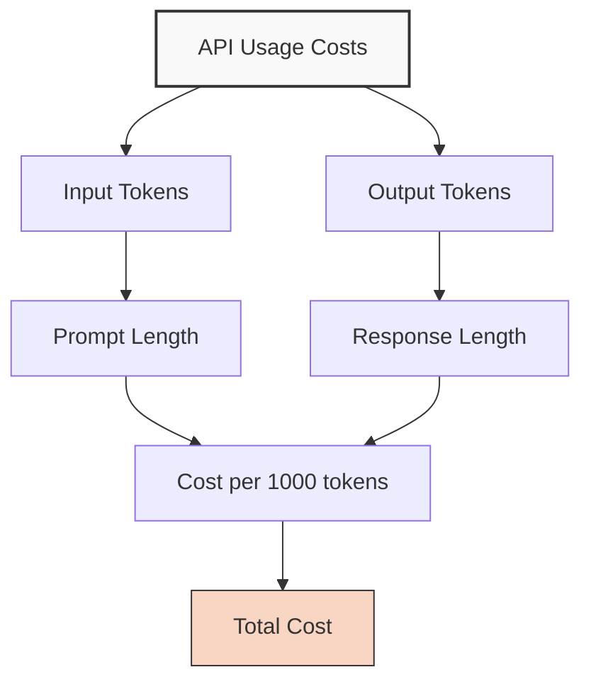

# Using the ChatGPT API

## Introduction to the OpenAI API

The ChatGPT API allows developers to integrate OpenAI's language models directly into their applications, providing programmatic access to AI capabilities. This lesson covers the basics of working with the API.

## API Keys and Authentication

Before you can use the API, you need to get an API key from OpenAI:

1. Create an account on [OpenAI's platform](https://platform.openai.com/)
2. Navigate to the API keys section
3. Generate a new secret key
4. Store this key securely - it should be treated like a password

<div class="warning-box">
  <h3>⚠️ API Key Security</h3>
  <p>Never hardcode your API key directly in your source code, especially in public repositories. Use environment variables or secure secret management systems instead.</p>
</div>

## Basic API Request Structure

<div class="code-container">
  <button class="copy-button" onclick="copyCode(this)">Copy</button>
  
```python
import openai
import os

# Set your API key as an environment variable
openai.api_key = os.getenv("OPENAI_API_KEY")

# Make a simple completion request
response = openai.ChatCompletion.create(
    model="gpt-3.5-turbo",
    messages=[
        {"role": "system", "content": "You are a helpful assistant."},
        {"role": "user", "content": "Hello, can you explain what an API is?"}
    ]
)

# Print the response
print(response.choices[0].message['content'])
```
</div>

## Understanding the Parameters

### Key Parameters

| Parameter | Description | Example Values |
|-----------|-------------|----------------|
| `model` | The AI model to use | `"gpt-3.5-turbo"`, `"gpt-4"` |
| `messages` | Array of message objects | `[{"role": "user", "content": "Hello"}]` |
| `temperature` | Controls randomness (0-2) | `0` (deterministic), `0.7` (default), `1` (creative) |
| `max_tokens` | Limits response length | `150`, `500`, `2000` |
| `stop` | Sequences where API will stop | `["\n", "Human:", "AI:"]` |
| `presence_penalty` | Discourages topic repetition (-2 to 2) | `-0.5`, `0`, `0.5` |
| `frequency_penalty` | Discourages word repetition (-2 to 2) | `-0.5`, `0`, `0.5` |

## Message Roles

<div class="role-explanation">
  <div class="role system">
    <h4>System</h4>
    <p>Sets behavior and context for the assistant</p>
    <pre><code>{"role": "system", "content": "You are a technical writing assistant."}</code></pre>
  </div>
  
  <div class="role user">
    <h4>User</h4>
    <p>The human's messages/questions</p>
    <pre><code>{"role": "user", "content": "How do I implement pagination in React?"}</code></pre>
  </div>
  
  <div class="role assistant">
    <h4>Assistant</h4>
    <p>The AI's previous responses (for continuation)</p>
    <pre><code>{"role": "assistant", "content": "To implement pagination in React, you first need to..."}</code></pre>
  </div>
</div>

## Complete Example: A Conversation

<div class="code-container">
  <button class="copy-button" onclick="copyCode(this)">Copy</button>
  
```python
import openai
import os

# Secure way to store your API key
from dotenv import load_dotenv
load_dotenv()  # Load environment variables from .env file

openai.api_key = os.getenv("OPENAI_API_KEY")

# Function to chat with the API
def chat_with_gpt(conversation):
    response = openai.ChatCompletion.create(
        model="gpt-3.5-turbo",
        messages=conversation,
        temperature=0.7,
        max_tokens=500
    )
    return response.choices[0].message['content']

# Start a conversation
conversation = [
    {"role": "system", "content": "You are a helpful programming tutor specialized in Python."}
]

# First user message
user_message = "What's the difference between a list and a tuple in Python?"
conversation.append({"role": "user", "content": user_message})
print(f"User: {user_message}")

# Get assistant response
assistant_response = chat_with_gpt(conversation)
conversation.append({"role": "assistant", "content": assistant_response})
print(f"Assistant: {assistant_response}")

# Continue the conversation
user_message = "Can you give me an example of when to use each one?"
conversation.append({"role": "user", "content": user_message})
print(f"\nUser: {user_message}")

# Get another response
assistant_response = chat_with_gpt(conversation)
print(f"Assistant: {assistant_response}")
```
</div>

## Error Handling

Always implement proper error handling when working with the API:

<div class="code-container">
  <button class="copy-button" onclick="copyCode(this)">Copy</button>
  
```python
import openai
import os
import time
from openai.error import RateLimitError, APIError, ServiceUnavailableError

openai.api_key = os.getenv("OPENAI_API_KEY")

def call_api_with_retry(messages, max_retries=5):
    retries = 0
    
    while retries < max_retries:
        try:
            response = openai.ChatCompletion.create(
                model="gpt-3.5-turbo",
                messages=messages
            )
            return response.choices[0].message['content']
            
        except RateLimitError:
            # Exponential backoff for rate limits
            wait_time = 2 ** retries
            print(f"Rate limit exceeded. Waiting {wait_time} seconds...")
            time.sleep(wait_time)
            retries += 1
            
        except (APIError, ServiceUnavailableError):
            # Server-side errors, wait and retry
            wait_time = 3 + retries
            print(f"API error. Waiting {wait_time} seconds...")
            time.sleep(wait_time)
            retries += 1
            
        except Exception as e:
            # Other errors
            print(f"Unexpected error: {str(e)}")
            return None
    
    print("Maximum retries reached. Failed to get response.")
    return None
```
</div>

## Cost Considerations



The OpenAI API is priced based on tokens (roughly 4 characters = 1 token):

| Model | Input Cost (per 1K tokens) | Output Cost (per 1K tokens) |
|-------|----------------------------|-----------------------------|
| GPT-3.5-Turbo | $0.0005 | $0.0015 |
| GPT-4 | $0.03 | $0.06 |
| GPT-4-32k | $0.06 | $0.12 |

<div class="tip-box">
  <h3>💡 Cost-Saving Tips</h3>
  <ul>
    <li>Be concise with your prompts</li>
    <li>Use system messages efficiently</li>
    <li>Set appropriate max_tokens limits</li>
    <li>Consider fine-tuning for specialized applications</li>
  </ul>
</div>

## Token Counting Example

<div class="code-container">
  <button class="copy-button" onclick="copyCode(this)">Copy</button>
  
```python
from transformers import GPT2TokenizerFast

def count_tokens(text):
    tokenizer = GPT2TokenizerFast.from_pretrained("gpt2")
    return len(tokenizer.encode(text))

system_message = "You are a helpful assistant that provides concise answers."
user_message = "Can you explain how to count tokens in the OpenAI API?"

system_tokens = count_tokens(system_message)
user_tokens = count_tokens(user_message)
total_tokens = system_tokens + user_tokens

print(f"System message tokens: {system_tokens}")
print(f"User message tokens: {user_tokens}")
print(f"Total input tokens: {total_tokens}")
print(f"Estimated cost (GPT-3.5): ${(total_tokens/1000) * 0.0005:.6f}")
```
</div>

## API Integration Patterns

### Web Application Integration

<div class="code-container">
  <button class="copy-button" onclick="copyCode(this)">Copy</button>
  
```javascript
// Example with Node.js and Express
const express = require('express');
const { Configuration, OpenAIApi } = require('openai');
require('dotenv').config();

const app = express();
app.use(express.json());

const configuration = new Configuration({
  apiKey: process.env.OPENAI_API_KEY,
});
const openai = new OpenAIApi(configuration);

app.post('/ask', async (req, res) => {
  try {
    const { prompt } = req.body;
    
    const response = await openai.createChatCompletion({
      model: "gpt-3.5-turbo",
      messages: [
        { role: "system", content: "You are a helpful assistant." },
        { role: "user", content: prompt }
      ],
    });
    
    res.json({ 
      answer: response.data.choices[0].message.content,
      usage: response.data.usage
    });
  } catch (error) {
    console.error('API error:', error);
    res.status(500).json({ error: 'Failed to get response from OpenAI' });
  }
});

app.listen(3000, () => {
  console.log('Server running on port 3000');
});
```
</div>

## Streaming Responses

For a more interactive experience, you can stream responses from the API:

<div class="code-container">
  <button class="copy-button" onclick="copyCode(this)">Copy</button>
  
```python
import openai
import os

openai.api_key = os.getenv("OPENAI_API_KEY")

# Create a streaming chat completion
response = openai.ChatCompletion.create(
    model="gpt-3.5-turbo",
    messages=[
        {"role": "system", "content": "You are a helpful assistant."},
        {"role": "user", "content": "Write a short poem about programming."}
    ],
    stream=True  # Enable streaming
)

# Process the streaming response
collected_chunks = []
collected_messages = []

# Iterate through the stream of events
for chunk in response:
    collected_chunks.append(chunk)  # save the event response
    chunk_message = chunk['choices'][0]['delta']  # extract the message
    collected_messages.append(chunk_message)  # save the message
    
    # If there's content in the message, print it
    if 'content' in chunk_message:
        print(chunk_message['content'], end='', flush=True)
```
</div>

## Best Practices Summary

1. **Security**: Never expose your API key
2. **Prompting**: Be specific and clear in your system and user messages
3. **Parameters**: Start with default parameters, then adjust as needed
4. **Rate Limits**: Implement retry logic with exponential backoff
5. **Costs**: Monitor token usage to manage expenses
6. **Caching**: Consider caching responses for repeated queries
7. **Error Handling**: Always expect and handle errors properly

## JavaScript Implementation

<div class="code-container">
  <button class="copy-button" onclick="copyCode(this)">Copy</button>
  
```javascript
// Copy button functionality
function copyCode(button) {
  const codeContainer = button.nextElementSibling;
  const codeText = codeContainer.textContent;
  
  navigator.clipboard.writeText(codeText)
    .then(() => {
      // Visual feedback
      const originalText = button.textContent;
      button.textContent = 'Copied!';
      button.classList.add('copied');
      
      setTimeout(() => {
        button.textContent = originalText;
        button.classList.remove('copied');
      }, 2000);
    })
    .catch(err => {
      console.error('Failed to copy code: ', err);
    });
}
```
</div>

## Exercise: Your First API Call

Try implementing a simple script that:

1. Securely loads your API key
2. Sends a request to ChatGPT asking for 5 creative project ideas
3. Handles any potential errors
4. Prints the response

<div class="solution-space" style="min-height: 200px; border: 1px dashed #ccc; padding: 10px;">
Write your solution here...
</div>

---

*Updated: May 2024* 