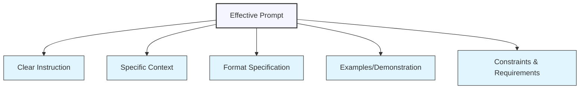
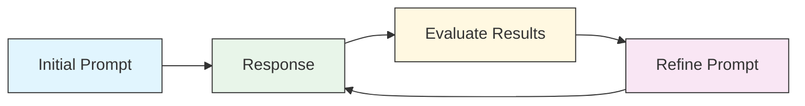

# Basic Prompt Structure and Best Practices

## The Anatomy of an Effective Prompt

A well-structured prompt is the key to getting high-quality, relevant responses from ChatGPT. Let's break down the essential components that make a prompt effective:



### 1. Clear Instruction

Begin with a direct, unambiguous instruction that tells ChatGPT exactly what you want it to do.

<div class="comparison-table">
  <div class="good">
    <h4>✅ Effective</h4>
    <p>"Create a detailed weekly meal plan for a vegetarian athlete."</p>
  </div>
  <div class="bad">
    <h4>❌ Ineffective</h4>
    <p>"Food ideas?"</p>
  </div>
</div>

### 2. Specific Context

Provide relevant background information to frame the task properly.

<div class="comparison-table">
  <div class="good">
    <h4>✅ Effective</h4>
    <p>"As a busy working parent of two children ages 6 and 8 who have peanut allergies, I need quick dinner recipes that..."</p>
  </div>
  <div class="bad">
    <h4>❌ Ineffective</h4>
    <p>"Give me some recipes."</p>
  </div>
</div>

### 3. Format Specification

Clearly indicate the desired output format to structure the response.

<div class="comparison-table">
  <div class="good">
    <h4>✅ Effective</h4>
    <p>"Present your answer in a markdown table with columns for Date, Breakfast, Lunch, Dinner, and Snacks."</p>
  </div>
  <div class="bad">
    <h4>❌ Ineffective</h4>
    <p>"Tell me what to eat each day."</p>
  </div>
</div>

### 4. Examples or Demonstrations

When needed, include examples to clarify your expectations.

<div class="comparison-table">
  <div class="good">
    <h4>✅ Effective</h4>
    <p>"Here's an example of the writing style I'm looking for: [example text]. Please write my product description in this style."</p>
  </div>
  <div class="bad">
    <h4>❌ Ineffective</h4>
    <p>"Write it in a good style."</p>
  </div>
</div>

### 5. Constraints and Requirements

Specify any limitations, exclusions, or special requirements.

<div class="comparison-table">
  <div class="good">
    <h4>✅ Effective</h4>
    <p>"The explanation should be suitable for a 10-year-old child and should not include complex scientific terminology."</p>
  </div>
  <div class="bad">
    <h4>❌ Ineffective</h4>
    <p>"Explain quantum physics."</p>
  </div>
</div>

## Prompt Templates for Common Tasks

Using consistent templates can help you get more reliable results. Here are some templates for common tasks:

### Analysis Template

```
I need an analysis of [subject].

Please cover the following aspects:
1. Key components/elements
2. Historical context
3. Main advantages and disadvantages
4. Current trends
5. Future implications

Format your response as a structured report with clear headings and bullet points where appropriate.
```

### Comparison Template

```
Compare and contrast [Item A] and [Item B] based on:

- Core features/characteristics
- Target audience
- Strengths and weaknesses
- Cost/value proposition
- Market position

Present your comparison in a side-by-side format that makes the differences clear.
```

### Creative Writing Template

```
Write a [type of content] about [subject] with the following specifications:

- Style/tone: [formal, conversational, humorous, etc.]
- Length: Approximately [word count] words
- Target audience: [description of audience]
- Key points to include: [list of points]
- Any specific phrases or keywords to include: [list of phrases]

The content should be engaging, original, and achieve the purpose of [intended purpose].
```

## Prompt Engineering Principles

Beyond structure, these principles will help you craft more effective prompts:

### Be Specific and Detailed

The more specific your prompt, the more tailored the response will be.

<div class="example-box">
  <h4>Example:</h4>
  <p><strong>Basic:</strong> "Write a blog post about climate change."</p>
  <p><strong>Improved:</strong> "Write a 1000-word blog post about how small businesses can implement cost-effective sustainability practices to reduce their carbon footprint. Include 5 actionable tips, relevant statistics from the past 2 years, and address common objections from business owners. The tone should be practical and encouraging rather than alarmist."</p>
</div>

### Layer Your Instructions

For complex tasks, break down your requirements into distinct parts.

```
I need help drafting an email to a potential client. Please approach this in three steps:

1. First, create a personalized introduction based on these details about the client: [client details]

2. Then, outline our service offering that addresses these specific needs: [needs]

3. Finally, craft a call-to-action that suggests [specific next step]

The email should be professional but warm, approximately 150-200 words total.
```

### Use Role Prompting

Assign ChatGPT a specific role or persona to frame its expertise.

<div class="example-box">
  <h4>Examples:</h4>
  <ul>
    <li>"As an experienced financial advisor, provide advice on..."</li>
    <li>"Taking the perspective of a user experience designer, evaluate this website mockup..."</li>
    <li>"In your role as a historical expert specializing in ancient Rome, explain..."</li>
  </ul>
</div>

### Iterate and Refine

Prompt engineering is iterative - use each response as feedback for improving your next prompt.



## Common Mistakes to Avoid

Even experienced users make these common prompt engineering mistakes:

### 1. Being Too Vague

<div class="mistake-box">
  <h4>❌ Problem:</h4>
  <p>"Give me information about dogs."</p>
  
  <h4>✅ Better Approach:</h4>
  <p>"Provide a comprehensive guide about caring for a Golden Retriever puppy during its first year, including vaccination schedules, training milestones, dietary needs, and common health concerns."</p>
</div>

### 2. Overloading with Instructions

<div class="mistake-box">
  <h4>❌ Problem:</h4>
  <p>A prompt with 15 different requirements, contradictory instructions, and no clear prioritization.</p>
  
  <h4>✅ Better Approach:</h4>
  <p>Break complex requests into multiple conversations or clearly prioritize requirements.</p>
</div>

### 3. Forgetting to Specify Format

<div class="mistake-box">
  <h4>❌ Problem:</h4>
  <p>"List healthy breakfast options."</p>
  
  <h4>✅ Better Approach:</h4>
  <p>"Create a table of 7 healthy breakfast options. For each option, include columns for the name of the dish, preparation time, main ingredients, approximate calories, and primary nutritional benefits."</p>
</div>

### 4. Neglecting to Set Constraints

<div class="mistake-box">
  <h4>❌ Problem:</h4>
  <p>"Write a story about a hero."</p>
  
  <h4>✅ Better Approach:</h4>
  <p>"Write a 500-word adventure story about a reluctant hero who discovers an ancient artifact. The story should be appropriate for middle-school students, avoid violence, and include themes of friendship and courage."</p>
</div>

## Advanced Formatting Techniques

The way you format your prompts can significantly impact the quality of responses:

### Using Markdown

ChatGPT understands markdown formatting, which you can leverage in your prompts:

```
Create a tutorial on making sourdough bread at home. 
Format your response using the following structure:

# Introduction
[Brief overview of sourdough and why it's popular]

## Equipment Needed
[List all equipment as bullet points]

## Ingredients
[Present as a markdown table with amounts]

## Step-by-Step Process
[Number each step and use **bold text** for important warnings or tips]

### Common Problems and Solutions
[Format as a Q&A]

## Conclusion
```

### Using Delimiters

Delimiters help clearly separate different parts of your prompt:

```
I'll provide information about a customer, then ask you to draft a personalized email.

CUSTOMER INFORMATION:
Name: John Smith
Purchase History: Premium plan subscriber for 2 years
Recent Issue: Experienced downtime on May 15
Support Interaction: Spoke with rep named Michael, felt issue wasn't resolved
Sentiment: Frustrated but has been a loyal customer

EMAIL REQUEST:
Draft an empathetic follow-up email addressing his concerns, offering a 20% discount on next month's subscription, and assuring improved service reliability.
```

## Exercise: Improving Prompts

Look at these basic prompts and consider how you would improve them using the principles we've discussed:

1. "Tell me about marketing."
2. "How do I learn programming?"
3. "Write a story."
4. "Give me diet advice."
5. "Help with my resume."

<div class="solution-space" style="height: 150px; border: 1px dashed #ccc; padding: 10px; margin-top: 10px;">
Write your improved versions here...
</div>

## Key Takeaways

- Structure your prompts with clear instructions, specific context, format specifications, examples, and constraints
- Use role prompting to get responses from specific perspectives
- Be specific rather than vague, and layer complex instructions
- Consider prompting as an iterative process - refine based on the responses you receive
- Use formatting techniques like markdown and delimiters to organize your prompt
- Avoid common mistakes like being too vague or overloading with instructions

---

In the next lesson, we'll explore how to use context effectively to guide ChatGPT's responses even further.

*Updated: May 2024* 