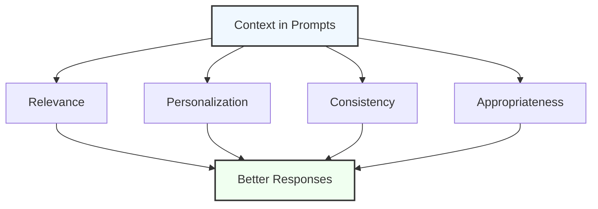
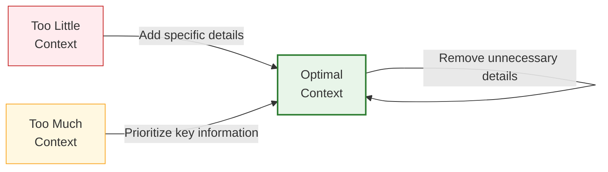

# Using Context to Guide ChatGPT

## Why Context Matters

Context is the secret ingredient that transforms ChatGPT from a generic text generator into a tailored assistant that understands your specific needs and situation. By providing relevant context, you help the AI:

1. **Understand your background** and specific circumstances
2. **Frame its knowledge** to be relevant to your situation
3. **Maintain consistency** across a conversation
4. **Make appropriate assumptions** about your goals
5. **Deliver more useful and targeted responses**



## Types of Context You Can Provide

Let's explore the different types of context you can incorporate into your prompts:

### 1. Personal Context

Sharing relevant details about yourself helps ChatGPT tailor responses to your specific situation.

<div class="example-box">
  <h4>Example:</h4>
  <p>"As a first-time homebuyer with a budget of $250,000 in a medium-sized Midwestern city, what should I be looking for in a starter home?"</p>
  <p class="explanation">The personal context about being a first-time buyer with a specific budget in a particular region allows for more targeted advice.</p>
</div>

### 2. Professional Context

Your industry, role, or professional environment can significantly shape the advice you need.

<div class="example-box">
  <h4>Example:</h4>
  <p>"I manage a team of 12 remote software developers across multiple time zones. We're struggling with communication breakdowns during project handoffs. What systems could we implement to improve this?"</p>
  <p class="explanation">This provides context about team size, industry, work arrangement, and the specific challenge being faced.</p>
</div>

### 3. Situational Context

The immediate situation or problem you're addressing.

<div class="example-box">
  <h4>Example:</h4>
  <p>"I'm preparing for a last-minute presentation to potential investors tomorrow morning. I need to quickly create a compelling 10-slide deck about our product, which is a subscription-based meal planning app for people with dietary restrictions."</p>
  <p class="explanation">The time pressure, audience, and specific deliverable provide important context for the response.</p>
</div>

### 4. Knowledge Level Context

Your existing understanding of a topic helps ChatGPT adjust the technical level of its response.

<div class="comparison-table">
  <div class="good">
    <h4>With Knowledge Context</h4>
    <p>"As someone with a basic understanding of HTML and CSS but no JavaScript experience, explain how to create a simple interactive form."</p>
  </div>
  <div class="bad">
    <h4>Without Knowledge Context</h4>
    <p>"Explain how to create an interactive form."</p>
  </div>
</div>

### 5. Project Context

Information about the broader project or goal you're working toward.

<div class="example-box">
  <h4>Example:</h4>
  <p>"I'm writing an ebook about sustainable gardening practices for beginners. This chapter focuses on water conservation. I need an engaging introduction that highlights the importance of water conservation while being encouraging rather than intimidating to newcomers."</p>
</div>

### 6. Previous Interactions

While ChatGPT maintains conversation history, explicitly referencing previous exchanges can be helpful.

<div class="example-box">
  <h4>Example:</h4>
  <p>"Based on the marketing strategy we discussed earlier for my small bakery, help me draft social media content for the seasonal product launch we planned."</p>
</div>

## Techniques for Providing Effective Context

Now that we understand the types of context, let's explore techniques for integrating context effectively:

### The "In a Nutshell" Method

Start your prompt with a concise summary of the most critical contextual information.

```
In a nutshell: I'm a teacher creating materials for ESL students (ages 12-14) with intermediate English skills.

Question: How can I design a classroom activity about environmental conservation that practices both speaking and writing skills?
```

### The Persona Framework

Frame your context as a specific persona or scenario.

```
Persona: I'm a 45-year-old fitness beginner with knee issues looking to get back in shape.

Goal: Find a safe, progressive exercise routine I can do at home with minimal equipment.

Constraints: 30 minutes max per session, no high-impact movements, prefer morning workouts.
```

### The Background-Question Format

Clearly separate background information from your actual query.

```
BACKGROUND:
- Managing a small e-commerce store selling handmade jewelry
- Currently using basic spreadsheets to track inventory of 200+ items
- Experience frequent stockouts and overstocking issues
- Limited technical expertise, but comfortable with basic software
- Budget constraint of $50/month for software solutions

QUESTION:
What inventory management systems would work well for my situation, and what implementation process would you recommend?
```

### The Expert Consultation Approach

Frame the context as if you're consulting with a specific type of expert.

```
I'd like to consult with you as if you were a pediatric nutritionist. My context is:
- 6-year-old child
- Recently diagnosed with mild dairy allergy
- Picky eater who loves dairy products (cheese, yogurt, etc.)
- Concerned about calcium intake
- Need school lunch ideas that don't require refrigeration

Based on this situation, what recommendations would you provide?
```

## When and How Much Context to Include

Providing context is important, but there are considerations for when and how much to include:

### When More Context Helps

- For **complex or nuanced topics** where background matters
- When you need **personalized advice** rather than general information
- If you're **continuing a multi-step process** from a previous conversation
- When you want to **specify constraints or requirements** that aren't obvious

### When Less Context Works

- For **straightforward factual questions** ("What's the boiling point of water?")
- When requesting **creative content** where you want minimal constraints
- For **initial exploratory questions** about a topic

### Context Length Guidelines



As a general guideline:

- **Essential context only:** Include what directly affects the answer
- **Prioritize relevance:** The most important contextual elements should come first
- **Structure for clarity:** Use formatting to separate different types of context
- **Consider the scope:** More complex questions typically benefit from more context

## Common Context Mistakes to Avoid

### 1. Irrelevant Personal Details

<div class="mistake-box">
  <h4>❌ Problem:</h4>
  <p>Including personal information that doesn't affect the task ("I like the color blue and I'm a Scorpio. Can you explain how photosynthesis works?")</p>
  
  <h4>✅ Better Approach:</h4>
  <p>Include only context that shapes the response ("I'm preparing a lesson for 3rd graders. Can you explain photosynthesis in simple terms with a fun analogy?")</p>
</div>

### 2. Inconsistent Context

<div class="mistake-box">
  <h4>❌ Problem:</h4>
  <p>Changing key contextual elements mid-conversation (starting with "I'm a beginner coder" then asking advanced implementation questions)</p>
  
  <h4>✅ Better Approach:</h4>
  <p>Maintain consistent context or explicitly note when your context changes ("While I mentioned I'm a beginner, I'd now like to explore a more advanced topic...")</p>
</div>

### 3. Over-constraining

<div class="mistake-box">
  <h4>❌ Problem:</h4>
  <p>Providing so many constraints that it's difficult to provide a good answer</p>
  
  <h4>✅ Better Approach:</h4>
  <p>Prioritize the most important constraints and consider breaking complex requests into sequential prompts</p>
</div>

### 4. Buried Questions

<div class="mistake-box">
  <h4>❌ Problem:</h4>
  <p>Hiding your actual question within paragraphs of context</p>
  
  <h4>✅ Better Approach:</h4>
  <p>Make your question clear and distinct, preferably at the beginning or end of your prompt, or highlighted in some way</p>
</div>

## Advanced Context Control Techniques

### Context Window Management

Remember that ChatGPT has a limited "context window" - it can only see a certain amount of previous conversation. For long interactions:

- **Summarize periodically:** "So far we've discussed X, Y and Z. Now let's move on to..."
- **Reference key points:** "Continuing with the marketing strategy we outlined earlier..."
- **Create new conversations for new topics:** Start fresh for entirely new subjects

### Context Refreshing

For longer conversations, periodically refresh important context:

```
To recap our project parameters:
- Creating a 6-week fitness program
- For intermediate exercisers
- Focusing on strength and mobility
- Using minimal equipment
- With 3 workouts per week

Now, let's develop the specific exercises for Week 3.
```

### Contextual Continuity

Use numbering or clear transitions to maintain contextual flow across multiple prompts:

```
[Part 1/3] Let's start developing our content marketing strategy by analyzing the target audience...

[Part 2/3] Based on the audience analysis we just completed, now let's create content themes...

[Part 3/3] Using the content themes we've established, let's now create an editorial calendar...
```

## Exercise: Improving Context in Prompts

Review these prompts and identify how you could improve them by adding relevant context:

1. "How do I fix my bike?"
2. "Give me a workout plan."
3. "What should I invest in?"
4. "Help me write an email."
5. "How can I learn Spanish?"

<div class="solution-space" style="height: 150px; border: 1px dashed #ccc; padding: 10px; margin-top: 10px;">
Write your improved versions here...
</div>

## Key Takeaways

- Context transforms generic responses into personalized, relevant guidance
- Different types of context include personal, professional, situational, knowledge level, project, and interaction history
- Structure your context using frameworks like "In a Nutshell," Persona, Background-Question, or Expert Consultation
- Balance providing enough context without overwhelming with irrelevant details
- Maintain consistent context throughout conversations or explicitly note changes
- For complex interactions, use context refreshing techniques to maintain continuity

---

In the next lesson, we'll explore how to provide step-by-step instructions for complex tasks.

*Updated: May 2024* 