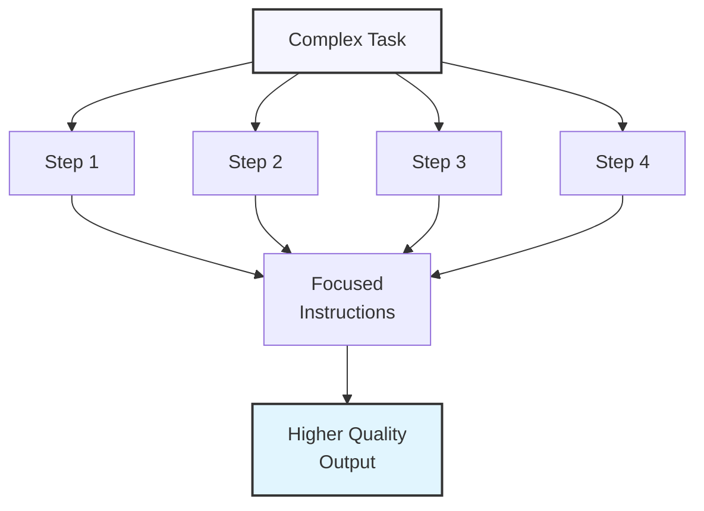
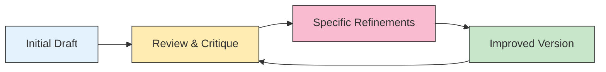

# Step-by-Step Instructions for Complex Tasks

## Breaking Down Complex Requests

When working with ChatGPT on complex tasks, you'll get better results by breaking down your request into clear, sequential steps. This approach helps:

1. **Maintain focus** on each part of the task
2. **Reduce ambiguity** and misinterpretation 
3. **Improve the quality** of each component
4. **Maintain control** over the development process
5. **Overcome token limitations** for extensive projects



## Single-Prompt Sequential Instructions

For moderately complex tasks, you can provide multiple steps within a single prompt:

### The Numbered Approach

<div class="example-box">
  <h4>Example: Creating a Social Media Campaign</h4>
  <pre>
Help me create a social media campaign for my new eco-friendly water bottle product. 
Please tackle this in the following steps:

1. First, identify 3-4 key selling points that would resonate with environmentally 
   conscious consumers.
   
2. Next, develop 5 engaging headline options that highlight these selling points.

3. Then, draft 3 sample Instagram posts (including caption text and hashtag 
   recommendations) targeting different customer pain points.
   
4. Finally, suggest a content posting schedule for the first two weeks of the 
   campaign.

For context, our target audience is active millennials (25-40) who are already 
making eco-conscious purchasing decisions.</pre>
</div>

### The Phased Approach

<div class="example-box">
  <h4>Example: Creating a Business Plan</h4>
  <pre>
I need help creating an outline for a business plan for my mobile pet grooming service.
Please work through these phases:

PHASE 1: BUSINESS CONCEPT
- Suggest a compelling business name
- Create a one-paragraph business concept statement
- Identify the primary services to offer

PHASE 2: MARKET ANALYSIS
- List 5 key customer segments
- Identify 3 main competitors and their strengths/weaknesses
- Suggest 3 ways to differentiate from competitors

PHASE 3: OPERATIONS OVERVIEW
- Outline basic equipment needs
- Suggest staffing requirements
- Propose a simple pricing structure for services

PHASE 4: MARKETING APPROACH
- Recommend 3 primary marketing channels
- Suggest a referral program concept
- Outline a basic customer loyalty approach</pre>
</div>

## Multi-Prompt Sequential Interactions

For truly complex tasks, breaking your request across multiple prompts allows for more detailed guidance and iterative refinement:

### The Progressive Development Model

<div class="example-box">
  <h4>Example: Developing a Product Launch Plan</h4>
  
  <div class="conversation-example">
    <div class="user-message">
      <strong>First Prompt:</strong><br>
      I want to develop a comprehensive launch plan for my new SaaS product, which is a project management tool designed specifically for remote creative teams. Let's start with the first phase: target audience analysis. Please help me identify the primary and secondary user personas, including their pain points, goals, and objections to adopting a new tool.
    </div>
    
    <div class="assistant-response">
      [ChatGPT responds with detailed persona analysis]
    </div>
    
    <div class="user-message">
      <strong>Second Prompt:</strong><br>
      Thank you for the persona analysis. Now, based on these personas, let's develop the messaging strategy. For each persona, create:
      1. A primary headline that addresses their main pain point
      2. Three key benefits statements
      3. Two objection handlers that address their specific concerns
      4. A call-to-action optimized for this audience
    </div>
    
    <div class="assistant-response">
      [ChatGPT responds with messaging strategy]
    </div>
    
    <div class="user-message">
      <strong>Third Prompt:</strong><br>
      Great messaging framework! Now, using these materials, let's create a 30-day launch timeline with specific marketing activities, including:
      1. Pre-launch activities (2 weeks before)
      2. Launch day activities
      3. Post-launch follow-up (2 weeks after)
      
      For each activity, include the target persona, channel, message focus, and goal.
    </div>
  </div>
</div>

### The Review and Refine Approach

<div class="example-box">
  <h4>Example: Writing a Research Paper Outline</h4>
  
  <div class="conversation-example">
    <div class="user-message">
      <strong>First Prompt:</strong><br>
      I'm writing a 15-page research paper on the impact of artificial intelligence on employment in the manufacturing sector. Help me create a detailed outline for this paper.
    </div>
    
    <div class="assistant-response">
      [ChatGPT provides initial outline]
    </div>
    
    <div class="user-message">
      <strong>Second Prompt:</strong><br>
      This outline is a good start, but I'd like to refine the section on "AI Implementation Challenges." Please expand this section to include:
      1. Technical integration issues
      2. Workforce training requirements
      3. Cost-benefit analysis frameworks
      4. Regulatory considerations
      
      For each, provide 2-3 subtopics and a brief description of what should be covered.
    </div>
    
    <div class="assistant-response">
      [ChatGPT expands the requested section]
    </div>
    
    <div class="user-message">
      <strong>Third Prompt:</strong><br>
      The outline is coming together well. Now I'd like to focus on the Literature Review section. Based on the outline we've developed, what are the 6-8 most important research papers or reports I should include in my literature review? For each suggestion, please provide:
      1. The likely title and author(s)
      2. What key findings or arguments they might contain
      3. How these would support my paper's structure
    </div>
  </div>
</div>

## Designing Effective Sequential Instructions

### Start with a Clear Framework

Before you begin, create a mental roadmap of the steps required:

1. **Identify the end goal** - What exact output do you need?
2. **Break it into logical components** - What are the natural divisions of this task?
3. **Determine dependencies** - Which parts must come before others?
4. **Decide on checkpoints** - Where would you benefit from reviewing before proceeding?

<div class="tip-box">
  <h3>💡 Pro Tip</h3>
  <p>For very complex projects, you can ask ChatGPT to help you create the step-by-step plan itself:</p>
  <p>"I need to create a comprehensive marketing strategy for my new mobile app. What would be a logical sequence of steps to develop this with your assistance? Please outline the major components we should tackle and the order in which we should address them."</p>
</div>

### Use Clear Transitions

When moving through a multi-step process, use clear transition language to maintain context:

<div class="example-box">
  <h4>Transition Examples:</h4>
  <ul>
    <li>"Now that we've established the target audience, let's move on to messaging..."</li>
    <li>"Based on the pricing strategy we just developed, please create..."</li>
    <li>"Using the framework from our previous discussion, apply it to..."</li>
    <li>"Let's build upon the concept outline by developing..."</li>
  </ul>
</div>

### Provide Success Criteria

For each step, clearly communicate what a successful completion looks like:

```
For this next section on competitor analysis, please include:
- At least 5 direct competitors
- For each competitor: core offerings, pricing model, and key differentiators
- A summary table comparing all competitors across these dimensions
- 3-4 key insights about market positioning gaps we could exploit

I'll consider this section complete when we have detailed profiles plus actionable insights for our positioning strategy.
```

## Advanced Step-by-Step Techniques

### The Parallel Development Method

For projects with multiple independent components, develop them in parallel:

<div class="example-box">
  <h4>Example: Website Development</h4>
  <pre>
I'm developing a website for my consulting business. I need to work on multiple 
components simultaneously. For each of the following, please provide detailed 
recommendations:

COMPONENT A: VISUAL BRANDING
- Color palette (primary and secondary colors with hex codes)
- Typography recommendations (for headings, body text, and accents)
- Visual style descriptors and mood board concepts

COMPONENT B: SITE STRUCTURE
- Recommended pages for a consulting business website
- Essential elements for each page
- Navigation structure and user flow

COMPONENT C: CONTENT STRATEGY
- Key messages for homepage
- Topics for 5 blog posts to establish expertise
- Call-to-action recommendations for different pages

Please develop each component separately, then briefly note how they should work 
together cohesively.</pre>
</div>

### The Exploration-Selection Method

When you're not sure exactly what you want, use a two-phase approach:

1. **Exploration Phase:** Generate multiple options
2. **Selection Phase:** Choose and refine the best option

<div class="example-box">
  <h4>Example: Product Name Development</h4>
  
  <div class="conversation-example">
    <div class="user-message">
      <strong>First Prompt (Exploration):</strong><br>
      I'm developing a mobile app that helps people track and reduce their personal carbon footprint. Please generate 15 potential names for this app, grouped into three categories:
      1. Descriptive/functional names
      2. Metaphorical/evocative names
      3. Short/modern/tech-focused names
      
      For each name, include a brief explanation of its appeal and meaning.
    </div>
    
    <div class="assistant-response">
      [ChatGPT provides 15 name options in the requested categories]
    </div>
    
    <div class="user-message">
      <strong>Second Prompt (Selection):</strong><br>
      From your list, I'm most interested in "CarbonStep", "EcoTrace", and "Footprint". For each of these three options:
      
      1. Evaluate its strengths and weaknesses
      2. Suggest a tagline that complements the name
      3. Consider potential logo concepts
      4. Check for any potential negative associations or interpretations
      
      After this analysis, recommend which of the three names you think is strongest and why.
    </div>
  </div>
</div>

### The Iteration-Refinement Loop

For creative or complex analytical tasks, implement a cycle of creating, reviewing, and refining:



<div class="example-box">
  <h4>Example: Writing Process</h4>
  
  <div class="conversation-example">
    <div class="user-message">
      <strong>Draft Prompt:</strong><br>
      Write the introduction (about 300 words) for a blog post titled "How Artificial Intelligence is Transforming Healthcare Diagnostics." The audience is healthcare professionals with limited technical AI knowledge.
    </div>
    
    <div class="assistant-response">
      [ChatGPT provides draft introduction]
    </div>
    
    <div class="user-message">
      <strong>Review Prompt:</strong><br>
      Review this introduction critically. Identify:
      1. Any technical terms that need simpler explanations
      2. Claims that should be supported with specific examples
      3. Areas where the flow could be improved
      4. Suggestions to make the opening more engaging
    </div>
    
    <div class="assistant-response">
      [ChatGPT provides critique]
    </div>
    
    <div class="user-message">
      <strong>Refinement Prompt:</strong><br>
      Based on your critique, please rewrite the introduction with these specific improvements:
      1. Add a compelling statistic about diagnostic accuracy in the opening paragraph
      2. Simplify the explanation of "neural networks" 
      3. Include a concrete example of a diagnostic use case
      4. Strengthen the final sentence to better set up the rest of the article
    </div>
  </div>
</div>

## Managing Multi-Session Complex Projects

For large projects that span multiple conversations:

### 1. Document Your Progress

Keep track of your ChatGPT sessions with summaries:

```
Before we continue with the next phase of our marketing strategy development, here's a summary of what we've completed so far:

1. Target audience analysis: Completed on [date] - Identified 3 primary personas
2. Competitive landscape: Completed on [date] - Analyzed 5 key competitors
3. Value proposition development: Completed on [date] - Created core messaging
4. Channel strategy: Completed on [date] - Selected 4 primary channels

Today, I'd like to focus on developing the content calendar for the first quarter.
```

### 2. Create Reference Documents

For complex projects, build reference documents that you can paste in future sessions:

<div class="example-box">
  <h4>Example: Project Reference</h4>
  <pre>
PROJECT REFERENCE: E-COMMERCE WEBSITE REDESIGN

KEY REQUIREMENTS:
- Improve mobile conversion rate (currently 2.3%)
- Streamline checkout process (currently 5 steps)
- Implement new brand guidelines (attached separately)
- Maintain accessibility compliance

APPROVED DECISIONS:
- Using a card-based product display system
- Implementing one-page checkout
- Adding customer review integration
- Using [Design System Name] component library

OPEN QUESTIONS:
- Category organization structure
- Filter/sorting functionality
- Wish list feature implementation
- Product recommendation algorithm

Today we're focusing on the category organization structure.</pre>
</div>

### 3. Use Session Linking

When starting a new session that builds on previous work, explicitly link back:

```
This is a continuation of our work on the employee handbook development project. 
In our last session (May 15), we completed the company overview, mission/values, 
and employment policies sections. Today, I'd like to continue with developing the 
benefits and compensation section.

The style guide we established is:
- Professional but warm tone
- Accessible language (8th-grade reading level)
- Use of "we" to refer to the company
- Bullet points for clarity where appropriate
- Examples to illustrate complex policies
```

## Exercise: Breaking Down a Complex Task

Practice breaking down a complex task into a step-by-step sequence. Choose one of these examples or use your own:

1. Creating a business proposal
2. Designing a personal fitness plan
3. Planning a home renovation project
4. Developing a learning curriculum
5. Writing a comprehensive research article

<div class="solution-space" style="height: 250px; border: 1px dashed #ccc; padding: 10px; margin-top: 10px;">
Break down your chosen task into sequential steps, specifying for each step:
- What information you need to provide
- What you want ChatGPT to create
- How you'll evaluate success before moving to the next step
</div>

## Key Takeaways

- Complex tasks yield better results when broken into clear, sequential steps
- Use single-prompt approaches for moderately complex tasks and multi-prompt interactions for more involved projects
- Design a clear framework before starting, with logical components and dependencies
- Use explicit transitions to maintain context between steps
- Provide success criteria so each step has a clear goal
- For large projects, maintain documentation across multiple sessions
- Consider specialized techniques like parallel development, exploration-selection, and iteration-refinement loops

---

In the next lesson, we'll discuss common mistakes in prompt engineering and how to avoid them.

*Updated: May 2024* 