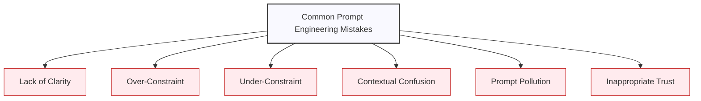
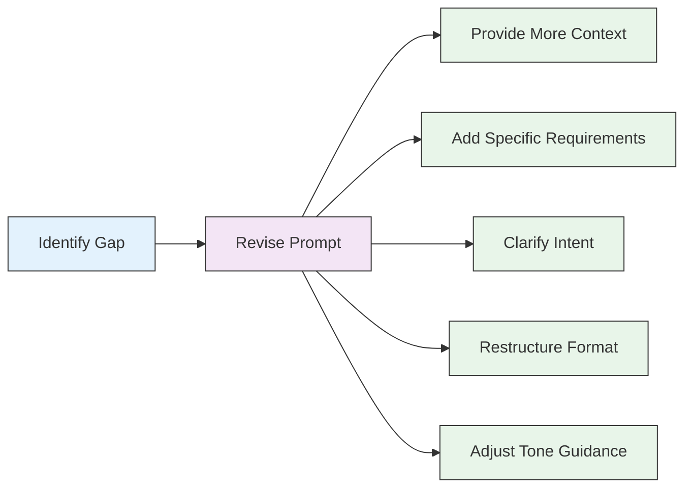

# Common Mistakes and How to Avoid Them

## Understanding Prompt Engineering Pitfalls

Even experienced users make mistakes when crafting prompts for ChatGPT. In this lesson, we'll examine the most common errors and provide practical strategies to avoid them.

## Mistake #1: Lack of Clarity

### The Problem

Ambiguous, vague, or poorly structured prompts lead to responses that miss the mark. When you're unclear about what you want, ChatGPT must make assumptions that may not align with your expectations.

  <h4>❌ Example of Unclear Prompt:</h4>
  
"Tell me about cars."

  
  
This prompt is too broad. ChatGPT could respond with history, mechanics, popular models, environmental impact, or countless other aspects of cars.

### The Solution

Clearly articulate exactly what you want to know or accomplish. Include specific parameters, formats, and objectives.

  <h4>✅ Improved Clarity:</h4>
  
"Provide a comparison of the top 3 electric car models released in 2023, focusing on range, price, charging infrastructure, and safety features. Format your response as a table with these categories as columns."

### Key Strategies

1. **Be specific** about the information you need
2. **Define the scope** clearly (time period, geography, particular aspect, etc.)
3. **Request a specific format** when presentation matters
4. **Prioritize aspects** if multiple elements are important

## Mistake #2: Over-Constraining

### The Problem

Providing too many requirements, parameters, or constraints can confuse the model or create impossible demands. This often results in responses that follow only some of your requirements or that try to accommodate all constraints in suboptimal ways.

  <h4>❌ Example of Over-Constraining:</h4>
  
"Write a short blog post about sustainable gardening that includes at least 15 actionable tips, covers organic pest control, water conservation, soil management, native plants, seasonal planting, and garden design, uses simple language a beginner can understand, includes scientific names of all plants mentioned, provides statistical evidence for all claims, incorporates personal anecdotes, and has exactly 7 paragraphs with no more than 3 sentences each."

### The Solution

Prioritize your most important requirements and allow some flexibility. Consider breaking complex requests into multiple interactions.

  <h4>✅ Balanced Approach:</h4>
  
"Write a beginner-friendly blog post about sustainable gardening. Focus on these key areas: water conservation and organic pest control. Include 5-7 actionable tips that a new gardener could implement immediately. Aim for about 500 words."

  
  
<em>Then in a follow-up prompt:</em> "Now, could you enhance this blog post by adding a section on soil management with 2-3 additional tips?"

### Key Strategies

1. **Prioritize** your most essential requirements
2. **Break complex requests** into multiple steps
3. **Be realistic** about the amount of information that fits in a given format
4. **Iterate gradually** rather than trying to perfect everything in one go

## Mistake #3: Under-Constraining

### The Problem

Providing too little guidance leaves ChatGPT to make many assumptions about your needs, resulting in generic responses that don't quite hit the mark for your specific situation.

  <h4>❌ Example of Under-Constraining:</h4>
  
"Write me a marketing email."

  
  
This prompt doesn't specify the product/service, target audience, purpose of the email, desired tone, or any other crucial details.

### The Solution

Include relevant context and parameters that would influence the response, even if they seem obvious to you.

  <h4>✅ Better Guidance:</h4>
  
"Write a marketing email for our premium yoga studio's new 'Sunrise Serenity' morning class package. The target audience is busy professionals aged 30-45 who are interested in fitness but struggle to maintain consistent exercise habits. The email should emphasize the mental and physical benefits of morning exercise routines and include a limited-time 20% discount offer for the first month. Tone should be motivational but not aggressive, with a touch of mindfulness philosophy. Include a clear call-to-action to sign up through our website."

### Key Strategies

1. **Provide context** about your situation or needs
2. **Specify audience** when relevant
3. **Define tone and style** preferences
4. **Include practical constraints** like length or format
5. **Clarify the purpose** of the content or information

## Mistake #4: Ignoring System Limitations

### The Problem

Expecting capabilities beyond what ChatGPT can deliver often leads to disappointment. Common examples include requesting real-time data, expecting perfect factual accuracy on niche topics, or asking for highly specific professional advice.

  <h4>❌ Unrealistic Expectations:</h4>
  
"Give me today's stock prices for all companies in the S&P 500, along with your prediction for which will increase by more than 5% tomorrow."

  
  
"Diagnose this unusual rash on my arm and recommend prescription medication to treat it."

### The Solution

Understand ChatGPT's capabilities and limitations. Frame your requests in ways that leverage its strengths while accounting for its constraints.

  <h4>✅ Realistic Approaches:</h4>
  
"Explain how to research and evaluate stocks using fundamental analysis. What key metrics should I focus on when analyzing companies in the technology sector?"

  
  
"What are some common causes of skin rashes, and what general questions would a dermatologist typically ask to help diagnose a rash? When should someone with a rash seek medical attention?"

### Key Strategies

1. **Recognize knowledge cutoffs** - ChatGPT doesn't have real-time information
2. **Avoid requests for professional advice** in regulated fields like medicine, law, etc.
3. **Ask for frameworks and approaches** rather than definitive answers in specialized domains
4. **Be skeptical of highly specific factual claims**, especially numbers and statistics
5. **Use ChatGPT as a thinking partner** rather than an oracle

## Mistake #5: Contextual Confusion

### The Problem

Failing to maintain clear context throughout a conversation or suddenly changing topics without proper transitions can lead to responses that miss the mark or carry over inappropriate assumptions.

  <h4>❌ Example of Contextual Confusion:</h4>
  
<strong>User:</strong> "I'm planning content for my cooking blog focused on Italian cuisine."

  
<strong>ChatGPT:</strong> [Provides suggestions for Italian cooking content]

  
<strong>User:</strong> "Generate 10 recipe ideas."

  
[ChatGPT might generate general recipes, not specifically Italian ones, because the context wasn't explicitly carried forward]

### The Solution

Maintain clear context throughout conversations and explicitly state when you're changing direction.

  <h4>✅ Better Context Management:</h4>
  
<strong>User:</strong> "I'm planning content for my cooking blog focused on Italian cuisine."

  
<strong>ChatGPT:</strong> [Provides suggestions for Italian cooking content]

  
<strong>User:</strong> "Based on our Italian cuisine focus, generate 10 authentic regional Italian recipe ideas that would appeal to beginner home cooks."

### Key Strategies

1. **Reference previous context** explicitly in follow-up questions
2. **Signal topic changes** clearly when moving to new subjects
3. **Periodically summarize** the evolving context in longer conversations
4. **Correct misunderstandings** immediately when ChatGPT misinterprets context

## Mistake #6: Prompt Pollution

### The Problem

Including unnecessary information, contradictory instructions, or poor formatting in your prompts creates "noise" that can confuse the model and dilute the effectiveness of your important instructions.

  <h4>❌ Example of Prompt Pollution:</h4>
  
"I need help writing a professional email but I'm not sure exactly what to say since I'm not very good at writing emails and I get nervous about the right tone to use. I think I want something business casual but also formal but not too stuffy because I don't want to seem unfriendly. The email is to ask about a potential collaboration. Oh and it should be brief but cover all the important details about my proposal. Thanks so much for helping me, I really appreciate it!"

### The Solution

Keep prompts focused, organized, and free of unnecessary conversational elements or contradictory guidance.

  <h4>✅ Clean, Structured Prompt:</h4>
  
"Draft a professional email to inquire about a potential business collaboration with a company I admire but haven't worked with before. I want to:

  <ul>
    <li>Introduce myself and my business briefly</li>
    <li>Propose a specific collaboration opportunity</li>
    <li>Request a meeting to discuss details</li>
  </ul>
  
Tone: Professional but warm, approachable but not casual 
  Length: Concise (150-200 words)"

### Key Strategies

1. **Organize information** using clear structure (bullet points, numbered lists, etc.)
2. **Eliminate unnecessary background** information
3. **Remove hedging language** ("I think maybe" or "if possible")
4. **Resolve contradictions** before submitting your prompt
5. **Use formatting** to distinguish between instructions and content

## Mistake #7: Leading or Biased Framing

### The Problem

Unintentionally biasing ChatGPT's response through loaded questions, assumptions, or one-sided framing leads to responses that reflect that bias rather than providing balanced information.

  <h4>❌ Examples of Biased Framing:</h4>
  
"Explain why remote work is obviously superior to office work in every way."

  
  
"List all the reasons why Technology X is a terrible choice for businesses."

### The Solution

Frame questions and requests neutrally to get more balanced, objective responses.

  <h4>✅ Neutral Framing:</h4>
  
"Compare remote work and office-based work models, including potential advantages and disadvantages of each approach for different types of businesses and employees."

  
  
"Provide an objective analysis of Technology X, including its strengths, limitations, and factors that businesses should consider when evaluating it against alternatives."

### Key Strategies

1. **Recognize your own biases** before crafting prompts
2. **Use neutral language** that doesn't presuppose conclusions
3. **Explicitly request balanced perspectives** when appropriate
4. **Ask for evidence or reasoning** rather than just opinions

## Mistake #8: Ineffective Iteration

### The Problem

Repeating the same approach after getting unsatisfactory results or making major changes without understanding what went wrong leads to frustration and wasted effort.

  <h4>❌ Poor Iteration:</h4>
  
<strong>User:</strong> "Write a catchy slogan for my eco-friendly water bottle company."

  
<strong>ChatGPT:</strong> [Provides slogans that don't quite match expectations]

  
<strong>User:</strong> "These aren't good. Give me better slogans."

  
<strong>ChatGPT:</strong> [Provides more slogans but still misses the mark]

### The Solution

Use targeted feedback that specifically addresses what wasn't working and what you're looking for instead.

  <h4>✅ Effective Iteration:</h4>
  
<strong>User:</strong> "Write a catchy slogan for my eco-friendly water bottle company."

  
<strong>ChatGPT:</strong> [Provides slogans that don't quite match expectations]

  
<strong>User:</strong> "Those slogans feel too generic. Our brand personality is adventurous and slightly irreverent. We want something that highlights both the environmental impact and the durability of our bottles. Could you try again with a more playful tone that might appeal to outdoor enthusiasts aged 25-40?"

### Key Strategies

1. **Be specific about what's not working** in previous responses
2. **Add new, relevant information** with each iteration
3. **Refine rather than restart** when possible
4. **Try different approaches** rather than just asking for "better" results

## Mistake #9: Inappropriate Trust Levels

### The Problem

Either placing too much trust in ChatGPT's outputs without verification or being overly skeptical about everything it generates can limit the value you receive.

  <h4>❌ Trust Extremes:</h4>
  
<strong>Over-trusting:</strong> Using ChatGPT-generated code in production without review, or citing specific statistics it provides without verification.

  
  
<strong>Under-trusting:</strong> Dismissing valuable frameworks, analyses, or creative content because they came from AI.

### The Solution

Develop appropriate trust levels based on the type of task and the potential consequences of errors.

  <h4>✅ Calibrated Trust:</h4>
  <ul>
    <li><strong>High verification needs:</strong> Facts, figures, technical code, professional advice</li>
    <li><strong>Moderate verification needs:</strong> Analytical frameworks, research summaries, process suggestions</li>
    <li><strong>Lower verification needs:</strong> Creative ideas, writing structure, brainstorming, general explanations of concepts</li>
  </ul>

### Key Strategies

1. **Verify factual claims** from authoritative sources
2. **Test technical solutions** before implementing them
3. **Use ChatGPT as a starting point** for critical tasks, not the final word
4. **Evaluate responses based on your expertise** in the relevant domain
5. **Be most cautious** in high-stakes situations

## How to Diagnose and Fix Prompt Problems

When you're not getting the results you want, use this troubleshooting framework:

### 1. Identify the Gap

Start by clearly identifying the difference between what you received and what you wanted.

  <h4>Gap Analysis Questions:</h4>
  <ul>
    <li>Is the response too general or too specific?</li>
    <li>Is it missing key information or including irrelevant details?</li>
    <li>Is the format or structure different from what I needed?</li>
    <li>Is the tone or style misaligned with my expectations?</li>
    <li>Is it answering a different question than what I intended?</li>
  </ul>

### 2. Revise Your Prompt

Based on your analysis, make targeted improvements to your prompt.

### 3. Request Refinement

Instead of starting over, you can often build on the existing response.

  <h4>Refinement Request:</h4>
  
"This is a good start, but I need the analysis to be more focused on small business applications rather than enterprise solutions. Could you revise the second and third sections to address budget constraints, limited IT resources, and scalability concerns specific to companies with fewer than 50 employees?"

## Exercise: Prompt Repair Workshop

Below are several flawed prompts. Practice identifying the specific problems and rewriting them to be more effective:

1. "Tell me everything about project management."

2. "I need a perfect email to convince my boss to let me work from home on Fridays, it needs to be persuasive and professional but also friendly and not too pushy, but also make it completely clear that this is important to me."

3. "Why is Python obviously the best programming language for all projects?"

4. "Create a marketing strategy."

5. "How do I fix my code? It's not working right."

Write your improved versions here...

## Key Takeaways

- **Clarity** is the foundation of effective prompts - be specific about what you want
- **Balance constraints** - provide enough guidance without overwhelming the model
- **Maintain context** throughout conversations with clear references
- **Understand ChatGPT's limitations** around factual knowledge and specialized expertise
- **Keep prompts clean** and free of unnecessary information or contradictions
- **Frame questions neutrally** to avoid unintentional bias
- **Iterate effectively** with specific feedback about what needs improvement
- **Calibrate trust** based on the type of task and potential consequences of errors
- **When troubleshooting**, identify specific gaps between what you received and what you wanted

---

Congratulations on completing Module 2! You now have a solid foundation in prompt engineering fundamentals. In Module 3, we'll explore advanced prompting strategies to further enhance your ability to get exactly what you need from ChatGPT.

*Updated: May 2024* 