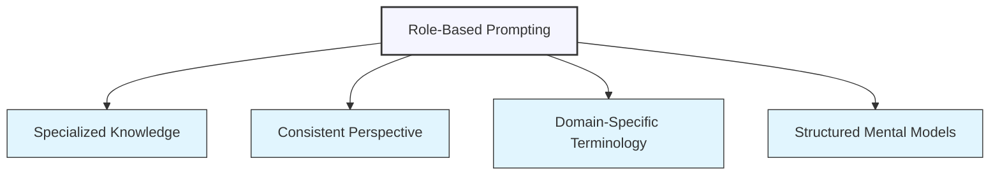

# Role-Based Prompting for Specialized Knowledge

## Understanding Role-Based Prompting

Role-based prompting is a powerful technique that helps you access more specialized and focused responses from ChatGPT. By assigning a specific role or persona to the AI, you can tap into different knowledge domains and perspectives.



### How Role Prompting Works

When you assign a role to ChatGPT, you're essentially providing a framework that guides:

1. **Which knowledge to prioritize** from its training data
2. **What perspective or approach** to take when analyzing information
3. **Which terminology and concepts** to emphasize in responses
4. **What level of detail** to include on specific topics

## The Anatomy of Effective Role Prompts

An effective role prompt has several key components:

### 1. Role Definition

Clearly specify the role you want ChatGPT to assume.

<div class="comparison-table">
  <div class="good">
    <h4>✅ Effective</h4>
    <p>"Act as an experienced financial analyst specializing in small-cap stocks."</p>
  </div>
  <div class="bad">
    <h4>❌ Ineffective</h4>
    <p>"Pretend you know about stocks."</p>
  </div>
</div>

### 2. Expertise Level

Indicate the level of expertise or experience within that role.

<div class="comparison-table">
  <div class="good">
    <h4>✅ Effective</h4>
    <p>"Assume the role of a senior mechanical engineer with 15+ years of experience in automotive suspension systems."</p>
  </div>
  <div class="bad">
    <h4>❌ Ineffective</h4>
    <p>"Be a mechanical engineer."</p>
  </div>
</div>

### 3. Contextual Background

Provide relevant background information that shapes the role's perspective.

<div class="comparison-table">
  <div class="good">
    <h4>✅ Effective</h4>
    <p>"Act as a digital marketing strategist who has worked primarily with B2B SaaS companies and has witnessed the evolution of social media advertising since 2010."</p>
  </div>
  <div class="bad">
    <h4>❌ Ineffective</h4>
    <p>"Be a marketing expert."</p>
  </div>
</div>

### 4. Thinking Style or Approach

Specify the characteristic way of thinking associated with the role.

<div class="comparison-table">
  <div class="good">
    <h4>✅ Effective</h4>
    <p>"Respond as a UX researcher who takes a human-centered approach, focuses on qualitative insights, and is skilled at identifying underlying user needs beyond stated preferences."</p>
  </div>
  <div class="bad">
    <h4>❌ Ineffective</h4>
    <p>"Answer as someone who designs websites."</p>
  </div>
</div>

## Strategic Applications of Role-Based Prompting

### Technical Domain Expertise

Access specialized knowledge in technical fields by assigning expert roles.

<div class="example-box">
  <h4>Example: Software Architecture Guidance</h4>
  <pre>
Act as an experienced software architect specializing in distributed systems and 
microservices. You have extensive experience with both monolithic-to-microservice 
migrations and greenfield microservice implementations.

Review this proposed architecture for a high-traffic e-commerce platform:
[Description of architecture]

Identify potential issues with scalability, resilience, and maintenance. Suggest 
improvements that address these concerns while considering implementation complexity 
and resource constraints of a mid-sized development team.</pre>
</div>

### Creative Perspectives

Stimulate creative thinking by assigning roles that bring unique creative viewpoints.

<div class="example-box">
  <h4>Example: Product Design Ideation</h4>
  <pre>
Assume the role of an industrial designer with a background in both traditional 
furniture design and modern minimalist aesthetics, similar to Dieter Rams or Naoto 
Fukasawa.

I'm developing a new line of home office furniture for small urban apartments. 
Approach this design challenge with your expertise in:
- Maximizing functionality in limited spaces
- Creating visual lightness
- Incorporating subtle, thoughtful details
- Selecting materials for durability and sustainability

Generate 3-5 innovative concepts for a desk that can transform or adapt to different uses 
throughout the day. For each concept, explain the key design principles, materials, and 
unique features.</pre>
</div>

### Educational Simplification

Use educator roles to make complex topics more accessible.

<div class="example-box">
  <h4>Example: Explaining Complex Topics</h4>
  <pre>
Take on the role of a science teacher who specializes in making complex subjects 
accessible to middle school students (ages 11-13). You excel at using relatable 
analogies, visual descriptions, and connecting abstract concepts to everyday experiences.

Explain how CRISPR gene editing technology works in a way that my students can understand. 
Include:
- A simple analogy that captures the basic mechanism
- An explanation of the potential benefits and ethical considerations
- 2-3 examples of how this technology might affect their lives in the future

Avoid overly technical terminology, but don't oversimplify to the point of inaccuracy.</pre>
</div>

### Multi-Perspective Analysis

Explore different viewpoints on complex issues by assigning various stakeholder roles.

<div class="example-box">
  <h4>Example: Policy Analysis</h4>
  <pre>
I need a multi-perspective analysis of a proposed urban policy to create car-free 
zones in city centers. For each of the following stakeholders, provide their likely 
perspective, concerns, and interests:

1. As a small business owner with a shop in the affected area
2. As a resident living within the proposed car-free zone
3. As a suburban commuter who drives to work in the city center
4. As an environmental policy expert
5. As a city transportation planner

For each perspective, highlight their primary concerns, potential benefits, and key 
objections. Conclude with insights about balancing these different stakeholder needs.</pre>
</div>

## Advanced Role-Based Techniques

### Specialized Sub-Roles

For even more focused expertise, define specialized sub-roles within broader domains.

<div class="example-box">
  <h4>Example: Specialized Legal Advice</h4>
  <p>Instead of simply "Act as a lawyer," try:</p>
  <p>"Act as an intellectual property attorney specializing in software patents and open source licensing compliance, with experience in both startup and enterprise environments. You have particular expertise in navigating the intersection of proprietary software and open source components."</p>
</div>

### Historical or Theoretical Perspectives

Access theoretical frameworks by assigning roles tied to specific thought traditions or historical perspectives.

<div class="example-box">
  <h4>Example: Economic Analysis</h4>
  <pre>
Provide an analysis of current inflation trends through three distinct perspectives:

1. First, as a Keynesian economist focusing on aggregate demand and government intervention
2. Then, as a Monetarist economist in the tradition of Milton Friedman, focusing on 
   money supply
3. Finally, as an Austrian School economist emphasizing market processes and malinvestment

For each perspective, explain:
- The likely causes of the current inflation based on that theoretical framework
- The recommended policy responses
- The predicted outcomes of those policies</pre>
</div>

### Composite Expertise Roles

Combine multiple domains of expertise for interdisciplinary perspectives.

<div class="example-box">
  <h4>Example: Sustainability Planning</h4>
  <pre>
Act as an advisor with dual expertise in environmental sustainability and corporate 
finance. You understand both the scientific aspects of carbon reduction and the business 
realities of implementation costs, ROI expectations, and shareholder considerations.

My manufacturing company wants to achieve carbon neutrality within 10 years while 
maintaining profitability. Develop a phased approach that balances:
- Meaningful environmental impact
- Financial feasibility
- Implementation complexity
- Stakeholder expectations

For each recommended phase, explain both the sustainability benefits and the financial 
implications.</pre>
</div>

## Role-Based Prompt Templates

Here are templates you can adapt for different scenarios:

### Expert Consultation Template

```
Act as a [specific type of expert] with [X years/level of experience] specializing in [specific domain or sub-field]. You have particular expertise in [specific techniques, approaches, or systems].

I need your expert guidance on the following situation/problem:
[Description of situation or problem]

Specifically, I would like your assessment of:
1. [First aspect to analyze]
2. [Second aspect to analyze]
3. [Third aspect to analyze]

Please provide recommendations based on best practices in your field, with particular attention to [specific concerns or constraints].
```

### Creative Professional Template

```
Assume the role of a [specific creative profession] who specializes in [style, medium, or approach] and is known for [characteristic quality of their work].

I'm working on [description of creative project] intended for [target audience/purpose].

Using your expertise, help me develop:
- [First deliverable]
- [Second deliverable]
- [Third deliverable]

My vision/goals for this project include [specific aesthetic, emotional response, or outcomes].
```

### Educator Template

```
Take on the role of a [type of educator] who teaches [subject] to [specific audience/level]. You have a gift for making complex concepts accessible through [teaching techniques].

I need help understanding [concept or topic]. Please explain this in a way that:
- Builds on foundational knowledge of [prerequisite concepts]
- Uses concrete examples and analogies
- Addresses common misconceptions
- Progresses from basic principles to more nuanced aspects

My goal is to [intended learning outcome].
```

## Common Pitfalls and How to Avoid Them

### 1. Role Without Clear Expertise Parameters

<div class="mistake-box">
  <h4>❌ Problem:</h4>
  <p>"Act as a doctor and tell me what's wrong with me."</p>
  
  <h4>✅ Better Approach:</h4>
  <p>"Act as a primary care physician with experience in initial symptom assessment. Based on these symptoms [list symptoms], what are some possible causes that should be investigated by a real doctor? What questions would a doctor typically ask to narrow down the possibilities?"</p>
</div>

### 2. Expecting Domain Knowledge Beyond Training Data

<div class="mistake-box">
  <h4>❌ Problem:</h4>
  <p>"Act as a specialist in cutting-edge quantum computing optimization techniques developed in the past few months."</p>
  
  <h4>✅ Better Approach:</h4>
  <p>"Act as a quantum computing researcher familiar with fundamental optimization approaches through 2021. Based on established trends and principles in this field, what directions might recent research be exploring for improving optimization techniques?"</p>
</div>

### 3. Conflicting Role Instructions

<div class="mistake-box">
  <h4>❌ Problem:</h4>
  <p>"Act as both a passionate environmental activist and a petroleum industry executive to analyze this policy."</p>
  
  <h4>✅ Better Approach:</h4>
  <p>"First, analyze this environmental policy from the perspective of an environmental activist focused on climate impact. Then, separately analyze the same policy from the perspective of a petroleum industry executive concerned with business operations and regulatory compliance. Finally, identify potential areas of common ground between these perspectives."</p>
</div>

### 4. Overly Broad Roles

<div class="mistake-box">
  <h4>❌ Problem:</h4>
  <p>"Act as a scientist and explain this concept."</p>
  
  <h4>✅ Better Approach:</h4>
  <p>"Act as a molecular biologist specializing in cellular signaling pathways, who is experienced in explaining complex processes to undergraduate students. Explain the concept of epigenetic modification and how it affects gene expression."</p>
</div>

## Ethical Considerations in Role-Based Prompting

When using role-based prompting, be mindful of these ethical considerations:

1. **Avoid impersonation** of specific real individuals
2. **Don't use roles to circumvent** ethical guidelines
3. **Be transparent about AI-generated content** when sharing with others
4. **Consider potential harm** from role-based advice in sensitive domains like health, law, or finance
5. **Respect professional boundaries** and recognize when human professional expertise is required

## Exercise: Crafting Effective Role Prompts

Practice creating effective role-based prompts for these scenarios:

1. Getting advice on designing a home garden layout
2. Understanding the key considerations in a business contract
3. Learning how to improve your public speaking skills
4. Analyzing potential market trends for a new technology
5. Getting help with teaching a difficult concept to children

<div class="solution-space" style="height: 250px; border: 1px dashed #ccc; padding: 10px; margin-top: 10px;">
Write your role-based prompts here...
</div>

## Key Takeaways

- Role-based prompting helps access specialized knowledge and perspectives within ChatGPT's training
- Effective role prompts include clear role definition, expertise level, contextual background, and thinking style
- This technique can be strategically applied for technical expertise, creative perspectives, educational simplification, and multi-perspective analysis
- Advanced techniques include specialized sub-roles, historical perspectives, and composite expertise roles
- Avoid common pitfalls like vague expertise parameters, expecting knowledge beyond training data, and overly broad roles
- Consider ethical implications when using role-based prompting, particularly in sensitive domains

---

In the next lesson, we'll explore how to use system messages to guide AI behavior more broadly.

*Updated: May 2024* 