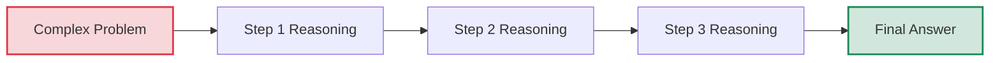

# Chain-of-Thought Reasoning for Complex Problems

## Understanding Chain-of-Thought Prompting

Chain-of-thought (CoT) prompting is a technique that encourages AI models to break down complex problems into a series of intermediate reasoning steps. Instead of asking for a direct answer, CoT prompting guides the AI to "think aloud" through its reasoning process, making its problem-solving steps explicit and transparent.



### Why Chain-of-Thought Works

Chain-of-thought prompting leverages several cognitive mechanisms that improve AI performance:

1. **Decomposition of complexity** - Breaking down difficult problems into manageable components
2. **Step-by-step verification** - Creating checkpoints to catch and correct reasoning errors
3. **Working memory expansion** - Allowing the model to track multiple variables and their relationships
4. **Logic structure enforcement** - Guiding the model to follow a coherent reasoning path
5. **Self-validation** - Enabling the model to review its own reasoning for consistency

## The Anatomy of Effective Chain-of-Thought Prompts

An effective CoT prompt typically includes several key elements:

### 1. Clear Problem Statement

Begin with a well-defined problem or question.

<div class="comparison-table">
  <div class="good">
    <h4>✅ Effective</h4>
    <p>"A train travels at 120 km/h. How long does it take (in hours) to travel 450 kilometers?"</p>
  </div>
  <div class="bad">
    <h4>❌ Ineffective</h4>
    <p>"How long does the train journey take?"</p>
  </div>
</div>

### 2. Reasoning Request

Include an explicit instruction to show the reasoning process.

<div class="comparison-table">
  <div class="good">
    <h4>✅ Effective</h4>
    <p>"Let's solve this step-by-step, showing all calculations and reasoning before arriving at the final answer."</p>
  </div>
  <div class="bad">
    <h4>❌ Ineffective</h4>
    <p>"Think about it carefully."</p>
  </div>
</div>

### 3. Logical Flow Direction

Guide the model on the structure of reasoning to follow.

<div class="comparison-table">
  <div class="good">
    <h4>✅ Effective</h4>
    <p>"First, identify what information we have and what we need to find. Then, determine which formula relates these quantities. Finally, substitute the values and calculate the result."</p>
  </div>
  <div class="bad">
    <h4>❌ Ineffective</h4>
    <p>"Solve it step by step."</p>
  </div>
</div>

### 4. Demonstration (Optional but Powerful)

Provide an example of the reasoning process for a similar problem.

<div class="comparison-table">
  <div class="good">
    <h4>✅ Effective</h4>
    <p>"For example, if a car travels at 60 km/h, to find how long it takes to travel 180 kilometers, I would reason:<br>
    1. I know speed = 60 km/h and distance = 180 km<br>
    2. Time = Distance ÷ Speed<br>
    3. Time = 180 km ÷ 60 km/h = 3 hours<br>
    Now, let's apply similar reasoning to our train problem."</p>
  </div>
  <div class="bad">
    <h4>❌ Ineffective</h4>
    <p>"Here's a similar problem: A car takes 3 hours to travel 180 km at 60 km/h."</p>
  </div>
</div>

## Types of Chain-of-Thought Techniques

Different types of problems benefit from different CoT approaches:

### 1. Zero-Shot Chain-of-Thought

Simply asking the model to reason step-by-step without examples.

<div class="example-box">
  <h4>Example: Zero-Shot CoT</h4>
  <pre>
If a shop sells a shirt for $45, which is 50% more than their cost price, what was their cost price? Solve this step by step, showing your reasoning at each stage.</pre>
</div>

### 2. Few-Shot Chain-of-Thought

Providing examples of step-by-step reasoning before posing the target problem.

<div class="example-box">
  <h4>Example: Few-Shot CoT</h4>
  <pre>
Example 1:
Problem: If a car travels at 60 km/h, how long does it take to travel 180 kilometers?
Reasoning: 
1. I have the speed (60 km/h) and distance (180 km)
2. To find time, I use the formula: Time = Distance ÷ Speed
3. Time = 180 km ÷ 60 km/h = 3 hours
Therefore, it takes 3 hours.

Example 2:
Problem: Mary bought a notebook for $4.30 and a pen that costs $1.20 less than the notebook. How much did she spend in total?
Reasoning:
1. Notebook cost = $4.30
2. Pen cost = Notebook cost - $1.20 = $4.30 - $1.20 = $3.10
3. Total spent = Notebook cost + Pen cost = $4.30 + $3.10 = $7.40
Therefore, Mary spent $7.40 in total.

Now, solve this problem using the same step-by-step approach:
Problem: A train travels at 120 km/h. How long does it take (in hours) to travel 450 kilometers?</pre>
</div>

### 3. Self-Consistency Chain-of-Thought

Generating multiple reasoning paths and selecting the most consistent answer.

<div class="example-box">
  <h4>Example: Self-Consistency CoT</h4>
  <pre>
A train travels at 120 km/h. How long does it take (in hours) to travel 450 kilometers? 

Generate three different ways to solve this problem, then determine which answer is correct by checking if they lead to the same result.

Method 1:
[Reasoning steps...]

Method 2:
[Reasoning steps...]

Method 3:
[Reasoning steps...]

Final answer based on consistency across methods:
[Conclusion]</pre>
</div>

### 4. Structured Chain-of-Thought

Using specific templates or frameworks to guide the reasoning process.

<div class="example-box">
  <h4>Example: Structured CoT</h4>
  <pre>
A train travels at 120 km/h. How long does it take (in hours) to travel 450 kilometers?

Follow this structured approach:

GIVEN:
- [List the known quantities and their units]

REQUIRED:
- [State what we need to find and in what units]

RELEVANT FORMULAS:
- [List any formulas that connect the given information to what we need to find]

SOLUTION:
- [Apply the formulas step by step, showing all calculations]

ANSWER:
- [State the final answer with appropriate units]</pre>
</div>

## Strategic Applications of Chain-of-Thought

Let's explore how CoT can be strategically applied to different types of complex problems:

### Mathematical Problem Solving

<div class="example-box">
  <h4>Example: Mathematical CoT Prompt</h4>
  <pre>
I need to calculate the monthly payment for a 30-year fixed-rate mortgage of $320,000 with an annual interest rate of 3.5%. Let's solve this step by step:

1. First, convert the annual interest rate to a monthly rate and decimal form
2. Determine the total number of payments
3. Apply the mortgage payment formula
4. Calculate the result with attention to precision

Show all calculations and explain the reasoning behind each step.</pre>
</div>

### Logical Reasoning and Deduction

<div class="example-box">
  <h4>Example: Logical Deduction CoT Prompt</h4>
  <pre>
Five friends (Alex, Blake, Casey, Dana, and Eli) are sitting in a row at a movie theater. We know the following:
- Alex is sitting next to Blake
- Casey is sitting next to Dana
- Eli is sitting at one end
- Blake is sitting in the middle seat
- Dana is not sitting next to Blake

Determine the seating arrangement from left to right.

Start by listing all possible arrangements given Blake is in the middle seat (position 3). Then, apply each constraint one by one to eliminate impossible arrangements. Show your reasoning for each step.</pre>
</div>

### Ethical Analysis

<div class="example-box">
  <h4>Example: Ethical Analysis CoT Prompt</h4>
  <pre>
A self-driving car must decide whether to swerve off the road, potentially harming its passenger, or continue forward, potentially hitting a pedestrian who suddenly stepped into the road. What ethical considerations should guide this decision?

Approach this question using a structured ethical analysis:

1. First, identify the key stakeholders and their interests
2. Analyze the scenario through different ethical frameworks (utilitarian, deontological, virtue ethics)
3. Consider relevant principles like the trolley problem, harm minimization, and autonomy
4. Examine how cultural and legal contexts might affect the analysis
5. Synthesize these perspectives to formulate a balanced ethical assessment

At each step, present the reasoning clearly with consideration of multiple viewpoints.</pre>
</div>

### Critical Evaluation of Arguments

<div class="example-box">
  <h4>Example: Critical Evaluation CoT Prompt</h4>
  <pre>
Evaluate the following argument: "Social media use causes depression in teenagers because studies show that teenagers who use more social media report higher rates of depression."

Analyze this argument step by step:

1. Identify the claim and evidence presented
2. Examine the logical structure of the argument (is it deductive, inductive, or abductive?)
3. Assess whether correlation is being confused with causation
4. Consider alternative explanations for the correlation
5. Evaluate whether the evidence is sufficient to support the claim
6. Identify any unstated assumptions
7. Determine the overall strength of the argument

For each step, clearly explain your reasoning and note any limitations in the argument.</pre>
</div>

### Complex Decision-Making

<div class="example-box">
  <h4>Example: Decision-Making CoT Prompt</h4>
  <pre>
A tech startup needs to decide whether to (A) launch their product quickly with limited features or (B) delay the launch to develop more features. 

Key factors:
- They have 10 months of funding remaining
- Competitors are 3-4 months from releasing similar products
- Current user testing shows 70% satisfaction with the limited feature set
- Adding more features would delay launch by 4 months but could increase satisfaction to 90%
- Early adopters are crucial for their market

Walk through a decision-making framework:

1. Clearly define the decision context and parameters
2. Identify the key criteria for evaluation (time, competition, quality, user satisfaction, etc.)
3. Analyze the pros and cons of each alternative against these criteria
4. Consider potential risks and mitigations for each option
5. Apply decision-making tools (e.g., weighted criteria analysis)
6. Synthesize the analysis into a recommendation with rationale

Show your reasoning for each step of the analysis.</pre>
</div>

## Advanced Techniques for Chain-of-Thought Prompting

### 1. Scaffolded Reasoning

Break down complex reasoning into increasingly sophisticated levels.

<div class="example-box">
  <h4>Example: Scaffolded Reasoning</h4>
  <pre>
Let's analyze the economic impact of raising the minimum wage:

Level 1: Basic Effects
- Who is directly affected by minimum wage increases?
- What immediate effects occur for these individuals?

Level 2: Market Dynamics
- How might employers respond to increased labor costs?
- What adjustments might occur in pricing, automation, or employment levels?

Level 3: Economic Ripple Effects
- How do changes in income levels affect consumer spending patterns?
- What industries benefit or face challenges from these changes?

Level 4: Macroeconomic Considerations
- How do these changes impact overall economic indicators?
- What are the potential long-term structural adjustments?

Level 5: Policy Implications
- What complementary policies might enhance benefits or mitigate drawbacks?
- How do differing economic contexts affect outcomes?

At each level, consider multiple perspectives and identify key tradeoffs.</pre>
</div>

### 2. Adversarial Thinking

Deliberately challenge initial assumptions and reasoning.

<div class="example-box">
  <h4>Example: Adversarial Thinking</h4>
  <pre>
Question: Is expanding renewable energy capacity the most effective approach to reducing carbon emissions?

First reasoning path: Argue that renewable energy expansion is the most effective approach
- [Reasoning steps supporting this position]

Now, challenge this reasoning:
- What important considerations did the first reasoning path overlook?
- What alternative approaches might be more effective in some contexts?
- What implementation challenges were not adequately addressed?
- How might the effectiveness vary across different regions or economic situations?

After considering these challenges, develop a more nuanced conclusion:
- [Refined position that incorporates the adversarial perspectives]</pre>
</div>

### 3. Meta-Cognitive Chain-of-Thought

Include reflections on the reasoning process itself.

<div class="example-box">
  <h4>Example: Meta-Cognitive CoT</h4>
  <pre>
Problem: A company needs to reduce costs by 15% while minimizing impact on customer satisfaction. What approach should they take?

Initial approach:
1. [First reasoning step]
   [Assessment: This is a good starting point, but may be too general. Let me specify further.]

2. [Refined reasoning step]
   [Assessment: This reasoning assumes all costs have equal impact on customer satisfaction, which may not be valid. Let me reconsider.]

3. [Adjusted reasoning step]
   [Assessment: I'm now accounting for differential impacts, but haven't considered implementation timeframes. Let me address that.]

4. [Further refined reasoning step]
   [Assessment: This approach balances short and long-term considerations with sensitivity to customer impact.]

Final recommendation:
[Conclusion that reflects the iterative refinement of thinking]</pre>
</div>

### 4. Multi-Perspective Chain-of-Thought

Analyze problems from multiple disciplinary or stakeholder perspectives.

<div class="example-box">
  <h4>Example: Multi-Perspective CoT</h4>
  <pre>
Question: Should a city invest in expanding its public transportation system?

Economic Perspective:
- [Reasoning about costs, benefits, economic development, and fiscal impacts]

Environmental Perspective:
- [Reasoning about emissions, land use, and ecological considerations]

Social Equity Perspective:
- [Reasoning about accessibility, mobility justice, and community impacts]

Urban Planning Perspective:
- [Reasoning about density, land use patterns, and development trajectories]

Technology Perspective:
- [Reasoning about innovation, future transportation modes, and adaptability]

Synthesis:
- [Integration of insights from all perspectives into a holistic assessment]</pre>
</div>

## Chain-of-Thought Templates

Here are templates you can adapt for different types of reasoning tasks:

### Problem-Solving Template

```
Problem: [Clear statement of the problem]

Reasoning approach:

1. Understanding the problem:
   - What information is given?
   - What are we trying to find?
   - What constraints or conditions apply?

2. Planning a solution strategy:
   - What principles, formulas, or methods apply to this type of problem?
   - What sequence of steps will lead to a solution?

3. Executing the plan:
   - [Step-by-step application of the solution strategy]
   - [Show all calculations and intermediate results]

4. Verification:
   - Does the solution satisfy all conditions of the problem?
   - Is the answer reasonable and in the correct units?
   - Can we check using a different method?

Final answer: [Clearly stated result with appropriate context]
```

### Analytical Evaluation Template

```
Topic for analysis: [Clear statement of what's being analyzed]

Structured analysis:

1. Description and context:
   - What is the key information about this topic?
   - What is the relevant background or context?

2. Multi-faceted examination:
   - Dimension 1: [e.g., Historical perspective]
     [Analysis of this dimension]
   - Dimension 2: [e.g., Economic implications]
     [Analysis of this dimension]
   - Dimension 3: [e.g., Social impact]
     [Analysis of this dimension]

3. Identify connections and patterns:
   - What relationships exist between these dimensions?
   - What patterns or contradictions emerge?

4. Consider implications:
   - What are the short-term implications?
   - What are the long-term or broader implications?
   - What uncertainties remain?

Conclusion: [Synthesized insights from the analysis]
```

### Decision-Making Template

```
Decision context: [Clear statement of the decision to be made]

Decision analysis framework:

1. Define objectives and criteria:
   - What are we trying to achieve? (primary and secondary goals)
   - What specific criteria should be used to evaluate options?
   - How should these criteria be weighted or prioritized?

2. Identify alternatives:
   - What are the main options available?
   - Are there hybrid or creative alternatives to consider?

3. Evaluate each alternative:
   - Alternative 1:
     - Strengths: [...]
     - Weaknesses: [...]
     - Opportunities: [...]
     - Threats: [...]
   - Alternative 2:
     - [Similar analysis]
   - Alternative 3:
     - [Similar analysis]

4. Risk assessment:
   - What could go wrong with each option?
   - How might we mitigate these risks?
   - How do the options compare in terms of risk profile?

5. Comparative analysis:
   - Which alternative best meets the key criteria?
   - What tradeoffs are involved?

Recommendation: [Justified decision with supporting rationale]
```

## Common Pitfalls and How to Avoid Them

### 1. Overly Generic Steps

<div class="mistake-box">
  <h4>❌ Problem:</h4>
  <p>"Step 1: Understand the problem<br>
  Step 2: Solve the problem<br>
  Step 3: Check the answer"</p>
  
  <h4>✅ Better Approach:</h4>
  <p>"Step 1: Identify that we need to calculate average monthly expenses, which requires finding the sum of all expenses and dividing by the number of months<br>
  Step 2: Add the monthly expenses: $120 + $95 + $145 + $110 + $105 + $85 = $660<br>
  Step 3: Divide by the number of months: $660 ÷ 6 = $110<br>
  Step 4: Verify by checking that $110 is reasonable given the range of values ($85 to $145)"</p>
</div>

### 2. Skipping Intermediate Steps

<div class="mistake-box">
  <h4>❌ Problem:</h4>
  <p>"To find the compound interest after 5 years, we use the formula A = P(1 + r)^t. Substituting our values, we get $1,276.28."</p>
  
  <h4>✅ Better Approach:</h4>
  <p>"To find the compound interest after 5 years:<br>
  1. We use the formula A = P(1 + r)^t<br>
  2. We substitute our values: A = $1,000 × (1 + 0.05)^5<br>
  3. Calculate (1 + 0.05)^5 = 1.05^5 = 1.27628<br>
  4. Multiply: $1,000 × 1.27628 = $1,276.28<br>
  5. Therefore, the final amount is $1,276.28"</p>
</div>

### 3. Inconsistent Logic Flow

<div class="mistake-box">
  <h4>❌ Problem:</h4>
  <p>"We need to determine if the company should expand. The expansion costs $2 million. The marketing department predicts increased sales. Therefore, they should expand."</p>
  
  <h4>✅ Better Approach:</h4>
  <p>"To determine if the company should expand:<br>
  1. First, let's evaluate the costs: The expansion requires $2 million upfront<br>
  2. Next, let's assess the benefits: Marketing predicts a sales increase of $500,000 annually<br>
  3. Calculate the payback period: $2,000,000 ÷ $500,000 = 4 years<br>
  4. Evaluate against the company's investment criteria: Their maximum acceptable payback period is 3 years<br>
  5. Therefore, based on the payback period exceeding their threshold, the expansion does not meet their investment criteria"</p>
</div>

### 4. Confirmation Bias

<div class="mistake-box">
  <h4>❌ Problem:</h4>
  <p>"We'll analyze whether social media is beneficial for teenagers. Social media helps teenagers connect with friends. It provides access to information. It allows creative expression. Therefore, social media is clearly beneficial for teenagers."</p>
  
  <h4>✅ Better Approach:</h4>
  <p>"To analyze whether social media is beneficial for teenagers, let's consider multiple perspectives:<br>
  1. Potential benefits:<br>
     - Social connection with peers<br>
     - Access to diverse information and viewpoints<br>
     - Platforms for creative expression<br>
  2. Potential drawbacks:<br>
     - Association with anxiety and depression in some studies<br>
     - Potential for cyberbullying and negative social comparison<br>
     - Possible impacts on attention and sleep patterns<br>
  3. Contextual factors:<br>
     - Usage patterns (amount and type of engagement)<br>
     - Individual differences in vulnerability and resilience<br>
     - Quality of offline support systems<br>
  4. Synthesis: The impact of social media appears highly contextual, with both potential benefits and risks that vary based on individual and usage factors"</p>
</div>

### 5. Overlooking Assumptions

<div class="mistake-box">
  <h4>❌ Problem:</h4>
  <p>"To calculate the profit, we subtract the costs from the revenue. Revenue is $50,000 and costs are $30,000, so profit is $20,000."</p>
  
  <h4>✅ Better Approach:</h4>
  <p>"To calculate the profit:<br>
  1. We need to subtract all costs from the revenue<br>
  2. Given information: Revenue is $50,000 and direct costs are $30,000<br>
  3. Checking for additional costs: We need to verify if the $30,000 includes all relevant costs<br>
  4. Important assumption: We're assuming the $30,000 includes all fixed and variable costs, including overhead, taxes, etc.<br>
  5. Calculation: $50,000 - $30,000 = $20,000<br>
  6. Therefore, assuming our assumption in step 4 is correct, the profit is $20,000"</p>
</div>

## Evaluating and Refining Chain-of-Thought Reasoning

To improve chain-of-thought reasoning, consider these assessment criteria:

### 1. Logic and Coherence

- Are the reasoning steps connected in a logical sequence?
- Does each step follow naturally from the previous one?
- Are there any unjustified leaps in reasoning?

### 2. Completeness

- Have all relevant aspects of the problem been addressed?
- Are there missing steps or considerations?
- Has the reasoning covered all necessary cases or conditions?

### 3. Precision and Clarity

- Are terms and concepts used consistently and precisely?
- Is the reasoning expressed clearly without ambiguity?
- Are calculations shown explicitly with appropriate units?

### 4. Validity of Inferences

- Do the conclusions follow from the premises?
- Are there logical fallacies in the reasoning?
- Are statistical or causal inferences made appropriately?

### 5. Consideration of Alternatives

- Have alternative approaches or explanations been considered?
- Is there acknowledgment of limitations or uncertainties?
- Has the reasoning accounted for potential counterarguments?

## Exercise: Practicing Chain-of-Thought Prompting

Apply chain-of-thought prompting to the following scenarios:

1. Create a CoT prompt for solving a probability problem involving conditional probability
2. Design a CoT prompt for analyzing the potential impact of a new technology on a specific industry
3. Develop a CoT prompt for evaluating the strength of a scientific study's methodology
4. Craft a CoT prompt for comparing different approaches to addressing climate change
5. Write a CoT prompt for a complex ethical dilemma involving competing values

<div class="solution-space" style="height: 250px; border: 1px dashed #ccc; padding: 10px; margin-top: 10px;">
Write your chain-of-thought prompts here...
</div>

## Key Takeaways

- Chain-of-thought prompting enhances AI performance on complex problems by breaking down reasoning into explicit steps
- Effective CoT prompts include clear problem statements, reasoning requests, logical flow direction, and sometimes demonstrations
- Different CoT techniques include zero-shot, few-shot, self-consistency, and structured approaches
- Strategic applications range from mathematical problem-solving to ethical analysis and complex decision-making
- Advanced techniques include scaffolded reasoning, adversarial thinking, meta-cognitive reflection, and multi-perspective analysis
- Common pitfalls include overly generic steps, skipping intermediate reasoning, inconsistent logic, confirmation bias, and overlooking assumptions
- Evaluating CoT reasoning should consider logic, completeness, precision, validity, and consideration of alternatives

---

In the next lesson, we'll explore parameter tuning for customized outputs.

*Updated: May 2024* 