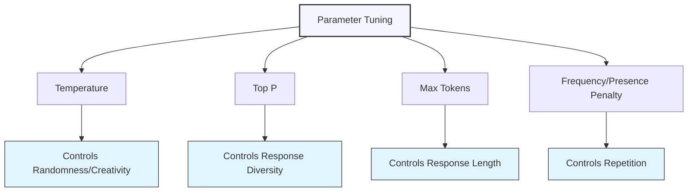

# Parameter Tuning for Customized Outputs

## Understanding AI Model Parameters

AI language models like ChatGPT allow users to adjust various parameters that control how the model generates text. These parameters influence aspects such as creativity, response length, and style—allowing for fine-tuned outputs that match specific requirements.

### Why Parameter Tuning Matters

Parameter tuning is essential for achieving outputs that match your specific requirements:

1. **Task-appropriate creativity** - Balancing innovation with reliability for different contexts
2. **Efficient communication** - Controlling verbosity and focus in responses
3. **Stylistic consistency** - Maintaining appropriate tone and formality
4. **Resource optimization** - Managing computational costs and response time
5. **Experience customization** - Tailoring the interaction to specific user needs

## Key Parameters and Their Effects

Let's explore the most important parameters and how they influence AI outputs:

### Temperature

Temperature controls randomness and creativity in the model's responses. It affects how the model samples from possible next tokens.

  

    <h4>Lower Temperature (0.1-0.4)</h4>
    <ul>
      <li>More deterministic and predictable outputs</li>
      <li>Focuses on highly probable tokens</li>
      <li>More factual and conservative</li>
      <li>Less varied and creative</li>
      <li>Good for: factual Q&A, coding, logical reasoning</li>
    </ul>
  

  

    <h4>Higher Temperature (0.7-1.0+)</h4>
    <ul>
      <li>More random and diverse outputs</li>
      <li>Considers less probable tokens</li>
      <li>More creative and surprising</li>
      <li>May occasionally produce less coherent results</li>
      <li>Good for: creative writing, brainstorming, casual conversation</li>
    </ul>
  

  <h4>Example: Temperature Effects</h4>
  
<strong>Prompt:</strong> "Write a tagline for a new coffee shop called 'Lunar Brew'"

  
  
<strong>Low Temperature (0.2):</strong> "Enjoy out-of-this-world coffee at Lunar Brew."

  
  
<strong>Medium Temperature (0.7):</strong> "Where every sip takes you to the stars – Lunar Brew, coffee that's astronomically good."

  
  
<strong>High Temperature (1.0):</strong> "Gravity-defying flavors that eclipse the ordinary – Lunar Brew: One small sip for man, one giant leap for your taste buds."

### Top P (Nucleus Sampling)

Top P controls diversity by limiting token selection to a subset whose cumulative probability exceeds the specified threshold.

  

    <h4>Lower Top P (0.1-0.5)</h4>
    <ul>
      <li>Focuses on highest probability tokens</li>
      <li>More predictable and focused outputs</li>
      <li>Less variance in responses</li>
      <li>Good for: clear instructions, focused answers</li>
    </ul>
  

  

    <h4>Higher Top P (0.7-1.0)</h4>
    <ul>
      <li>Considers a wider range of possible tokens</li>
      <li>More diverse and varied outputs</li>
      <li>Allows for more creative possibilities</li>
      <li>Good for: creative tasks, exploring possibilities</li>
    </ul>
  

  
<strong>Important:</strong> Temperature and Top P are typically not used together, as they both control randomness but in different ways. Usually, you would adjust one while keeping the other at its default value (often Top P=1 when using Temperature, or Temperature=1 when using Top P).

### Max Tokens

Max Tokens limits the maximum length of the model's response, measured in tokens (roughly 4 characters or 0.75 words in English).

  

    <h4>Lower Max Tokens (50-150)</h4>
    <ul>
      <li>Brief, concise responses</li>
      <li>Forces focus on key information</li>
      <li>Faster response time</li>
      <li>Good for: quick answers, summaries, headlines</li>
    </ul>
  

  

    <h4>Higher Max Tokens (500-4000+)</h4>
    <ul>
      <li>More comprehensive, detailed responses</li>
      <li>Allows for in-depth explanations</li>
      <li>Enables multi-part answers</li>
      <li>Good for: detailed explanations, creative writing, complex analysis</li>
    </ul>
  

  <h4>Example: Max Tokens Effects</h4>
  
<strong>Prompt:</strong> "Explain how blockchain works"

  
  
<strong>Low Max Tokens (100):</strong> "Blockchain is a distributed, immutable ledger that records transactions across many computers. Each block contains data and a hash pointing to the previous block, creating a chain. This structure makes it secure and resistant to modification, as altering one block would require changing all subsequent blocks."

  
  
<strong>High Max Tokens (1000):</strong> [A comprehensive explanation covering distributed ledger technology, consensus mechanisms, cryptographic hashing, blocks and chains structure, public vs. private blockchains, smart contracts, real-world applications, and current limitations]

### Frequency Penalty

Frequency Penalty reduces the likelihood of repeating the same tokens that have already appeared in the response.

  

    <h4>Lower Frequency Penalty (0.0-0.3)</h4>
    <ul>
      <li>May repeat similar phrases or ideas</li>
      <li>Can emphasize key points through repetition</li>
      <li>More natural for certain styles like poetry</li>
      <li>Good for: when consistency is valuable</li>
    </ul>
  

  

    <h4>Higher Frequency Penalty (0.7-2.0)</h4>
    <ul>
      <li>Actively avoids repeating tokens</li>
      <li>More varied vocabulary and phrasing</li>
      <li>Explores diverse ideas and perspectives</li>
      <li>Good for: brainstorming, creative variety</li>
    </ul>
  

### Presence Penalty

Presence Penalty reduces the likelihood of covering topics that have already been mentioned in the response.

  

    <h4>Lower Presence Penalty (0.0-0.3)</h4>
    <ul>
      <li>Allows deeper exploration of mentioned topics</li>
      <li>May focus intensely on introduced concepts</li>
      <li>Good for: deep dives into specific subjects</li>
    </ul>
  

  

    <h4>Higher Presence Penalty (0.7-2.0)</h4>
    <ul>
      <li>Encourages coverage of new topics</li>
      <li>More topically diverse content</li>
      <li>Avoids dwelling on previously mentioned concepts</li>
      <li>Good for: expansive brainstorming, diverse idea generation</li>
    </ul>
  

  <h4>Example: Frequency and Presence Penalty Effects</h4>
  
<strong>Prompt:</strong> "List potential uses for AI in healthcare"

  
  
<strong>Low Penalties (0.1):</strong> [Response focuses deeply on diagnostic applications, with multiple examples and aspects of AI diagnosis explored in detail]

  
  
<strong>High Penalties (1.5):</strong> [Response covers a wide range of applications briefly: diagnosis, treatment planning, administrative efficiency, drug discovery, personalized medicine, remote monitoring, surgical robotics, etc.]

## Strategic Parameter Selection for Different Tasks

Different tasks benefit from different parameter configurations. Here are recommended settings for common use cases:

### Factual Questions and Information Retrieval

  <table>
    <tr>
      <th>Parameter</th>
      <th>Recommended Setting</th>
      <th>Rationale</th>
    </tr>
    <tr>
      <td>Temperature</td>
      <td>0.1-0.3</td>
      <td>Low temperature for more deterministic, factual responses</td>
    </tr>
    <tr>
      <td>Max Tokens</td>
      <td>250-500</td>
      <td>Enough for complete answers without unnecessary elaboration</td>
    </tr>
    <tr>
      <td>Frequency Penalty</td>
      <td>0.0-0.2</td>
      <td>Allow some repetition for emphasis of key facts</td>
    </tr>
    <tr>
      <td>Presence Penalty</td>
      <td>0.0-0.2</td>
      <td>Stay focused on the specific question</td>
    </tr>
  </table>

  <h4>Example: Factual Query Settings</h4>
  <pre>
{
  "model": "gpt-4",
  "temperature": 0.2,
  "max_tokens": 300,
  "frequency_penalty": 0.1,
  "presence_penalty": 0.1
}

Prompt: "What causes ocean tides and how do they work?"</pre>

### Creative Writing and Storytelling

  <table>
    <tr>
      <th>Parameter</th>
      <th>Recommended Setting</th>
      <th>Rationale</th>
    </tr>
    <tr>
      <td>Temperature</td>
      <td>0.7-1.0</td>
      <td>Higher temperature for creative, varied, and unexpected elements</td>
    </tr>
    <tr>
      <td>Max Tokens</td>
      <td>500-2000+</td>
      <td>Allow space for narrative development</td>
    </tr>
    <tr>
      <td>Frequency Penalty</td>
      <td>0.5-1.2</td>
      <td>Encourage varied vocabulary and phrasing</td>
    </tr>
    <tr>
      <td>Presence Penalty</td>
      <td>0.5-1.0</td>
      <td>Encourage plot development and new elements</td>
    </tr>
  </table>

  <h4>Example: Creative Writing Settings</h4>
  <pre>
{
  "model": "gpt-4",
  "temperature": 0.9,
  "max_tokens": 1000,
  "frequency_penalty": 0.8,
  "presence_penalty": 0.7
}

Prompt: "Write a short story about a lighthouse keeper who discovers something unexpected washed up on shore."</pre>

### Business and Technical Writing

  <table>
    <tr>
      <th>Parameter</th>
      <th>Recommended Setting</th>
      <th>Rationale</th>
    </tr>
    <tr>
      <td>Temperature</td>
      <td>0.3-0.5</td>
      <td>Balanced setting for clarity with appropriate flexibility</td>
    </tr>
    <tr>
      <td>Max Tokens</td>
      <td>400-800</td>
      <td>Enough for comprehensive coverage without excess</td>
    </tr>
    <tr>
      <td>Frequency Penalty</td>
      <td>0.2-0.4</td>
      <td>Moderate variety while maintaining consistency</td>
    </tr>
    <tr>
      <td>Presence Penalty</td>
      <td>0.2-0.4</td>
      <td>Focused content with appropriate transitions between topics</td>
    </tr>
  </table>

  <h4>Example: Business Writing Settings</h4>
  <pre>
{
  "model": "gpt-4",
  "temperature": 0.4,
  "max_tokens": 600,
  "frequency_penalty": 0.3,
  "presence_penalty": 0.3
}

Prompt: "Draft a project status update email for stakeholders about our product launch delay."</pre>

### Brainstorming and Idea Generation

  <table>
    <tr>
      <th>Parameter</th>
      <th>Recommended Setting</th>
      <th>Rationale</th>
    </tr>
    <tr>
      <td>Temperature</td>
      <td>0.8-1.1</td>
      <td>High temperature to encourage diverse, creative ideas</td>
    </tr>
    <tr>
      <td>Max Tokens</td>
      <td>500-1000</td>
      <td>Sufficient space for multiple ideas with brief explanations</td>
    </tr>
    <tr>
      <td>Frequency Penalty</td>
      <td>0.9-1.5</td>
      <td>High penalty to encourage diverse vocabulary and concepts</td>
    </tr>
    <tr>
      <td>Presence Penalty</td>
      <td>1.0-1.8</td>
      <td>High penalty to push for topical diversity</td>
    </tr>
  </table>

  <h4>Example: Brainstorming Settings</h4>
  <pre>
{
  "model": "gpt-4",
  "temperature": 1.0,
  "max_tokens": 800,
  "frequency_penalty": 1.2,
  "presence_penalty": 1.5
}

Prompt: "Generate unconventional marketing strategies for an eco-friendly home cleaning product."</pre>

### Code Generation and Debugging

  <table>
    <tr>
      <th>Parameter</th>
      <th>Recommended Setting</th>
      <th>Rationale</th>
    </tr>
    <tr>
      <td>Temperature</td>
      <td>0.1-0.3</td>
      <td>Low temperature for precise, deterministic code output</td>
    </tr>
    <tr>
      <td>Max Tokens</td>
      <td>500-1000</td>
      <td>Sufficient space for code plus explanations</td>
    </tr>
    <tr>
      <td>Frequency Penalty</td>
      <td>0.0-0.2</td>
      <td>Allow consistent syntax and terminology in technical contexts</td>
    </tr>
    <tr>
      <td>Presence Penalty</td>
      <td>0.0-0.2</td>
      <td>Stay focused on the specific technical solution</td>
    </tr>
  </table>

  <h4>Example: Code Generation Settings</h4>
  <pre>
{
  "model": "gpt-4",
  "temperature": 0.2,
  "max_tokens": 800,
  "frequency_penalty": 0.1,
  "presence_penalty": 0.1
}

Prompt: "Write a Python function that takes a list of integers and returns a new list containing only the prime numbers."</pre>

## Advanced Parameter Tuning Strategies

Beyond basic parameter settings, consider these advanced approaches:

### Dynamic Parameter Adjustment

Adjust parameters within a single session based on the current phase of work.

  <h4>Example: Dynamic Parameters for Content Creation</h4>
  <pre>
// Initial brainstorming phase
{
  "temperature": 1.0,
  "max_tokens": 500,
  "frequency_penalty": 1.0,
  "presence_penalty": 1.5
}

// Refinement phase - choosing and developing a specific idea
{
  "temperature": 0.7,
  "max_tokens": 1000,
  "frequency_penalty": 0.5,
  "presence_penalty": 0.5
}

// Final polishing phase - precise editing and formatting
{
  "temperature": 0.3,
  "max_tokens": 1500,
  "frequency_penalty": 0.2,
  "presence_penalty": 0.2
}</pre>

### Parameter Combinations for Specific Styles

Create parameter "presets" that produce particular stylistic effects.

  <h4>Example: Parameter Combinations for Different Writing Styles</h4>
  <pre>
// Academic/Technical Style
{
  "temperature": 0.2,
  "max_tokens": 800,
  "frequency_penalty": 0.1,
  "presence_penalty": 0.1
}

// Conversational/Casual Style
{
  "temperature": 0.7,
  "max_tokens": 400,
  "frequency_penalty": 0.6,
  "presence_penalty": 0.6
}

// Concise/Executive Style
{
  "temperature": 0.3,
  "max_tokens": 200,
  "frequency_penalty": 0.4,
  "presence_penalty": 0.5
}

// Narrative/Storytelling Style
{
  "temperature": 0.8,
  "max_tokens": 1200,
  "frequency_penalty": 0.7,
  "presence_penalty": 0.4
}</pre>

### A/B Testing Parameter Settings

When optimizing for specific use cases, systematically test different parameter combinations.

  <h4>Example: A/B Testing for Marketing Copy</h4>
  <pre>
// Version A: More focused, deterministic
{
  "temperature": 0.4,
  "max_tokens": 300,
  "frequency_penalty": 0.3,
  "presence_penalty": 0.3
}

// Version B: More creative, varied
{
  "temperature": 0.8,
  "max_tokens": 300,
  "frequency_penalty": 0.7,
  "presence_penalty": 0.7
}

// Prompt for both versions:
"Write a product description for our new noise-cancelling headphones."

// Evaluate which version performs better with target audience</pre>

### Combining Parameter Tuning with Other Techniques

For maximum control, combine parameter tuning with other prompting techniques.

  <h4>Example: Combined Approach</h4>
  <pre>
// System Message
"You are a marketing expert specializing in compelling B2B technology messaging. 
Your writing is concise, benefit-focused, and uses evidence to build credibility."

// Parameters
{
  "temperature": 0.6,
  "max_tokens": 500,
  "frequency_penalty": 0.5,
  "presence_penalty": 0.4
}

// Few-shot examples
"Example 1: [input] → [output]
Example 2: [input] → [output]"

// Chain-of-thought instruction
"Think step by step about the target audience, their pain points, and how this 
solution addresses them, then draft the copy."

// Actual prompt
"Write a landing page headline and three bullet points for our AI-powered 
contract analysis software that helps legal teams review documents 70% faster."</pre>

## Parameters in Different AI Models

Parameter effects can vary between different AI models and versions. Here are some key differences:

  <table>
    <tr>
      <th>Parameter Considerations</th>
      <th>GPT-3.5</th>
      <th>GPT-4</th>
    </tr>
    <tr>
      <td>Temperature Sensitivity</td>
      <td>More dramatic effects with temperature changes</td>
      <td>More nuanced, gradual changes with temperature adjustments</td>
    </tr>
    <tr>
      <td>Max Tokens Efficiency</td>
      <td>May require more tokens for complex responses</td>
      <td>Often more efficient with token usage</td>
    </tr>
    <tr>
      <td>Penalty Response</td>
      <td>Sometimes requires higher penalty values for desired effect</td>
      <td>Often responds well to more moderate penalty values</td>
    </tr>
    <tr>
      <td>Optimal Creativity Range</td>
      <td>Temperature 0.7-0.9 often best for creative tasks</td>
      <td>Temperature 0.8-1.0 may provide better creative results</td>
    </tr>
  </table>

  
<strong>Important:</strong> All parameter recommendations should be treated as starting points. The "best" settings will depend on your specific use case, the exact prompt, and your personal preferences.

## Common Pitfalls and How to Avoid Them

### 1. Over-Optimization for Creativity

  <h4>❌ Problem:</h4>
  
Setting temperature very high (>1.2) for all creative tasks, resulting in incoherent or excessively random outputs.

  
  <h4>✅ Better Approach:</h4>
  
Start with moderate temperature settings (0.7-0.9) for creative tasks, then incrementally adjust based on results. Balance creativity with coherence based on your specific needs.

### 2. Excessive Response Length

  <h4>❌ Problem:</h4>
  
Setting very high max tokens (>2000) for all tasks, resulting in unnecessarily verbose responses that may contain repetitive or low-value content.

  
  <h4>✅ Better Approach:</h4>
  
Match max tokens to the complexity of the task. For most general questions, 300-500 tokens is sufficient. Only use higher values when detailed explanations or creative works are needed.

### 3. Parameter Interference

  <h4>❌ Problem:</h4>
  
Setting both temperature and top P to non-default values, or using high penalties for precision tasks, leading to unpredictable results.

  
  <h4>✅ Better Approach:</h4>
  
Focus on adjusting one primary randomness parameter (either temperature or top P). Use penalties sparingly for technical or factual content, reserving higher values for creative or divergent thinking tasks.

### 4. Static Parameters Across Session Phases

  <h4>❌ Problem:</h4>
  
Using the same parameter settings throughout a multi-stage process (e.g., brainstorming → development → refinement).

  
  <h4>✅ Better Approach:</h4>
  
Adapt parameters to match the current phase of work. Use higher temperature/penalties during exploration and ideation, then reduce them during refinement and finalization.

## Practical Parameter Tuning Framework

Follow this systematic approach to find optimal parameters for your use cases:

### 1. Task Analysis

Begin by clarifying the nature of your task:
- What type of content are you generating? (factual, creative, technical, etc.)
- What qualities are most important? (accuracy, creativity, variety, conciseness)
- What are your expectations for tone and style?

### 2. Baseline Testing

Start with recommended parameter presets based on similar use cases:
- Select the preset closest to your task type from the examples in this lesson
- Run several test prompts to evaluate results
- Note specific strengths and weaknesses in the outputs

### 3. Iterative Refinement

Systematically adjust one parameter at a time:
- Change temperature in increments of 0.1-0.2
- Adjust penalties in increments of 0.2-0.3
- Test max tokens in different ranges based on desired output length

### 4. Validation and Documentation

Once you find effective settings:
- Test with multiple different prompts in the same category
- Document successful parameter combinations for future use
- Note any prompt-specific adjustments that may be needed

  <h4>Example: Parameter Tuning Worksheet</h4>
  <pre>
Task Category: Product Description Generation

Starting Parameters:
- Temperature: 0.5
- Max Tokens: 400
- Frequency Penalty: 0.3
- Presence Penalty: 0.3

Test Results:
- Test 1: Good technical accuracy but somewhat generic phrasing
  → Increase temperature to 0.6, increase frequency penalty to 0.5

- Test 2: Better phrasing variety but missed key technical details
  → Lower temperature to 0.55, increase max tokens to 500

- Test 3: Good balance of technical accuracy and engaging language
  → Keep these settings as optimal for this task

Final Optimized Parameters:
- Temperature: 0.55
- Max Tokens: 500
- Frequency Penalty: 0.5
- Presence Penalty: 0.3

Notes: For highly technical products, consider reducing temperature 
to 0.5. For lifestyle products, consider increasing to 0.6.</pre>

## Exercise: Parameter Tuning Practice

Apply parameter tuning to optimize outputs for these scenarios:

1. Generate a technical explanation of a complex concept for a beginner audience
2. Create varied marketing taglines for a new product
3. Draft a concise executive summary of a detailed report
4. Write a step-by-step tutorial with code examples
5. Generate diverse plot ideas for a short story

Document your parameter choices and reasoning here...

## Key Takeaways

- Parameter tuning allows fine control over AI-generated content characteristics
- Temperature primarily controls randomness and creativity in responses
- Max tokens limits response length and enforces concision
- Frequency and presence penalties reduce repetition and encourage diversity
- Different tasks benefit from specific parameter configurations
- Advanced strategies include dynamic adjustment, style presets, and A/B testing
- Combine parameter tuning with other prompting techniques for maximum control
- Systematic testing and refinement leads to optimal parameter settings

---

In the next lesson, we'll explore few-shot prompting for consistent outputs.

*Updated: May 2024* 