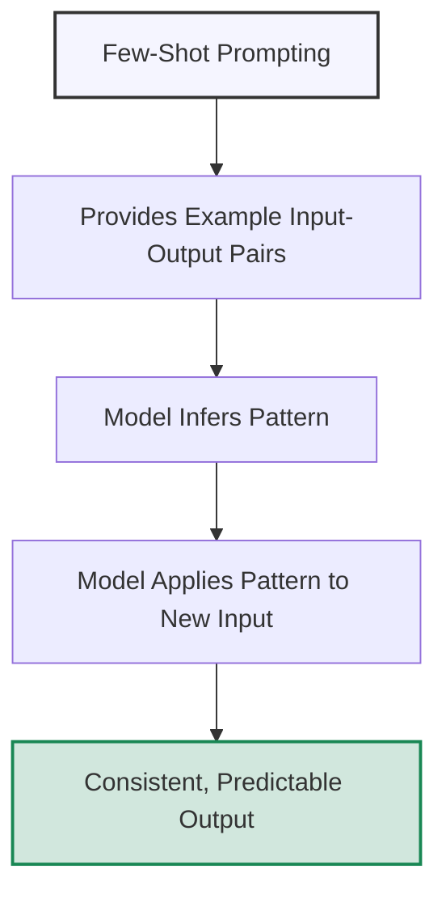

# Few-Shot Prompting for Consistent Outputs

## Understanding Few-Shot Prompting

Few-shot prompting is a powerful technique that uses examples within your prompt to guide AI models toward generating responses in a specific format, style, or approach. Rather than explicitly explaining what you want, you demonstrate it through examples, allowing the AI to recognize and follow patterns.



### Why Few-Shot Prompting Works

Few-shot prompting leverages the AI's ability to recognize patterns and generalize from limited examples:

1. **Pattern recognition** - AI systems excel at identifying and continuing patterns
2. **Implicit rule learning** - Examples often communicate rules more effectively than explicit instructions
3. **Context setting** - Examples establish a shared understanding of the task
4. **Demonstration over explanation** - Shows rather than tells what you want
5. **Format induction** - Clearly demonstrates the desired output format

## The Anatomy of Few-Shot Prompts

Effective few-shot prompts contain several important components:

### 1. Task Description (Optional)

A brief explanation of what you're asking the AI to do.

<div class="comparison-table">
  <div class="good">
    <h4>✅ Effective</h4>
    <p>"Below are examples of analyzing statements for logical fallacies. For each new statement, identify any fallacies present and explain why they qualify as that type of fallacy."</p>
  </div>
  <div class="bad">
    <h4>❌ Ineffective</h4>
    <p>"Here are some examples. Do the same for new inputs."</p>
  </div>
</div>

### 2. Example Input-Output Pairs

Clear demonstrations of the task with input and corresponding output.

<div class="comparison-table">
  <div class="good">
    <h4>✅ Effective</h4>
    <p><strong>Input:</strong> "What are the dimensions of an A4 paper?"<br>
    <strong>Output:</strong> "An A4 paper measures 210 × 297 millimeters or 8.27 × 11.69 inches."</p>
  </div>
  <div class="bad">
    <h4>❌ Ineffective</h4>
    <p><strong>Example:</strong> "A4 paper dimensions are 210 × 297 millimeters."</p>
  </div>
</div>

### 3. Clear Example Delimiters

Distinct markers that separate examples from each other and from the actual query.

<div class="comparison-table">
  <div class="good">
    <h4>✅ Effective</h4>
    <p>"Example 1:<br>
    [Input] What is photosynthesis?<br>
    [Output] Photosynthesis is the process by which green plants convert sunlight, water, and carbon dioxide into glucose and oxygen.<br><br>
    Example 2:<br>
    [Input] What is cellular respiration?<br>
    [Output] Cellular respiration is the process by which cells convert glucose and oxygen into energy, carbon dioxide, and water."</p>
  </div>
  <div class="bad">
    <h4>❌ Ineffective</h4>
    <p>"Photosynthesis is the process by which green plants convert sunlight, water, and carbon dioxide into glucose and oxygen. Cellular respiration is the process by which cells convert glucose and oxygen into energy, carbon dioxide, and water."</p>
  </div>
</div>

### 4. Query in Matching Format

Present your actual question in the same format as the example inputs.

<div class="comparison-table">
  <div class="good">
    <h4>✅ Effective</h4>
    <p>After providing examples with "[Input]" and "[Output]" labels:<br><br>
    "[Input] What is osmosis?"</p>
  </div>
  <div class="bad">
    <h4>❌ Ineffective</h4>
    <p>After providing examples with "[Input]" and "[Output]" labels:<br><br>
    "Now explain osmosis to me."</p>
  </div>
</div>

### 5. Variety in Examples (For Complex Tasks)

Examples that cover different scenarios or edge cases within the task domain.

<div class="comparison-table">
  <div class="good">
    <h4>✅ Effective</h4>
    <p>For a sentiment analysis task, including examples of positive, negative, neutral, and mixed sentiment responses.</p>
  </div>
  <div class="bad">
    <h4>❌ Ineffective</h4>
    <p>For a sentiment analysis task, only including examples of clearly positive or clearly negative responses.</p>
  </div>
</div>

## Strategic Applications of Few-Shot Prompting

Let's explore how few-shot prompting can be strategically applied to different scenarios:

### Consistent Formatting

Use few-shot prompts to establish specific output formats.

<div class="example-box">
  <h4>Example: Structured Article Summary</h4>
  <pre>
I need you to summarize news articles in a consistent format. Follow these examples:

Example 1:
Article: "The city council approved a new budget of $2.5 million for park renovations yesterday. Mayor Johnson emphasized that improving green spaces is a priority for this fiscal year. The project will begin next month with upgrades to playground equipment."

Summary:
TITLE: City Approves $2.5M for Park Renovations
KEY POINTS:
• Budget of $2.5 million approved for park renovations
• Mayor Johnson identified green spaces as a priority
• Project begins next month
• Initial focus on playground equipment upgrades
STAKEHOLDERS: City council, Mayor Johnson, park users
TIMELINE: Starting next month, continuing through fiscal year

Example 2:
Article: "Tech giant Nexus unveiled its latest smartphone yesterday, featuring an improved camera system and longer battery life. The new device, priced at $899, will be available in stores from October 15. Analysts predict strong sales despite the competitive market."

Summary:
TITLE: Nexus Unveils New Smartphone with Enhanced Features
KEY POINTS:
• New smartphone announced with improved camera and battery
• Priced at $899
• Available from October 15
• Analysts predict strong sales
STAKEHOLDERS: Nexus, consumers, market analysts, competitors
TIMELINE: Available October 15

Now, please summarize this article:
Article: "The university research team has secured a $1.2 million grant for their climate change study. The funds will support a two-year project examining the effects of rising temperatures on coastal ecosystems. Dr. Martinez, the lead researcher, says this work is crucial for developing effective conservation strategies."</pre>
</div>

### Specific Reasoning Patterns

Guide the model to follow particular reasoning approaches.

<div class="example-box">
  <h4>Example: Pros and Cons Analysis</h4>
  <pre>
I need balanced analyses of different technologies. Here are examples of the format to follow:

Example 1:
Technology: Electric Vehicles
Pros:
1. Zero direct emissions while driving, reducing air pollution in urban areas
2. Lower operating costs due to cheaper electricity compared to fossil fuels
3. Fewer moving parts, potentially resulting in lower maintenance requirements
4. Energy efficiency: EVs convert about 60% of electrical energy to power at the wheels

Cons:
1. Limited driving range compared to conventional vehicles
2. Longer refueling (charging) time
3. Production of batteries involves significant environmental impact
4. Electricity may still come from fossil fuel sources, depending on the grid

Example 2:
Technology: Cloud Computing
Pros:
1. Scalability: easy to increase or decrease resources based on demand
2. Reduced upfront infrastructure costs for businesses
3. Accessibility from multiple locations and devices
4. Automatic updates and maintenance handled by providers

Cons:
1. Requires reliable internet connection
2. Potential security and privacy vulnerabilities
3. Limited control over underlying infrastructure
4. Ongoing subscription costs may exceed one-time purchases long-term

Now, please analyze:
Technology: Facial Recognition Software</pre>
</div>

### Creative Writing Styles

Use examples to establish specific tones, voices, or literary styles.

<div class="example-box">
  <h4>Example: Hemingway-Inspired Writing</h4>
  <pre>
Generate responses in the style of Ernest Hemingway, known for short, direct sentences, 
minimal adjectives, and understated emotion. Here are examples:

Prompt: Describe a fishing trip.
Hemingway Style: The boat went out at dawn. The sea was calm. The old rod bent with 
the weight of something true. Sun and salt and struggle. The fish fought well. It 
jumped three times before coming in. We did not speak of its size later. We drank 
instead. The rum was good.

Prompt: Write about a café in Paris.
Hemingway Style: The café was clean and well-lighted. It was warm inside. Outside, 
the rain fell. The waiter brought another coffee without being asked. The bitter 
taste was right. People came in and shook off water. Their voices were low. At the 
next table, a woman wrote in a notebook. She did not look up. Paris was inside these walls.

Now, write in this style:
Prompt: Describe a boxing match.</pre>
</div>

### Consistent Data Transformations

Demonstrate how to convert information from one format to another.

<div class="example-box">
  <h4>Example: Converting Text Requirements to JSON Schema</h4>
  <pre>
Task: Convert plain English descriptions of data objects into valid JSON schema definitions.

Example 1:
Input: "Create a schema for a Person object with a required name (string), age (number), 
and optional email (string in email format)."

Output:
```json
{
  "type": "object",
  "properties": {
    "name": { 
      "type": "string",
      "description": "The person's full name"
    },
    "age": { 
      "type": "number",
      "description": "The person's age in years"
    },
    "email": {
      "type": "string",
      "format": "email",
      "description": "The person's email address"
    }
  },
  "required": ["name", "age"]
}
```

Example 2:
Input: "Define a Book schema with required title and author fields (both strings), 
a required year (integer), and an optional array of string tags."

Output:
```json
{
  "type": "object",
  "properties": {
    "title": {
      "type": "string",
      "description": "The book's title"
    },
    "author": {
      "type": "string",
      "description": "The book's author"
    },
    "year": {
      "type": "integer",
      "description": "Publication year"
    },
    "tags": {
      "type": "array",
      "items": {
        "type": "string"
      },
      "description": "Categorization tags for the book"
    }
  },
  "required": ["title", "author", "year"]
}
```

Now, convert this requirement:
Input: "Create a Product schema with a required name, price (number), description (string), 
and an optional inventory_count (integer that must be non-negative)."</pre>
</div>

## Advanced Few-Shot Techniques

For more sophisticated applications, consider these advanced techniques:

### 1. Cross-Domain Few-Shot Learning

Demonstrate how to apply a pattern from one domain to another related domain.

<div class="example-box">
  <h4>Example: Cross-Domain Translation</h4>
  <pre>
Task: Translate concepts between different fields using appropriate terminology.

Example 1:
Computing → Architecture
Input: "Modular programming allows developers to build independent, interchangeable 
components that can be tested separately."
Output: "Modular design allows architects to create independent, interchangeable 
spatial elements that can be prototyped separately."

Example 2:
Biology → Business
Input: "Organisms adapt to environmental pressures through natural selection, 
favoring traits that enhance survival."
Output: "Companies adapt to market pressures through competitive selection, 
favoring strategies that enhance profitability."

Now translate:
Psychology → Marketing
Input: "Cognitive dissonance occurs when people experience discomfort from holding 
contradictory beliefs or values."</pre>
</div>

### 2. Progressive Few-Shot Examples

Arrange examples in order of increasing complexity to guide the model through a learning curve.

<div class="example-box">
  <h4>Example: Progressive Math Problem Solving</h4>
  <pre>
I'll solve progressively more complex algebraic word problems:

Example 1 (Simple):
Problem: "If x + 5 = 12, what is the value of x?"
Solution:
1) I need to isolate x by subtracting 5 from both sides
2) x + 5 - 5 = 12 - 5
3) x = 7
Therefore, x = 7

Example 2 (Intermediate):
Problem: "A bookstore sold 3 hardcovers and 5 paperbacks for $95. The next day, it sold 
5 hardcovers and 2 paperbacks for $110. What is the price of each type of book?"
Solution:
1) Let's define variables:
   - Let h = price of one hardcover
   - Let p = price of one paperback
2) Create a system of equations:
   - 3h + 5p = 95 (first day)
   - 5h + 2p = 110 (second day)
3) Solve for h using elimination:
   - Multiply the first equation by 2: 6h + 10p = 190
   - Multiply the second equation by 5: 25h + 10p = 550
   - Subtract: 6h + 10p - (25h + 10p) = 190 - 550
   - -19h = -360
   - h = 360/19 = 18.95
4) Substitute back to find p:
   - 3(18.95) + 5p = 95
   - 56.85 + 5p = 95
   - 5p = 38.15
   - p = 7.63
Therefore, hardcovers cost $18.95 and paperbacks cost $7.63

Example 3 (Advanced):
Problem: "A company makes two products, X and Y. Each product X requires 2 hours of 
assembly and 1 hour of finishing. Each product Y requires 1 hour of assembly and 3 hours 
of finishing. The company has 100 hours of assembly time and 120 hours of finishing time 
available per week. If the profit is $30 for each product X and $40 for each product Y, 
how many of each should be produced to maximize profit?"
Solution: 
[Your solution for the advanced example...]

Now solve this problem:
Problem: "A mixture of 20% alcohol solution is to be mixed with a 50% alcohol solution to 
obtain 10 liters of a 30% solution. How many liters of each solution should be used?"</pre>
</div>

### 3. Counterfactual Few-Shot Examples

Include both correct and incorrect examples with explanations of why they're right or wrong.

<div class="example-box">
  <h4>Example: Code Debugging</h4>
  <pre>
I'll analyze Python code snippets and fix bugs, explaining my reasoning:

Example 1:
Buggy Code:
```python
def calculate_average(numbers):
    total = 0
    for num in numbers:
        total += num
    return total / len(numbers)
```

Error Case:
calculate_average([])

Bug Analysis:
This function will raise a ZeroDivisionError when given an empty list because it attempts 
to divide by len(numbers), which is 0. This is a common edge case to check for.

Fixed Code:
```python
def calculate_average(numbers):
    if not numbers:
        return 0  # Or return None, or raise a ValueError, depending on requirements
    total = 0
    for num in numbers:
        total += num
    return total / len(numbers)
```

Example 2:
Buggy Code:
```python
def find_largest(numbers):
    largest = 0
    for num in numbers:
        if num > largest:
            largest = num
    return largest
```

Error Case:
find_largest([-5, -10, -2])

Bug Analysis:
This function incorrectly initializes largest to 0, which means it will return 0 for lists 
containing only negative numbers, even though 0 isn't in the list. It should initialize 
largest to the first element or use Python's built-in max() function.

Fixed Code:
```python
def find_largest(numbers):
    if not numbers:
        return None  # Handle empty list case
    largest = numbers[0]
    for num in numbers:
        if num > largest:
            largest = num
    return largest
```

Now debug this code:
Buggy Code:
```python
def remove_duplicates(items):
    result = []
    for item in items:
        if item not in result:
            result.append(item)
    return result
```

Error Case:
remove_duplicates([1, 2, 3, 4, 5] * 1000)  # Large list with duplicates</pre>
</div>

### 4. Parameterized Few-Shot Examples

Include examples with different parameters that systematically vary to demonstrate the impact of those parameters.

<div class="example-box">
  <h4>Example: Tone Adjustment</h4>
  <pre>
I'll rewrite the same message with different tone parameters to demonstrate how tone affects 
communication:

Original Message: "We need to discuss the project timeline. The current pace isn't meeting our deadlines."

Rewrite (Formal, 9/10):
"I would like to request a discussion regarding the project timeline at your earliest convenience. 
Upon review, it appears that our current rate of progress is insufficient to meet the established deadlines."

Rewrite (Friendly, 8/10):
"Hey there! I think we should have a chat about how the project is progressing timeline-wise. 
It seems like we might need to pick up the pace a bit to hit those deadlines we agreed on. What do you think?"

Rewrite (Direct, 9/10):
"We need to discuss the project timeline immediately. Our current pace is too slow and will cause us to miss our deadlines."

Rewrite (Empathetic, 8/10):
"I understand everyone's been working hard, and I know timelines can be challenging. I think we need to talk about the project schedule though, as I'm concerned we may struggle to meet our deadlines at our current pace."

Rewrite (Urgent, 10/10):
"URGENT: Project timeline meeting required ASAP. Current progress rate will certainly cause deadline failure. This requires immediate attention."

Please rewrite this message with a Collaborative tone (7/10):
"The marketing department didn't provide the assets we requested. This is delaying our website update."</pre>
</div>

## Few-Shot Templates for Common Use Cases

Here are reusable templates for different types of tasks:

### Content Transformation Template

```
# Content Transformation Task

I'll transform content from [source format] to [target format] following these examples:

## Example 1:
Original [source format]:
[First example original content]

Transformed [target format]:
[First example transformed content]

## Example 2:
Original [source format]:
[Second example original content]

Transformed [target format]:
[Second example transformed content]

## Example 3:
Original [source format]:
[Third example original content]

Transformed [target format]:
[Third example transformed content]

## Now transform this:
Original [source format]:
[Content to be transformed]
```

### Analysis Pattern Template

```
# [Type of Analysis] Analysis Pattern

I'll analyze [subjects] according to the following structure and examples:

## Example Analysis 1:
Subject: [First example subject]

Analysis:
1. [First aspect]:
   [Analysis of first aspect for first subject]
  
2. [Second aspect]:
   [Analysis of second aspect for first subject]
  
3. [Third aspect]:
   [Analysis of third aspect for first subject]
  
Summary: [Brief conclusion about first subject]

## Example Analysis 2:
Subject: [Second example subject]

Analysis:
1. [First aspect]:
   [Analysis of first aspect for second subject]
  
2. [Second aspect]:
   [Analysis of second aspect for second subject]
  
3. [Third aspect]:
   [Analysis of third aspect for second subject]
  
Summary: [Brief conclusion about second subject]

## Now analyze:
Subject: [Subject to be analyzed]
```

### Comparative Evaluation Template

```
# Comparative Evaluation Framework

I'll evaluate options based on specific criteria, following these examples:

## Example Comparison 1:
Options being compared: [List of options in first example]

Evaluation Criteria:
1. [First criterion]:
   - Option A: [Evaluation] - Score: [X/10]
   - Option B: [Evaluation] - Score: [X/10]
   - Option C: [Evaluation] - Score: [X/10]

2. [Second criterion]:
   - Option A: [Evaluation] - Score: [X/10]
   - Option B: [Evaluation] - Score: [X/10]
   - Option C: [Evaluation] - Score: [X/10]

Overall Recommendation: [Recommendation with justification]

## Example Comparison 2:
Options being compared: [List of options in second example]

Evaluation Criteria:
1. [First criterion]:
   - Option A: [Evaluation] - Score: [X/10]
   - Option B: [Evaluation] - Score: [X/10]

2. [Second criterion]:
   - Option A: [Evaluation] - Score: [X/10]
   - Option B: [Evaluation] - Score: [X/10]

Overall Recommendation: [Recommendation with justification]

## Now compare:
Options being compared: [List of options to evaluate]
```

## Common Pitfalls and How to Avoid Them

### 1. Too Few Examples

<div class="mistake-box">
  <h4>❌ Problem:</h4>
  <p>Providing only one example, which doesn't give enough information to establish a clear pattern.</p>
  
  <h4>✅ Better Approach:</h4>
  <p>For most tasks, include at least 2-3 examples to establish a clear pattern. For complex or nuanced tasks, consider using 4-5 examples that demonstrate different variations or edge cases.</p>
</div>

### 2. Inconsistent Example Formats

<div class="mistake-box">
  <h4>❌ Problem:</h4>
  <p>Using different formats, structures, or styles across your example set, sending mixed signals about what you expect.</p>
  
  <h4>✅ Better Approach:</h4>
  <p>Ensure all examples follow the exact same format and structure. Use consistent labeling, terminology, and separators throughout your examples.</p>
</div>

### 3. Examples Too Similar to Each Other

<div class="mistake-box">
  <h4>❌ Problem:</h4>
  <p>Providing examples that are nearly identical, which fails to demonstrate how to handle variation.</p>
  
  <h4>✅ Better Approach:</h4>
  <p>Include examples that vary meaningfully while still following the same pattern. For instance, if demonstrating a response format for questions, include examples of how to handle yes/no questions, open-ended questions, and multi-part questions.</p>
</div>

### 4. Unclear Delineation Between Examples

<div class="mistake-box">
  <h4>❌ Problem:</h4>
  <p>Not clearly marking where one example ends and another begins, making it difficult for the AI to identify distinct examples.</p>
  
  <h4>✅ Better Approach:</h4>
  <p>Use consistent, clear delimiters between examples such as numbered headers, horizontal lines, or consistent labeling (Example 1:, Example 2:, etc.).</p>
</div>

## Optimizing Few-Shot Performance

To get the best results from few-shot prompting, consider these optimization strategies:

### 1. Example Selection

Choose examples that best represent what you want from the model:

- **Representative of expected inputs** - Examples should mirror the types of inputs the model will actually encounter
- **Appropriately varied** - Include enough diversity to cover the space of expected inputs
- **Clear and unambiguous** - Avoid examples that could be interpreted in multiple ways
- **Ordered by relevance** - Place the most relevant examples closer to your query

### 2. Example Ordering

The order of examples matters due to recency effects:

- **Increasing complexity** - Start with simpler examples and progress to more complex ones
- **Recency priority** - Place examples most similar to your target query last in your sequence
- **Logical progression** - Arrange examples to build conceptually on each other when appropriate

### 3. Contextual Efficiency

Be mindful of context limits and token usage:

- **Conciseness** - Make examples clear but concise to maximize the number you can include
- **Token optimization** - With models that have context limits, focus on the most important aspects
- **Selective detail** - Include detail only where it demonstrates an important aspect of the pattern

### 4. Integration with Other Techniques

Combine few-shot prompting with other prompting techniques:

- **Chain-of-thought examples** - Demonstrate reasoning processes through examples that show step-by-step thinking
- **System message guidance** - Use system messages to establish general rules, then few-shot examples to demonstrate specifics
- **Parameter tuning** - Adjust temperature and other parameters alongside few-shot prompting for optimal results

## Exercise: Crafting Few-Shot Prompts

Practice creating effective few-shot prompts for these scenarios:

1. Generate product descriptions in a consistent style based on feature lists
2. Extract structured data (name, date, amount) from informal text descriptions of financial transactions 
3. Create examples showing how to rewrite academic content for a middle school audience
4. Demonstrate how to provide balanced feedback on creative writing samples
5. Show examples of converting customer service inquiries into support ticket summaries

<div class="solution-space" style="height: 250px; border: 1px dashed #ccc; padding: 10px; margin-top: 10px;">
Write your few-shot prompts here...
</div>

## Key Takeaways

- Few-shot prompting uses examples to demonstrate the desired output pattern, format, or reasoning process
- Effective few-shot prompts include clear task descriptions, well-structured examples, distinct delimiters, and queries in matching format
- Strategic applications include establishing consistent formats, guiding specific reasoning patterns, defining creative styles, and demonstrating data transformations
- Advanced techniques include cross-domain learning, progressive examples, counterfactual examples, and parameterized examples
- Common pitfalls include using too few examples, inconsistent formatting, overly similar examples, and unclear delineation
- Optimizing few-shot performance involves strategic example selection, careful ordering, contextual efficiency, and integration with other techniques

---

In the next and final lesson of this module, we'll explore techniques for prompting with fine-tuned models.

*Updated: May 2024* 