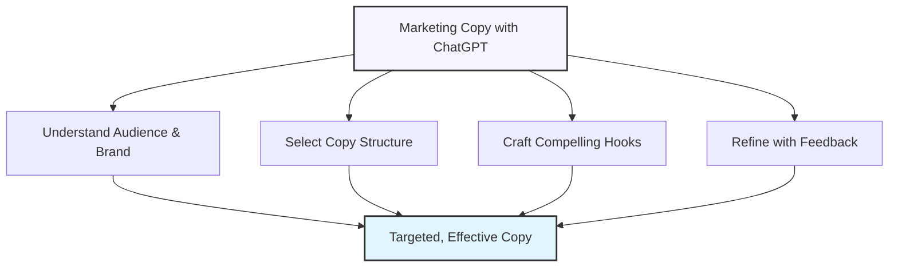

# Writing Compelling Marketing Copy

## The Art and Science of AI-Powered Marketing Copy

Marketing copy needs to captivate, persuade, and drive action—all while reflecting your brand's unique voice. ChatGPT is a powerful ally for marketers, helping craft compelling messages that resonate with target audiences. This lesson explores how to leverage AI to create high-converting marketing copy across various formats and platforms.

## Core Principles of Effective Marketing Copy

Before diving into specific techniques, let's explore the foundational principles that make marketing copy effective:

### 1. Audience-Centered Approach

Always start with a deep understanding of your target audience.

  

    <h4>✅ Effective</h4>
    
"As a busy parent juggling work and family, imagine reclaiming an hour each day with our meal prep service."

  

  

    <h4>❌ Ineffective</h4>
    
"Our meal prep service helps people save time."

  

### 2. Clear Value Proposition

Articulate what makes your offering unique and valuable.

  

    <h4>✅ Effective</h4>
    
"The only project management tool designed specifically for remote creative teams, reducing feedback cycles by 60%."

  

  

    <h4>❌ Ineffective</h4>
    
"A great project management tool with lots of features for teams."

  

### 3. Compelling Hooks

Capture attention immediately with a powerful opening.

  

    <h4>✅ Effective</h4>
    
"What if your website could generate leads while you sleep? Our AI-powered chatbot turns 40% more visitors into qualified leads—even at 3 AM."

  

  

    <h4>❌ Ineffective</h4>
    
"We offer chatbot services for websites that help with lead generation."

  

### 4. Scannable Structure

Format your copy to accommodate skimming and highlight key points.

  

    <h4>✅ Effective</h4>
    
Using subheadings, bullet points, short paragraphs, and strategic bolding to highlight key benefits and make content easy to scan.

  

  

    <h4>❌ Ineffective</h4>
    
Dense blocks of text with important information buried deep within paragraphs, requiring careful reading to extract value.

  

### 5. Benefit-Focused Language

Emphasize outcomes rather than features.

  

    <h4>✅ Effective</h4>
    
"Build muscular strength and cardiovascular endurance in just 20 minutes a day with our high-intensity interval program, even if you have a packed schedule."

  

  

    <h4>❌ Ineffective</h4>
    
"Our program includes 15 different exercises and comes with an instruction manual."

  

## Crafting Marketing Copy with ChatGPT

Now let's explore how to leverage ChatGPT to create effective marketing messages:

### Step 1: Define Your Campaign Parameters

Start by clearly instructing ChatGPT about your specific requirements.

  <h4>Example: Campaign Parameter Prompt</h4>
  <pre>
I need marketing copy for [product/service] targeting [specific audience].

Key details:
• Primary benefit: [main value proposition]
• Key features: [list 2-3 most important features]
• Customer pain points: [list 1-2 problems your product solves]
• Brand voice: [e.g., professional, conversational, humorous, etc.]
• Call to action: [desired next step]
• Format: [e.g., email subject line, Facebook ad, product description]
• Length: [word count or character limit]

The copy should emphasize [specific angle or approach] and avoid [any topics or approaches to exclude].</pre>

### Step 2: Generate Multiple Variations

Ask ChatGPT to create different versions to explore diverse approaches.

  <h4>Example: Variation Request</h4>
  <pre>
Please generate 3 different approaches for this marketing copy:

1. An emotionally-driven narrative that focuses on the transformation
2. A data-backed, results-oriented approach highlighting proven outcomes
3. A problem-solution framework that emphasizes pain point resolution

For each approach, please include a headline and body copy.</pre>

### Step 3: Refine with Specific Feedback

Guide ChatGPT to improve its outputs based on strategic marketing principles.

  <h4>Example: Refinement Prompt</h4>
  <pre>
I like approach #2, but would like to refine it further:

1. Make the headline more attention-grabbing by incorporating a surprising statistic
2. Strengthen the proof elements by adding a brief customer success example
3. Simplify the language in paragraph 2 – aim for a 7th-grade reading level
4. Make the call-to-action more urgent by adding a time-sensitive element
5. Incorporate the power words "transform," "proven," and "guaranteed" naturally</pre>

## Strategic Applications for Different Marketing Formats

Let's explore how to tailor your ChatGPT prompts for specific marketing formats:

### Product Descriptions

Effective product descriptions balance information with persuasion.

  <h4>Example: Product Description Prompt</h4>
  <pre>
Create a compelling product description for our new [product name], which is a [brief description].

Product details:
• Key feature 1: [detail]
• Key feature 2: [detail]
• Key feature 3: [detail]
• Materials/specifications: [relevant details]
• Price point: [price]
• Target customer: [ideal customer profile]

The tone should be [desired tone] and highlight how this product solves [specific problem] 
for our customers. Include sensory details where appropriate, and format the copy to be scannable 
with a compelling headline. Keep the description between 150-200 words.

Also include:
• A strong headline (max 60 characters)
• 3-5 bullet points highlighting key benefits
• A brief closing with subtle urgency</pre>

  <h4>Output Example:</h4>
  
<strong>SleepHaven Cooling Weighted Blanket: Fall Asleep 55% Faster</strong>

  
  
Transform restless nights into deep, rejuvenating sleep with our revolutionary SleepHaven Cooling Weighted Blanket. Engineered using sleep science, this breakthrough comfort essential delivers gentle, evenly-distributed pressure across your body while maintaining the perfect temperature throughout the night.

  
  
<strong>Experience the SleepHaven difference:</strong>

  <ul>
    <li><strong>Fall asleep faster</strong> – Precision-calibrated weight (12lbs) triggers natural relaxation responses, reducing time to fall asleep by up to 55%</li>
    <li><strong>Stay cool all night</strong> – Advanced bamboo fabric technology wicks away moisture and regulates temperature better than standard cotton</li>
    <li><strong>Premium craftsmanship</strong> – Medical-grade glass beads contained in ultra-small pockets ensure perfectly even weight distribution</li>
    <li><strong>Easy care</strong> – Removable, machine-washable cover makes maintenance effortless</li>
  </ul>
  
  
Join over 10,000 customers who've revolutionized their sleep quality. SleepHaven blankets are selling quickly due to seasonal demand – order today to ensure delivery within two weeks.

### Email Subject Lines

Subject lines determine whether your carefully crafted emails get opened.

  <h4>Example: Subject Line Prompt</h4>
  <pre>
Generate 10 compelling email subject lines for our [type of promotion/announcement] 
to our [target audience].

Key details:
• We're promoting: [offer details]
• Main benefit: [primary customer benefit]
• Unique selling point: [what makes this special]
• Urgency factor: [any time limitation]
• Character limit: 50 characters maximum

Please create a mix of:
• Curiosity-based subject lines
• Benefit-focused subject lines
• Urgency-driven subject lines
• Question-based subject lines
• Personalized-feeling subject lines

Avoid spam trigger words and clickbait tactics.</pre>

  <h4>Output Example:</h4>
  
For a limited-time wellness retreat promotion:

  <ol>
    <li>Your 72-hour escape plan is ready, [FIRST NAME]</li>
    <li>Reset your mind & body in just 3 days</li>
    <li>Is burnout holding you back? This is your way out</li>
    <li>Last 5 spots: The retreat everyone's talking about</li>
    <li>What would you do with 20% more energy?</li>
    <li>The science behind our 3-day transformation</li>
    <li>Stressed professionals are flocking to this retreat</li>
    <li>ENDS FRIDAY: Wellness retreat at 30% off</li>
    <li>The self-care you've been postponing awaits</li>
    <li>[FIRST NAME], your wellness breakthrough is here</li>
  </ol>

### Social Media Ad Copy

Social media ads need to stop the scroll and drive action within limited space.

  <h4>Example: Social Media Ad Prompt</h4>
  <pre>
Create compelling copy for a [platform] ad promoting our [product/service/offer]. 

Campaign details:
• Primary audience: [audience description]
• Main pain point: [problem we solve]
• Key benefit: [main value proposition]
• Supporting proof: [statistic, testimonial, or authority element]
• Call to action: [desired next step]
• Character limit: [platform-specific limit]

The ad should follow this structure:
1. Attention-grabbing headline that stops the scroll
2. Engaging first line that identifies the pain point or desire
3. Concise explanation of the solution/offer
4. Proof element that builds credibility
5. Clear call-to-action

Please provide 3 variations with different emotional appeals: one focused on avoiding pain, 
one on achieving gains, and one leveraging social proof.</pre>

  <h4>Output Example:</h4>
  
For a Facebook ad promoting a productivity app:

  
  
<strong>Variation 1 (Pain Avoidance)</strong>

  
<strong>Headline:</strong> Stop Losing 4 Hours Every Day To Disorganization

  
<strong>Body:</strong> Feeling overwhelmed by endless tasks, missed deadlines, and constant interruptions?

  
TaskMaster Pro eliminates the chaos with our science-backed organization system that reclaims your time and mental space.

  
In a Stanford productivity study, our users reported 72% less stress and completed projects 2.5x faster.

  
→ Reclaim your time now with our 14-day free trial. No credit card needed.

  
  
<strong>Variation 2 (Achievement Focus)</strong>

  
<strong>Headline:</strong> Achieve 3X More In Half The Time

  
<strong>Body:</strong> What would you do with 20 extra hours each week?

  
TaskMaster Pro's AI-powered workflow engine helps ambitious professionals accomplish more while working less.

  
Our average user completes their weekly goals by Wednesday instead of scrambling on Friday.

  
→ Supercharge your productivity today. Try free for 14 days.

  
  
<strong>Variation 3 (Social Proof)</strong>

  
<strong>Headline:</strong> "How I Went From Burnout To Promotion In 60 Days"

  
<strong>Body:</strong> Join the 50,000+ professionals who transformed their work life with TaskMaster Pro.

  
Our revolutionary productivity system is trusted by employees at Google, Microsoft, and 65% of Fortune 500 companies.

  
"I was drowning in tasks before TaskMaster. Now I lead my department and leave by 5 PM daily." – Jamie R., Marketing Director

  
→ Join the productivity revolution. Start your free trial now.

### Landing Page Copy

Landing pages need to convert visitors with compelling, structured messaging.

  <h4>Example: Landing Page Prompt</h4>
  <pre>
Create conversion-focused landing page copy for our [product/service] that targets [specific audience].

Key information:
• Main headline (focus on primary benefit)
• Subheadline (supporting statement that elaborates on the headline)
• 3 key benefit sections (with subheadings and brief descriptions)
• Feature section (convert 5 key features into benefit-oriented statements)
• Social proof section (outline structure for testimonials/case study)
• Objection handling section (address 3 common concerns)
• Call to action (primary and secondary)

The copy should emphasize our unique value proposition: [your UVP].
Our brand voice is [describe brand voice].
Target word count: ~600 words total, optimized for scannability and conversion.</pre>

  <h4>Output Example Structure:</h4>
  

    
<strong>[HEADLINE: Primary benefit statement]</strong>

    
<em>[SUBHEADLINE: Supporting statement with additional context]</em>

    
    
<strong>Benefit Section 1: [Benefit-focused heading]</strong>

    
[2-3 sentences elaborating on this benefit]

    
    
<strong>Benefit Section 2: [Benefit-focused heading]</strong>

    
[2-3 sentences elaborating on this benefit]

    
    
<strong>Benefit Section 3: [Benefit-focused heading]</strong>

    
[2-3 sentences elaborating on this benefit]

    
    
<strong>How [Product Name] Works</strong>

    
[Overview sentence]

    <ul>
      <li><strong>[Feature 1 as benefit]:</strong> [Brief explanation]</li>
      <li><strong>[Feature 2 as benefit]:</strong> [Brief explanation]</li>
      <li><strong>[Feature 3 as benefit]:</strong> [Brief explanation]</li>
      <li><strong>[Feature 4 as benefit]:</strong> [Brief explanation]</li>
      <li><strong>[Feature 5 as benefit]:</strong> [Brief explanation]</li>
    </ul>
    
    
<strong>What Our Customers Are Saying</strong>

    
[Framework for testimonial 1 with specific results]

    
[Framework for testimonial 2 with specific results]

    
    
<strong>Common Questions</strong>

    
<strong>[Objection 1 framed as question]</strong>

    
[Response that addresses concern]

    
    
<strong>[Objection 2 framed as question]</strong>

    
[Response that addresses concern]

    
    
<strong>[Objection 3 framed as question]</strong>

    
[Response that addresses concern]

    
    
<strong>Ready to [benefit restatement]?</strong>

    
[Primary call to action with urgency element]

    
<em>[Secondary call to action/alternative option]</em>

  

## Advanced Techniques for Enhancing Marketing Copy

Take your ChatGPT-generated marketing copy to the next level with these advanced strategies:

### 1. Framework-Based Copy

Use established marketing frameworks to structure your prompts.

  <h4>Example: AIDA Framework Prompt</h4>
  <pre>
Create marketing copy for our [product/service] following the AIDA framework:

• Attention: Grab attention with a powerful headline about [specific pain point/desire]
• Interest: Build interest by expanding on how [product/service] addresses this issue
• Desire: Create desire by highlighting key benefits and proof elements
• Action: Conclude with a clear call to action

Product details:
[Include relevant product information]

Target audience:
[Describe your ideal customer]

Keep the tone [desired tone] and focus on the primary benefit of [main benefit].</pre>

  <h4>Other Useful Frameworks:</h4>
  <ul>
    <li><strong>PAS (Problem-Agitation-Solution)</strong>: Identify a problem, amplify the negative emotions, present your solution</li>
    <li><strong>BAB (Before-After-Bridge)</strong>: Describe current situation, paint picture of ideal future, explain how your product bridges the gap</li>
    <li><strong>4Ps (Promise-Picture-Proof-Push)</strong>: Make a promise, paint a picture of benefits, provide proof, push for action</li>
    <li><strong>FAB (Features-Advantages-Benefits)</strong>: List features, explain their advantages, highlight ultimate benefits</li>
  </ul>

### 2. Persona-Driven Copy

Have ChatGPT write from the perspective of your ideal customer.

  <h4>Example: Persona-Based Prompt</h4>
  <pre>
Write a marketing email for our [product/service] from the perspective of our target persona:

Persona details:
• Name: [name]
• Age: [age]
• Occupation: [job]
• Key challenges: [list challenges]
• Goals: [list goals]
• Communication style: [describe style]
• Knowledge level about our product: [beginner/intermediate/advanced]

The email should address how our [product/service] helps solve [key challenge] and 
supports [primary goal]. Write as if you are thinking like this persona, considering 
their specific motivations, concerns, and language style.</pre>

### 3. Competitor-Informed Approaches

Use competitor analysis to differentiate your copy.

  <h4>Example: Competitor Differentiation Prompt</h4>
  <pre>
Create marketing copy for our [product/service] that effectively differentiates us from competitors.

Our product: [brief description of your product]

Key competitor approaches:
• Competitor A emphasizes: [their main selling point]
• Competitor B focuses on: [their main selling point]
• Competitor C highlights: [their main selling point]

Our unique advantages:
• [Your unique advantage 1]
• [Your unique advantage 2]
• [Your unique advantage 3]

Write copy that acknowledges what customers might expect from the market (based on competitors), 
then positions our differentiators as superior solutions. Use the "Only we..." approach to highlight 
our exclusive benefits.</pre>

## Testing and Optimizing Marketing Copy

The most effective marketing copy is continuously tested and refined.

### A/B Testing Preparation

Use ChatGPT to generate variants for A/B testing.

  <h4>Example: A/B Test Variant Prompt</h4>
  <pre>
Create 4 variations of our call-to-action for A/B testing:

Current CTA: "Start your free trial"

Please create variations that test:
1. Specificity: Mention the 14-day period in different ways
2. Value focus: Emphasize what they'll gain
3. Risk reversal: Focus on no credit card/no obligation
4. Exclusivity: Create a sense of limited access

Each CTA should be 2-5 words and direct. Explain the psychological principle behind each variant.</pre>

### Data-Informed Refinement

Use performance data to guide further optimization.

  <h4>Example: Data-Driven Optimization Prompt</h4>
  <pre>
We've been testing our product page copy and have the following data:

Current conversion rate: 2.3%

Heatmap insights:
• Users spend most time on the first two benefits
• Many users drop off before reaching testimonials
• Users often hover over pricing but don't click through

User feedback:
• "Not sure if it works for my specific situation"
• "Couldn't quickly understand what made it different"
• "Looks good but seemed complicated to get started"

Based on this data, please revise our product page copy to address these issues. 
Specifically focus on:
1. Front-loading key differentiators
2. Simplifying the perceived complexity
3. Adding personalization elements to address "will it work for me"
4. Making testimonials more scenario-specific
5. Clarifying the getting started process</pre>

## Ethics in Marketing Copy

Ethical considerations should always guide your marketing copy creation.

  
<strong>Important:</strong> Even with AI assistance, marketers are responsible for ensuring copy is truthful, substantiated, and ethical. Misleading claims can damage brand reputation and may violate advertising regulations.

Guidelines for ethical marketing copy:

1. **Truthfulness**: Only make claims you can substantiate
2. **Clarity**: Avoid intentionally confusing or misleading language
3. **Transparency**: Disclose important terms and conditions
4. **Inclusivity**: Ensure copy doesn't alienate or stereotype groups
5. **Balance**: Present both benefits and limitations appropriately

  <h4>Example: Ethical Optimization Prompt</h4>
  <pre>
Review the following marketing copy for potential ethical issues and suggest improvements:

[Insert your draft copy here]

Please evaluate this copy for:
• Unsubstantiated claims or exaggerations
• Potentially misleading statements
• Missing disclosures or clarifications
• Inclusive language considerations
• Emotional manipulation tactics

For any issues identified, please suggest alternative phrasing that maintains persuasiveness 
while adhering to ethical marketing standards.</pre>

## Exercise: Crafting Effective Marketing Copy

Practice creating marketing copy for these scenarios:

1. Write a product description for a premium noise-cancelling headphone
2. Create an email subject line and preheader for a limited-time course enrollment
3. Develop social media ad copy for a fitness app targeting busy professionals
4. Craft a value proposition for a sustainable clothing brand
5. Write three variations of call-to-action buttons for a SaaS website

Write your marketing copy solutions here...

## Key Takeaways

- Effective marketing copy is audience-centered, benefit-focused, and structured for scannability
- ChatGPT excels at generating multiple variations to test different approaches and angles
- Detailed prompts with specific parameters yield better results than vague requests
- Different marketing formats (product descriptions, emails, ads, landing pages) require tailored approaches
- Advanced techniques like framework-based copy and persona-driven approaches enhance persuasiveness
- Testing and data-informed refinement are essential for optimizing performance
- Ethical considerations should always guide your marketing copy creation

---

In the next lesson, we'll explore how to create comprehensive blog posts and articles with AI assistance.

*Updated: May 2024* 