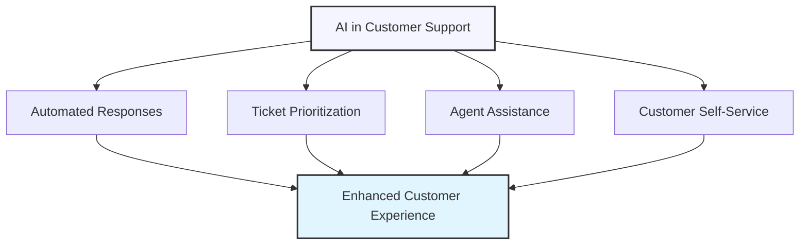

# AI-Powered Customer Service and Support

## Transforming Customer Support with AI Assistants

Customer service is a critical business function that directly impacts customer satisfaction, retention, and brand reputation. AI assistants can transform support operations by providing faster responses, 24/7 availability, and consistent service quality—all while reducing costs and allowing human agents to focus on complex issues that require empathy and nuanced understanding.



## Key Applications of AI in Customer Support

AI can be integrated into customer service operations in several powerful ways:

### 1. Automated Response Systems

AI can directly engage with customers to resolve common issues without human intervention.

<div class="comparison-table">
  <div class="good">
    <h4>✅ Effective Use</h4>
    <p>Implementing an AI chatbot that can authenticate users, access their account information, and help with password resets, subscription changes, and basic troubleshooting—resolving 60% of inquiries without human involvement.</p>
  </div>
  <div class="bad">
    <h4>❌ Ineffective Use</h4>
    <p>Deploying a basic FAQ bot that repeatedly fails to understand customer intent and frustrates users with irrelevant answers before eventually transferring all conversations to human agents.</p>
  </div>
</div>

### 2. Agent Assistance Tools

AI can support human agents by providing relevant information and suggesting responses.

<div class="comparison-table">
  <div class="good">
    <h4>✅ Effective Use</h4>
    <p>An AI system that analyzes customer inquiries in real-time, retrieves relevant knowledge base articles, suggests personalized response templates, and recommends next best actions—reducing average handle time by 40%.</p>
  </div>
  <div class="bad">
    <h4>❌ Ineffective Use</h4>
    <p>A basic suggestion system that provides generic responses without context awareness, requiring agents to spend additional time editing suggestions or ignoring the tool entirely.</p>
  </div>
</div>

### 3. Ticket Routing and Prioritization

AI can ensure inquiries reach the right specialist and are handled in the optimal order.

<div class="comparison-table">
  <div class="good">
    <h4>✅ Effective Use</h4>
    <p>An AI system that analyzes message content, sentiment, customer history, and business impact to automatically categorize tickets, assign them to the most qualified agents, and prioritize urgent issues—reducing resolution time by 35%.</p>
  </div>
  <div class="bad">
    <h4>❌ Ineffective Use</h4>
    <p>Basic keyword-based routing that frequently misclassifies tickets, causing unnecessary transfers between departments and increasing customer frustration.</p>
  </div>
</div>

### 4. Customer Self-Service Resources

AI can power knowledge bases and help centers that enable customers to solve problems independently.

<div class="comparison-table">
  <div class="good">
    <h4>✅ Effective Use</h4>
    <p>An AI-enhanced search system that understands natural language queries, provides contextual answers from your knowledge base, offers step-by-step guides with visual elements, and proactively suggests related information—deflecting 40% of potential support inquiries.</p>
  </div>
  <div class="bad">
    <h4>❌ Ineffective Use</h4>
    <p>A basic search function that only matches exact keywords, returns outdated information, and fails to prioritize the most relevant results, leading customers to abandon self-service attempts.</p>
  </div>
</div>

## Implementing AI Customer Support with ChatGPT

Here's how to leverage ChatGPT to enhance different aspects of your customer support operation:

### Step 1: Define Your Support Use Cases

Start by identifying the specific scenarios where AI can add the most value.

<div class="example-box">
  <h4>Example: Support Scenario Analysis</h4>
  <pre>
Analyze our current customer support operations to identify the best opportunities for AI implementation:

Key metrics to consider:
• Most common support inquiries (volume and type)
• Average resolution time by issue category
• First-contact resolution rates
• Support agent satisfaction/pain points
• Customer satisfaction drivers and detractors

For each high-volume inquiry type, please evaluate:
1. Complexity level (simple, moderate, complex)
2. Need for human empathy/judgment
3. Access to structured data requirements
4. Potential business impact of faster resolution
5. Opportunity for self-service vs. agent assistance

Based on this analysis, recommend the top 3 use cases for AI implementation, with expected benefits for each.</pre>
</div>

### Step 2: Develop Response Templates and Knowledge Base

Create the foundation for your AI support system with well-structured content.

<div class="example-box">
  <h4>Example: Response Template Development</h4>
  <pre>
Help me create response templates for our most common customer inquiry: [inquiry type].

For this template, please include:

1. A friendly greeting that acknowledges the issue
2. Clear, step-by-step instructions to resolve the problem
3. Explanations for why each step is necessary
4. Troubleshooting guidance for common obstacles
5. A supportive closing with next steps if the issue persists

The template should:
• Use simple, jargon-free language
• Include placeholders for personalization (customer name, account details, etc.)
• Maintain our brand voice, which is [describe brand voice]
• Be concise while still being thorough
• Include appropriate empathy statements

Please create three versions of this template for different scenarios:
• Basic template for straightforward situations
• Detailed template for complex situations
• Escalation template for when the standard solution doesn't work</pre>
</div>

### Step 3: Train Your AI Assistant with Specific Guidance

Provide clear instructions to shape your AI assistant's behavior and capabilities.

<div class="example-box">
  <h4>Example: AI Customer Support System Message</h4>
  <pre>
You are CustomerCareAI, a helpful support assistant for [Company Name], a company that provides [product/service description].

Your primary goals are to:
1. Provide accurate, helpful responses that resolve customer issues efficiently
2. Maintain a friendly, empathetic tone consistent with our brand voice
3. Collect relevant information before attempting to solve problems
4. Know when to transfer to a human agent for complex issues

When responding to customers:
• Always begin by acknowledging their concern
• Ask clarifying questions when information is incomplete
• Provide step-by-step instructions with clear formatting
• Verify understanding and satisfaction before closing
• Use a warm, professional tone that reflects our values of [company values]

Information you can access:
• Product features and specifications for [products]
• Common troubleshooting procedures for [common issues]
• Company policies on [relevant policies]

You CANNOT:
• Process returns, refunds, or account changes directly
• Access specific customer account information
• Make exceptions to company policies
• Handle complaints about employees

For these situations, politely explain that you'll connect them with a human agent who can assist further.

When helping customers, follow this general framework:
1. Greet and acknowledge → 2. Understand the issue → 3. Provide solution → 4. Confirm resolution → 5. Close warmly</pre>
</div>

### Step 4: Create Escalation Workflows

Establish clear guidelines for when and how to transfer from AI to human agents.

<div class="example-box">
  <h4>Example: Escalation Criteria Prompt</h4>
  <pre>
Create a comprehensive set of escalation criteria for our AI customer support system.

Please identify specific triggers that should prompt an escalation to a human agent, including:

1. Issue-based triggers
   • Complex technical problems that require advanced troubleshooting
   • Account-specific actions that require authentication/verification
   • Policy exceptions or special circumstances
   • Product defects or warranty claims

2. Customer sentiment triggers
   • Detection of significant frustration or anger
   • Repeated expressions of dissatisfaction with AI responses
   • Explicit requests for human assistance
   • Multiple restatements of the same issue

3. Conversation flow triggers
   • More than 3 clarification exchanges without progress
   • Repeated misunderstanding of customer intent
   • Circular conversation patterns
   • Issues involving multiple products or services

For each trigger, please provide:
• A clear description of the trigger condition
• Example phrases or patterns that indicate this condition
• Recommended escalation message to transition smoothly to a human agent
• Any information that should be captured and passed to the human agent</pre>
</div>

## Advanced Techniques for AI Support Systems

Take your AI customer support to the next level with these advanced approaches:

### 1. Personalization Through Customer Data Integration

Enhance AI responses with relevant customer context.

<div class="example-box">
  <h4>Example: Personalized Support Prompt</h4>
  <pre>
You are our AI customer support assistant with access to the following customer information:

Customer profile:
• Name: [Name]
• Subscription level: [Level]
• Customer since: [Date]
• Recent purchases: [Products]
• Support history: [Brief summary]
• Known preferences: [Preferences]

Current context:
• Channel: [Email/Chat/etc.]
• Issue category: [Category]
• Previous attempts to resolve: [Yes/No]

Using this information, please provide a personalized response to this inquiry:

[Customer inquiry]

Your response should:
• Address the customer by name
• Acknowledge relevant customer history
• Tailor solutions based on their specific products and subscription level
• Reference previous interactions if relevant
• Maintain appropriate tone for relationship length and history

Do not explicitly mention all the data you have access to, but use it naturally to personalize the interaction.</pre>
</div>

### 2. Sentiment Analysis and Emotional Intelligence

Train your AI to recognize and respond appropriately to customer emotions.

<div class="example-box">
  <h4>Example: Sentiment-Aware Response Prompt</h4>
  <pre>
Analyze the sentiment in this customer message and generate an emotionally appropriate response:

Customer message:
"This is the third time I've tried to get this issue fixed. I've spent hours on this and
no one seems to care. I'm about ready to cancel my subscription and leave a review 
online about this terrible experience."

First, analyze the sentiment:
• Primary emotion expressed
• Intensity level (1-5)
• Key frustration points
• History indicators
• Threat or risk level

Then, generate a response that:
• Acknowledges the emotional state appropriately
• Demonstrates genuine understanding and empathy
• Takes clear ownership of the situation
• Provides a concrete next step or resolution path
• Offers appropriate compensation or goodwill gesture based on the severity
• De-escalates the situation without dismissing feelings

The response should follow our empathy framework:
1. Validate → 2. Apologize (if appropriate) → 3. Reassure → 4. Act → 5. Follow through</pre>
</div>

### 3. Multilingual Support Capabilities

Expand your support reach with AI-powered language capabilities.

<div class="example-box">
  <h4>Example: Multilingual Support Prompt</h4>
  <pre>
You are our multilingual customer support AI. A customer has reached out in [language]. 
Please help with the following:

1. Provide a complete and accurate translation of their message into English:

Original message:
[Customer message in foreign language]

2. Generate a helpful response in the customer's original language that:
• Addresses their query completely
• Maintains our friendly, helpful brand voice
• Uses culturally appropriate expressions and conventions
• Avoids idioms or phrases that may not translate well
• Includes the same information you would provide in English

3. Also provide an English translation of your response for our records.

Our product information and policies are as follows:
[Relevant information]</pre>
</div>

### 4. Continuous Improvement Through Feedback Analysis

Use AI to analyze support interactions and identify improvement opportunities.

<div class="example-box">
  <h4>Example: Support Quality Analysis Prompt</h4>
  <pre>
Analyze this sample of 5 customer support interactions to identify patterns, strengths, and
improvement opportunities:

[Transcripts of support interactions]

For each interaction, evaluate:
1. Issue resolution effectiveness (Was the problem solved correctly?)
2. Efficiency (How directly was the solution reached?)
3. Tone and empathy (How well were customer emotions addressed?)
4. Information accuracy (Was all information provided correct?)
5. Personalization level (How tailored was the response to the customer?)

Then provide:
• Overall patterns across all interactions
• Top 3 strengths demonstrated in these interactions
• Top 3 improvement opportunities with specific examples
• Recommendations for response templates or knowledge base articles to create
• Suggestions for additional training or system enhancements

Focus particularly on identifying:
• Common customer confusion points
• Frequent escalation triggers
• Opportunities for self-service improvements
• Potential automation of repetitive responses</pre>
</div>

## Customer Support Templates

Here are templates you can adapt for common customer support scenarios:

### General Inquiry Response Template

```
Thank you for reaching out to [Company Name] customer support!

Regarding your question about [briefly restate inquiry]:

[Provide clear, direct answer to their main question]

Additional information that might be helpful:
• [Related point 1]
• [Related point 2]
• [Related point 3]

If you need any clarification or have additional questions, please don't hesitate to ask. 
I'm here to help!

Best regards,
[Company Name] Support Team
```

### Troubleshooting Response Template

```
Hello [Customer Name],

I understand you're experiencing an issue with [restate the problem]. I'm here to help you resolve this.

Let's troubleshoot this step by step:

1. First, please [first troubleshooting step]
   This helps by [brief explanation of why this step matters]

2. If the issue persists, [second troubleshooting step]
   [Any specific details they should watch for]

3. Finally, try [third troubleshooting step]
   [Expected outcome if successful]

If you've completed these steps and still experience the issue, please let me know by:
• Describing what happened at each step
• Sharing any error messages you received
• Letting me know if you noticed anything unusual

We'll get this resolved for you as quickly as possible!

Thanks for your patience,
[Company Name] Support
```

### Complaint Response Template

```
Hello [Customer Name],

Thank you for bringing this issue to our attention. I sincerely apologize for the [specific issue] you experienced with [product/service]. We hold ourselves to high standards, and it's clear we fell short in this situation.

I understand this has caused [acknowledge impact on customer], and I want to assure you we take this feedback seriously.

Here's what I'm doing to help:

1. [Immediate action being taken]
2. [Additional step being taken]
3. [How this will be prevented in future]

As a goodwill gesture for the inconvenience, I'd like to [offer appropriate compensation/solution].

Please let me know if this resolution works for you, or if you have any other concerns you'd like me to address.

We truly value your business and appreciate the opportunity to make this right.

Sincerely,
[Name]
[Company] Customer Care Team
```

## Common Pitfalls and How to Avoid Them

### 1. Overreliance on Automation

<div class="mistake-box">
  <h4>❌ Problem:</h4>
  <p>Attempting to automate all customer interactions, including complex or emotionally sensitive situations that require human empathy and judgment.</p>
  
  <h4>✅ Better Approach:</h4>
  <p>Implement a hybrid system where AI handles routine inquiries but has clear escalation paths to human agents for complex issues, complaints, or when customers express frustration with automated responses. Regularly review escalation criteria to ensure appropriate balance.</p>
</div>

### 2. Generic, Impersonal Responses

<div class="mistake-box">
  <h4>❌ Problem:</h4>
  <p>AI generates technically correct but generic responses that fail to address the customer's specific situation or emotional needs.</p>
  
  <h4>✅ Better Approach:</h4>
  <p>Integrate customer data (purchase history, previous interactions, preferences) into your AI system to enable personalized responses. Train your AI to acknowledge specific details mentioned by the customer and match their communication style. Include empathy statements that respond to emotional cues.</p>
</div>

### 3. Lack of Transparency

<div class="mistake-box">
  <h4>❌ Problem:</h4>
  <p>Attempting to disguise AI assistants as human agents, creating unrealistic expectations and potential trust issues when limitations become apparent.</p>
  
  <h4>✅ Better Approach:</h4>
  <p>Be transparent about AI usage while highlighting its benefits (24/7 availability, consistent information, fast responses). Consider a disclosure like: "I'm an AI assistant helping with [Company]'s customer support. I can help with [capabilities], and my human colleagues are available if you need additional assistance."</p>
</div>

### 4. Insufficient Training and Monitoring

<div class="mistake-box">
  <h4>❌ Problem:</h4>
  <p>Deploying AI support systems without adequate training on company-specific information or ongoing performance monitoring.</p>
  
  <h4>✅ Better Approach:</h4>
  <p>Continuously update your AI system with current product information, policies, and common issues. Implement regular reviews of AI-customer interactions to identify improvement opportunities. Create feedback loops where human agents can flag and correct AI misunderstandings or knowledge gaps.</p>
</div>

### 5. Failure to Capture Value from AI Interactions

<div class="mistake-box">
  <h4>❌ Problem:</h4>
  <p>Using AI solely to deflect support tickets without leveraging the valuable customer insight data generated through these interactions.</p>
  
  <h4>✅ Better Approach:</h4>
  <p>Implement analytics to identify trends in customer issues, frequently asked questions, and product confusion points. Use these insights to improve products, update documentation, and enhance user experience. Create a systematic process for routing customer feedback from AI interactions to relevant teams.</p>
</div>

## Measuring Success: KPIs for AI Customer Support

To evaluate and optimize your AI support implementation, track these key performance indicators:

### 1. Operational Efficiency

- **Resolution Rate**: Percentage of inquiries fully resolved by AI without human intervention
- **Average Handle Time**: Duration from initial contact to issue resolution
- **First Response Time**: How quickly customers receive initial acknowledgment
- **Escalation Rate**: Percentage of AI conversations transferred to human agents
- **Cost per Interaction**: Total support costs divided by number of inquiries

### 2. Customer Experience

- **Customer Satisfaction (CSAT)**: Post-interaction ratings of support quality
- **Customer Effort Score (CES)**: How easy it was for customers to get their issue resolved
- **Net Promoter Score (NPS)**: Likelihood of customers to recommend your company
- **Sentiment Analysis**: Emotional tone of customer responses to AI interactions
- **Self-Service Adoption**: Percentage of customers successfully using AI-powered self-service

### 3. Business Impact

- **Support Volume Distribution**: Breakdown of issues handled by AI vs. human agents
- **Agent Time Allocation**: How human agents spend time after AI implementation
- **Retention Impact**: Difference in retention rates between AI-assisted and unassisted customers
- **Upsell/Cross-sell Success**: Revenue generated through AI support recommendations
- **Knowledge Base Effectiveness**: Percentage reduction in repeat questions after content improvements

## Exercise: Designing Your AI Support Strategy

Apply what you've learned to develop a strategic plan for implementing AI in your customer support operations:

1. Assess your current support operations and identify top use cases for AI implementation
2. Draft a system message to guide your AI assistant's behavior and capabilities
3. Create response templates for your three most common customer inquiries
4. Develop escalation criteria for when AI should transfer to human agents
5. Design a measurement framework to track the impact of your AI implementation

<div class="solution-space" style="height: 250px; border: 1px dashed #ccc; padding: 10px; margin-top: 10px;">
Write your strategy here...
</div>

## Key Takeaways

- AI can transform customer support through automated responses, agent assistance, intelligent routing, and enhanced self-service
- Effective implementation requires clear use cases, well-structured knowledge, specific AI guidance, and thoughtful escalation workflows
- Advanced techniques include personalization through data integration, sentiment analysis, multilingual support, and continuous improvement
- Common pitfalls include overreliance on automation, generic responses, lack of transparency, insufficient training, and failure to capture insights
- Success measurement should track operational efficiency, customer experience, and business impact metrics
- The ideal approach combines AI efficiency with human empathy in a transparent, continuously improving system

---

In the next lesson, we'll explore using AI for content creation and management across multiple channels.

*Updated: May 2024* 