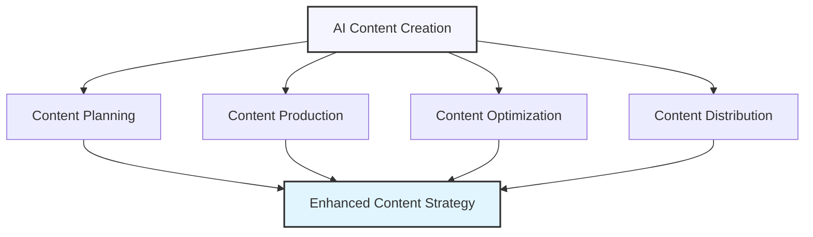

# AI for Content Creation and Management

## Streamlining Content Production with AI

Content creation is a resource-intensive process that requires creativity, subject matter expertise, and consistency across channels. AI can transform content operations by accelerating ideation, drafting, editing, and distribution—enabling teams to produce more high-quality content with fewer resources while maintaining brand consistency.

## Key Applications of AI in Content Creation

AI can enhance content creation workflows in several valuable ways:

### 1. Content Ideation and Planning

AI can help identify valuable content opportunities and develop comprehensive plans.

  

    <h4>✅ Effective Use</h4>
    
Using AI to analyze search trends, competitor content, and audience engagement patterns to identify content gaps and generate data-backed topic ideas organized by buyer journey stage.

  

  

    <h4>❌ Ineffective Use</h4>
    
Asking AI to generate generic topic lists without strategic direction, audience focus, or competitive differentiation.

  

### 2. Content Drafting and Creation

AI can accelerate the content production process across various formats.

  

    <h4>✅ Effective Use</h4>
    
Providing AI with detailed briefs that include audience insights, key messages, tone guidelines, and desired outcomes to generate well-structured first drafts that human creators can refine and enhance.

  

  

    <h4>❌ Ineffective Use</h4>
    
Using AI-generated content verbatim without strategic direction, fact-checking, or human refinement to add unique brand perspective and voice.

  

### 3. Content Optimization and Enhancement

AI can improve existing content to boost performance and impact.

  

    <h4>✅ Effective Use</h4>
    
Analyzing underperforming content to identify improvement opportunities and using AI to enhance readability, SEO, engagement factors, and conversion elements while maintaining the original message.

  

  

    <h4>❌ Ineffective Use</h4>
    
Using generic optimization prompts that result in keyword stuffing or diluting the content's original value with unnecessary filler material.

  

### 4. Multi-Channel Content Adaptation

AI can efficiently adapt content for different platforms and formats.

  

    <h4>✅ Effective Use</h4>
    
Creating a comprehensive piece of pillar content and using AI to thoughtfully adapt it into platform-specific formats (social posts, email sequences, video scripts) that respect each channel's best practices.

  

  

    <h4>❌ Ineffective Use</h4>
    
Simply truncating content for different platforms without adapting the format, tone, and structure to match each channel's unique requirements and audience expectations.

  

## Implementing AI Content Creation with ChatGPT

Here's how to effectively use ChatGPT throughout your content creation workflow:

### Step 1: Strategic Content Planning

Begin with a clear content strategy to guide AI assistance.

  <h4>Example: Content Strategy Prompt</h4>
  <pre>
Help me develop a quarterly content plan for our [product/service] targeting [target audience].

Our content objectives are:
• [Objective 1, e.g., Increase organic traffic by 20%]
• [Objective 2, e.g., Generate leads for our new service offering]
• [Objective 3, e.g., Establish thought leadership in our industry]

Key audience challenges:
• [Challenge 1]
• [Challenge 2]
• [Challenge 3]

Competitor content focus areas:
• Competitor A focuses on [topic/approach]
• Competitor B emphasizes [topic/approach]
• Competitor C highlights [topic/approach]

Based on this information, please provide:
1. 3-5 thematic content pillars that align with our objectives
2. 10 specific content ideas for each pillar, with search-optimized titles
3. Recommended content formats for each idea
4. A content distribution matrix showing primary and secondary channels for each content type
5. Success metrics to track for each content pillar</pre>

### Step 2: Detailed Content Briefs

Create comprehensive briefs to guide AI content generation.

  <h4>Example: Content Brief Prompt</h4>
  <pre>
Create a detailed content brief for an article titled "[Article Title]" targeting [target audience].

Article objectives:
• [Primary objective, e.g., Educate prospects on key industry challenge]
• [Secondary objective, e.g., Position our solution as the optimal approach]
• [Tertiary objective, e.g., Generate newsletter signups]

Key information to include:
• [Important point 1]
• [Important point 2]
• [Important point 3]
• [Statistics, research, or examples to reference]

SEO requirements:
• Primary keyword: [keyword]
• Secondary keywords: [keywords]
• Search intent: [informational/commercial/transactional]

Content specifications:
• Word count: [target length]
• Content type: [blog post/guide/case study/etc.]
• Tone: [professional/conversational/authoritative/etc.]
• Desired reading level: [e.g., 8th grade/business professional]

Please develop a comprehensive brief that includes:
1. An annotated outline with section headings and key points to cover
2. Introduction approach and recommended hook
3. Specific subtopics to address with rationale
4. Types of examples or case studies to include
5. Data points or statistics to research
6. Recommended call-to-action
7. Additional notes for the writer</pre>

### Step 3: First Draft Generation

Use AI to create structured first drafts based on your briefs.

  <h4>Example: Content Creation Prompt</h4>
  <pre>
Write a first draft for a [content type] about [topic] based on the following brief:

Title: [Title]
Target audience: [Audience description]
Primary objective: [Main goal of the content]

Key points to cover:
• [Point 1]
• [Point 2]
• [Point 3]

Structural requirements:
• Introduction that establishes [specific elements to include]
• [Number] sections addressing [topics]
• Each section should include [requirements]
• Conclusion with [specific elements to include]
• Call-to-action focusing on [desired next step]

Style guidelines:
• Voice: [description of voice]
• Tone: [desired tone]
• [Any other style requirements]

Please include:
• A compelling headline
• Engaging subheadings for each section
• Bullet points or numbered lists where appropriate
• Transitional phrases between sections
• [Any other specific requirements]</pre>

### Step 4: Content Refinement and Enhancement

Use AI to polish and optimize your content for maximum impact.

  <h4>Example: Content Enhancement Prompt</h4>
  <pre>
Review and enhance the following content draft to improve its quality, engagement potential, 
and effectiveness:

[Paste content draft]

Please focus on the following improvements:

1. Structural enhancements:
   • Improve the flow and logical progression
   • Strengthen transitions between sections
   • Balance section lengths for better readability

2. Engagement improvements:
   • Enhance the introduction to better hook the reader
   • Add compelling examples or mini-stories where appropriate
   • Incorporate more vivid, descriptive language
   • Suggest pull quotes or highlight sections

3. Persuasiveness enhancements:
   • Strengthen the argumentation and evidence
   • Add data points or research-backed statements (with placeholders for verification)
   • Improve the call-to-action for better conversion potential

4. Readability optimizations:
   • Simplify complex sentences
   • Replace jargon with clearer alternatives
   • Add bullet points or numbered lists where appropriate
   • Suggest better subheadings

5. SEO considerations:
   • Natural integration of the target keyword: [keyword]
   • Improve meta description and title tag
   • Suggest internal linking opportunities

Please provide both specific line-by-line edits and overall strategic recommendations.</pre>

## Strategic Applications for Different Content Types

Let's explore AI prompting strategies for specific content formats:

### Blog Posts and Articles

  <h4>Example: Blog Post Creation Prompt</h4>
  <pre>
Write a comprehensive blog post on [topic] for [target audience].

Article specifics:
• Title: [title]
• Target word count: [count]
• Primary keyword: [keyword]
• Secondary keywords: [keywords]

The article should follow this structure:
1. Introduction
   • Hook the reader with [approach, e.g., surprising statistic, question, scenario]
   • Briefly explain why this topic matters to the reader
   • Include a clear thesis statement
   
2. Main section 1: [Topic]
   • Cover [specific points]
   • Include [examples/data points]
   
3. Main section 2: [Topic]
   • Cover [specific points]
   • Include [examples/data points]
   
4. Main section 3: [Topic]
   • Cover [specific points]
   • Include [examples/data points]
   
5. Conclusion
   • Summarize key takeaways
   • End with [approach, e.g., thought-provoking question, call-to-action]

Additional requirements:
• Use a [formal/conversational/educational] tone
• Include 2-3 places where we could add relevant statistics (with placeholders)
• Add subheadings for each major section
• Use bullet points and numbered lists where appropriate
• Keep paragraphs under 3-4 sentences for readability
• Include a meta description of approximately 150 characters</pre>

### Social Media Content

  <h4>Example: Social Media Content Prompt</h4>
  <pre>
Create a set of platform-specific social media posts promoting our [content/product/event].

Content details:
• Title/name: [title]
• Main benefit/hook: [main value proposition]
• Target audience: [audience]
• Link to include: [URL]
• Call-to-action: [desired action]

Please create:

1. LinkedIn post (text only, professional tone)
   • ~1200-1300 characters
   • Include 3-5 relevant hashtags
   • Focus on industry insights and professional benefits
   
2. Twitter/X posts (3 variations, 280 characters max each)
   • Version 1: Question-based approach
   • Version 2: Statistic or fact-based approach
   • Version 3: Direct value proposition approach
   • Each with 1-2 relevant hashtags
   
3. Facebook post
   • ~250 words max
   • More conversational tone
   • Focus on storytelling elements
   • Include question to encourage comments
   
4. Instagram caption
   • ~150 words max
   • More casual, engaging tone
   • Include 8-10 relevant hashtags grouped at the end
   • Designed to pair with an image of [describe image concept]

For each platform, adapt the tone, length, and structure to match platform best practices while maintaining our brand voice which is [describe brand voice].</pre>

### Email Sequences

  <h4>Example: Email Sequence Prompt</h4>
  <pre>
Create a 5-email nurture sequence for [specific audience segment] who have [triggering action, e.g., downloaded our whitepaper].

Sequence objectives:
• Primary: [main goal, e.g., Book a demo]
• Secondary: [secondary goal, e.g., Establish our expertise]

Key audience characteristics:
• Role/position: [job title or role]
• Primary challenges: [challenges]
• Knowledge level about our solution: [beginner/intermediate/advanced]

For each email, please provide:

1. Subject line (primary and A/B test alternative)
2. Preview text (~50-100 characters)
3. Greeting
4. Body content (~250-300 words)
5. Call-to-action (primary and secondary if applicable)
6. Sign-off

The sequence should follow this flow:
• Email 1: Value delivery - Provide immediate value related to the whitepaper topic
• Email 2: Problem expansion - Explore related challenges and their impact
• Email 3: Solution introduction - Present approach to solving these challenges
• Email 4: Social proof - Share success stories/case studies
• Email 5: Decision facilitation - Clear invitation to take the next step

Additional requirements:
• Maintain a [describe tone] tone throughout
• Each email should be stand-alone valuable even if they don't read others
• Progressive disclosure of information across the sequence
• Include personalization tokens for [list relevant fields]
• Avoid spam trigger words and excessive punctuation</pre>

### Video and Podcast Scripts

  <h4>Example: Video Script Prompt</h4>
  <pre>
Create a script for a [length] educational video about [topic] for our [platform] channel.

Video goal: [primary objective]
Target audience: [audience description]
Key message: [main takeaway]

The video should follow this structure:

1. Hook (0:00-0:15)
   • Grab attention with [approach]
   • Briefly state the value viewers will get

2. Introduction (0:15-0:45)
   • Introduce the topic and its importance
   • Establish credibility
   • Preview what will be covered

3. Main content (0:45-[time])
   • Section 1: [topic] (approximately [time] minutes)
   • Section 2: [topic] (approximately [time] minutes)
   • Section 3: [topic] (approximately [time] minutes)

4. Conclusion (final [time] minutes)
   • Recap key points
   • Deliver call-to-action
   • End with [approach]

Please format the script with:
• Clear timecodes for each section
• [VISUAL] notes for key visual elements or b-roll suggestions
• [HOST] for all spoken lines
• Notes for transitions, graphics, or special effects
• Suggestions for on-screen text or callouts

The tone should be [desired tone] and the language should be appropriate for [audience knowledge level].</pre>

## Advanced Techniques for AI Content Creation

Take your AI content creation to the next level with these advanced approaches:

### 1. Modular Content Development

Create reusable content components that can be assembled into various formats.

  <h4>Example: Modular Content Prompt</h4>
  <pre>
Help me develop modular content components around the topic of [topic] that can be recombined 
for different channels and purposes.

Please create the following standalone yet complementary content modules:

1. Core concept explanation (300 words)
   • Clear definition of [concept]
   • Why it matters to our audience
   • Basic framework for understanding it

2. Statistical evidence module (200 words)
   • 5-7 key statistics that illustrate the importance of [topic]
   • Brief context for each statistic
   • Overall narrative thread connecting the data points

3. Challenge/problem module (250 words)
   • 3 main challenges related to [topic]
   • Consequences of each challenge
   • Common misconceptions

4. Solution approach module (300 words)
   • Step-by-step approach to addressing the challenges
   • Best practices framework
   • Implementation considerations

5. Case example module (250 words)
   • Anonymized example showing application
   • Situation-Action-Result structure
   • Lessons learned and applicability

6. Expert perspective module (200 words)
   • Key insights framed as expert quotes
   • Different viewpoints represented
   • Forward-looking perspectives

For each module, include recommendations on how it could be adapted for:
• Long-form blog content
• Social media snippets
• Email content
• Webinar/presentation material
• Sales enablement content</pre>

### 2. Personalized Content Generation

Create variations of content tailored to different audience segments.

  <h4>Example: Personalized Content Prompt</h4>
  <pre>
Adapt the following core content to create personalized versions for three different 
audience segments:

Core content:
[Paste your core content]

Please create tailored versions for:

Segment 1: [describe segment]
• Knowledge level: [basic/intermediate/advanced]
• Primary concerns: [list concerns]
• Preferred communication style: [description]
• Industry: [industry]
• Specific pain points: [list pain points]

Segment 2: [describe segment]
• Knowledge level: [basic/intermediate/advanced]
• Primary concerns: [list concerns]
• Preferred communication style: [description]
• Industry: [industry]
• Specific pain points: [list pain points]

Segment 3: [describe segment]
• Knowledge level: [basic/intermediate/advanced]
• Primary concerns: [list concerns]
• Preferred communication style: [description]
• Industry: [industry]
• Specific pain points: [list pain points]

For each segment, modify the content to:
• Use relevant examples and terminology for their industry
• Address their specific pain points and concerns
• Match their knowledge level (simplify/add depth as needed)
• Adjust the tone to match their preferred communication style
• Emphasize benefits most relevant to their situation
• Customize the call-to-action to their specific next step

Keep the core message consistent while making each version feel specifically created for that audience.</pre>

### 3. Content Repurposing and Transformation

Efficiently transform existing content into multiple formats.

  <h4>Example: Content Repurposing Prompt</h4>
  <pre>
Transform the following [blog post/whitepaper/etc.] into multiple content formats for 
our omnichannel strategy:

Original content:
[Paste original content]

Please create the following derived content:

1. LinkedIn article (800-1000 words)
   • Professional tone
   • Focus on industry insights and analysis
   • Include 3-5 key takeaways as bullet points
   • Add a thought leadership perspective

2. Twitter thread (8-10 tweets)
   • Key insights formatted for Twitter
   • Each tweet under 280 characters
   • Logical flow from one tweet to the next
   • Mix of statements, questions, and data points

3. Infographic content outline
   • 5-7 key data points to visualize
   • Suggested flow and structure
   • Text for section headers, callouts, and conclusion
   • Description of key visual elements to include

4. Email newsletter version (300-400 words)
   • Conversational introduction
   • 3-4 key points with brief explanations
   • Clear call-to-action to read full content
   • Subject line options (3 variations)

5. 3-5 pull quotes for social sharing
   • Impactful, standalone statements
   • Under 100 characters each
   • Capturing the most surprising or valuable insights

For each format, preserve the core message while optimizing for the specific channel's 
best practices and audience expectations.</pre>

### 4. SEO-Optimized Content Planning

Use AI to develop search-optimized content strategies.

  <h4>Example: SEO Content Strategy Prompt</h4>
  <pre>
Help me develop a comprehensive SEO content strategy for the topic cluster around [main topic].

Based on this seed topic, please:

1. Suggest a pillar content piece (3000+ words)
   • Recommended title with primary keyword
   • 10-15 subtopics to cover
   • Key questions to answer
   • Featured snippet opportunities
   
2. Develop a supporting content cluster with 10-12 related topics
   • For each topic, provide:
     - Suggested title optimized for search
     - Primary and secondary keywords
     - Search intent analysis (informational, commercial, etc.)
     - Brief content angle (what unique perspective we should take)
     - Estimated search volume category (high/medium/low)
     - Competition level (high/medium/low)
     - Content format recommendation (guide, list, how-to, etc.)
   
3. Internal linking strategy
   • How each piece should link to the pillar content
   • Cross-linking opportunities between cluster content
   • Anchor text recommendations
   
4. Suggested content calendar
   • Publication order based on strategic importance
   • Content grouped by topic relationship
   • Quick wins vs. long-term investments
   
5. Performance measurement framework
   • KPIs for each content type
   • Success metrics beyond traffic
   • Timeline for expected results

Focus on creating genuine value for our audience while strategically targeting relevant keywords.</pre>

## Content Testing and Optimization

The most effective content strategy involves continuous testing and refinement.

### A/B Testing Headline Variations

Use AI to generate multiple headline options for testing.

  <h4>Example: Headline Testing Prompt</h4>
  <pre>
Generate 10 headline variations for our article about [topic] targeting [audience].

The article focuses on:
• [Key point 1]
• [Key point 2]
• [Key point 3]

Our target keyword is: [keyword]

Please create variations using different approaches:
• Benefit-driven headlines (2-3 variations)
• Question headlines (1-2 variations)
• How-to headlines (1-2 variations)
• Numbered list headlines (1-2 variations)
• Curiosity-gap headlines (1-2 variations)
• Emotional headlines (1-2 variations)

For each headline:
• Keep it under 65 characters (for SEO display)
• Include the target keyword or a close variant
• Note which emotional trigger or psychological principle it uses
• Rate its potential clickworthiness on a scale of 1-10

Ensure all headlines accurately represent the content while being compelling enough to drive clicks.</pre>

### Content Performance Optimization

Use data insights to guide content improvements.

  <h4>Example: Content Optimization Prompt</h4>
  <pre>
Help me optimize this underperforming content based on the following analytics data:

Current content:
[Paste content]

Performance data:
• Average time on page: [time] (below site average)
• Bounce rate: [rate]% (above site average)
• Conversion rate: [rate]% (below goal)
• Top entrance keywords: [keywords]
• Heat map insights: [observations, e.g., "Users rarely scroll below the second paragraph"]
• User feedback: [feedback, e.g., "Content doesn't answer my specific questions"]

Target keywords:
• Primary: [keyword] (currently ranking #[position])
• Secondary: [keywords]

Please provide recommendations for:

1. Content structure improvements
   • Introduction enhancements
   • Section reorganization
   • Formatting changes to improve scannability
   
2. Content depth adjustments
   • Topics that need more comprehensive coverage
   • Areas to condense or remove
   • Questions to address that are currently missing
   
3. Engagement enhancements
   • Interactive elements to consider adding
   • Visual content suggestions
   • Storytelling elements to incorporate
   
4. SEO optimizations
   • Title tag and meta description improvements
   • Heading structure recommendations
   • Internal linking opportunities
   • Schema markup suggestions
   
5. Conversion optimization
   • Call-to-action placement and wording
   • Trust elements to incorporate
   • Objection handling content to add

Please provide both strategic recommendations and specific implementation suggestions.</pre>

## Common Pitfalls and How to Avoid Them

### 1. Generic, Undifferentiated Content

  <h4>❌ Problem:</h4>
  
Creating AI-generated content that lacks unique perspective, original insights, or brand differentiation.

  
  <h4>✅ Better Approach:</h4>
  
Use AI to generate structured drafts based on detailed briefs that include your unique brand perspective, proprietary data, original research, and specific customer insights. Have subject matter experts review and enhance AI-generated content with unique angles and experiences that competitors can't easily replicate.

### 2. Over-Optimization for Search Engines

  <h4>❌ Problem:</h4>
  
Prioritizing keyword density and SEO tactics over content quality and reader experience, resulting in unnatural content that ranks initially but drives poor engagement.

  
  <h4>✅ Better Approach:</h4>
  
Focus first on creating genuinely valuable content for your audience, then optimize for search in ways that enhance rather than detract from readability. Use AI to identify semantic keyword opportunities and natural integration points rather than forcing keywords into content.

### 3. Inconsistent Brand Voice

  <h4>❌ Problem:</h4>
  
Each piece of AI-generated content having a slightly different tone and style, diluting brand identity across channels.

  
  <h4>✅ Better Approach:</h4>
  
Create a detailed brand voice guide for AI prompting with specific examples of desired tone, terminology, sentence structures, and value framing. Use consistent system messages across all content generation requests and maintain a library of successful prompts that capture your brand voice effectively.

### 4. Factual Inaccuracies and Hallucinations

  <h4>❌ Problem:</h4>
  
Publishing AI-generated content containing fabricated statistics, misattributed quotes, or factual errors that damage credibility.

  
  <h4>✅ Better Approach:</h4>
  
Implement a rigorous fact-checking process for all AI-generated content. Use AI to identify claims needing verification and maintain an authoritative knowledge base of approved facts, statistics, and references that can be provided in prompts. Have subject matter experts review all technical or specialized content.

### 5. Inefficient Workflows

  <h4>❌ Problem:</h4>
  
Creating one-off prompts for each content piece, resulting in inconsistent quality and excessive time spent on prompt engineering.

  
  <h4>✅ Better Approach:</h4>
  
Develop standardized templates for different content types with structured sections for audience information, key messages, and formatting requirements. Create modular prompt components that can be combined for different content needs, and maintain a library of successful prompts that can be adapted for similar future projects.

## Exercise: Developing Your AI Content Strategy

Apply what you've learned to develop a strategic plan for implementing AI in your content creation workflow:

1. Assess your current content needs and identify top use cases for AI implementation
2. Create a content brief template for your most common content type
3. Develop a system message that captures your brand voice and content guidelines
4. Design a content testing framework to evaluate AI-generated content effectiveness
5. Create a workflow diagram showing how AI integrates with human expertise in your process

Write your strategy here...

## Key Takeaways

- AI transforms content creation through automated ideation, drafting, optimization, and cross-channel adaptation
- Effective implementation requires strategic planning, detailed briefs, brand-specific guidance, and human refinement
- Advanced techniques include modular content development, personalization, repurposing, and SEO optimization
- Common pitfalls include generic content, over-optimization, inconsistent voice, factual errors, and inefficient workflows
- The ideal approach combines AI efficiency with human creativity and expertise in a structured, iterative process

---

In the next lesson, we'll explore using AI for data analysis and business intelligence.

*Updated: May 2024* 