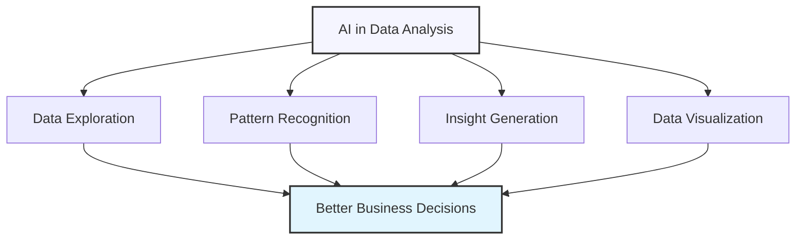

# AI for Data Analysis and Business Intelligence

## Transforming Data Insights with AI

Data analysis is essential for informed business decisions, but traditional approaches often involve time-consuming manual analysis, specialized technical skills, and difficult-to-interpret results. AI can democratize data insights by making analysis more accessible, automating routine tasks, revealing hidden patterns, and translating complex findings into actionable recommendations.

## Key Applications of AI in Data Analysis

AI can enhance data analysis workflows in several valuable ways:

### 1. Data Exploration and Cleaning

AI can help prepare data for meaningful analysis.

  

    <h4>✅ Effective Use</h4>
    
Using AI to identify anomalies, missing values, and inconsistencies in datasets, then suggesting appropriate cleaning strategies based on data type and distribution characteristics.

  

  

    <h4>❌ Ineffective Use</h4>
    
Blindly applying automated data cleaning without understanding the context of the data or validating that the cleaning methods preserve important patterns and relationships.

  

### 2. Pattern Detection and Trend Analysis

AI can identify meaningful patterns that might escape human analysts.

  

    <h4>✅ Effective Use</h4>
    
Leveraging AI to detect subtle correlations, seasonal patterns, and emerging trends across multiple variables, then validating these findings against business knowledge to distinguish meaningful insights from statistical noise.

  

  

    <h4>❌ Ineffective Use</h4>
    
Treating all correlations identified by AI as causal relationships without critical evaluation or ignoring business context when interpreting algorithmic findings.

  

### 3. Insight Generation and Recommendations

AI can translate data patterns into actionable business recommendations.

  

    <h4>✅ Effective Use</h4>
    
Using AI to analyze performance metrics against benchmarks, identify root causes of deviations, and generate specific recommendations prioritized by potential business impact and implementation feasibility.

  

  

    <h4>❌ Ineffective Use</h4>
    
Generating generic recommendations without connecting them to specific business objectives or failing to provide context about confidence levels and potential implementation challenges.

  

### 4. Data Storytelling and Visualization

AI can make complex data insights accessible to non-technical stakeholders.

  

    <h4>✅ Effective Use</h4>
    
Using AI to create clear narratives around data findings, selecting optimal visualization formats for different insight types, and adapting the presentation complexity to match audience technical literacy.

  

  

    <h4>❌ Ineffective Use</h4>
    
Creating visually complex charts without clear explanations of their significance or failing to connect visualizations to the business questions they address.

  

## Implementing AI Data Analysis with ChatGPT

Here's how to leverage ChatGPT for different stages of data analysis:

### Step 1: Framing the Analysis

Start with clear business questions and analysis objectives.

  <h4>Example: Analysis Framing Prompt</h4>
  <pre>
Help me plan a data analysis project to answer the following business question:
[State your primary business question, e.g., "What factors are driving customer churn in our subscription service?"]

Background context:
• Our business is [brief description]
• This analysis will inform decisions about [specific decisions]
• Key stakeholders include [roles/departments]
• Previous related analyses have shown [relevant findings]

Please help me:

1. Break down this main question into 3-5 specific sub-questions that would provide actionable insights
2. For each sub-question, suggest:
   • Relevant data sources we likely need
   • Key variables and metrics to examine
   • Potential analysis methods and approaches
   • Types of insights that would be most valuable
   • How to connect findings back to business actions

3. Identify potential challenges or limitations we might encounter
4. Suggest a logical sequence for tackling these questions
5. Recommend how to frame findings for maximum stakeholder impact

My data analysis capabilities include [tools/methods you have access to], and we have access to data on [available data types].</pre>

### Step 2: Data Exploration and Understanding

Use AI to help understand and prepare your data for analysis.

  <h4>Example: Data Exploration Prompt</h4>
  <pre>
I have a dataset about [brief description] with the following columns:
[List column names and brief description of what they contain]

Here are some example rows from the dataset:
[Paste a few sample rows or describe the general structure]

Please help me explore and understand this data by:

1. Suggesting appropriate data types for each column
2. Identifying potential quality issues I should look for (missing values, outliers, inconsistencies)
3. Recommending initial exploratory analyses to understand:
   • Distributions of key variables
   • Potential relationships between variables
   • Time-based patterns (if applicable)
   • Segments or clusters worth investigating

4. Advising on data transformations that might be needed, such as:
   • Normalization or standardization
   • Handling categorical variables
   • Creating derived metrics or features
   • Aggregating data to appropriate levels

5. Suggesting visualizations that would be most informative for initial exploration

I'll be using [tools you're using] for this analysis, so please tailor your recommendations accordingly.</pre>

### Step 3: Performing the Analysis

Leverage AI to structure your analysis approach and interpret results.

  <h4>Example: Analysis Interpretation Prompt</h4>
  <pre>
I've performed the following analysis on my [type of] data:
[Describe the analysis you performed and paste relevant results, statistics, or observations]

The business context is: 
[Explain the business situation and what you're trying to understand]

Please help me interpret these results by:

1. Explaining what these findings mean in plain business language
2. Identifying the most significant patterns or insights
3. Distinguishing between correlation and potential causation
4. Suggesting alternative interpretations or explanations
5. Highlighting limitations or caveats to these findings
6. Recommending follow-up analyses to validate or deepen these insights

For context, our baseline/benchmark for [key metric] is typically [value], and a change of [magnitude] would be considered practically significant for our business.</pre>

### Step 4: Generating Recommendations

Use AI to translate your analysis into actionable recommendations.

  <h4>Example: Recommendation Generation Prompt</h4>
  <pre>
Based on our data analysis, we've identified the following key insights:
[List the main findings from your analysis in bullet points]

Our business objectives are:
• [Objective 1]
• [Objective 2]
• [Objective 3]

Our constraints include:
• [Resource constraint]
• [Timeline constraint]
• [Other relevant constraints]

Please help me develop actionable recommendations by:

1. Suggesting 3-5 specific actions based on our findings
2. For each recommendation:
   • Connect it directly to specific data insights
   • Explain the expected business impact
   • Outline implementation considerations
   • Suggest how to measure success
   • Note potential risks or limitations

3. Prioritize these recommendations based on:
   • Potential business impact
   • Implementation feasibility
   • Time to value
   • Alignment with stated objectives

4. Suggest how to test these recommendations (e.g., A/B testing approach, pilot program)
5. Identify what additional data would strengthen our confidence in these recommendations</pre>

## Strategic Applications for Different Analysis Types

Let's explore AI prompting strategies for specific analysis scenarios:

### Sales and Revenue Analysis

  <h4>Example: Sales Analysis Prompt</h4>
  <pre>
I need to analyze our sales performance for [time period] to identify growth opportunities.

We have data including:
• Sales by product/service
• Sales by region/location
• Sales by customer segment
• Sales by channel
• Sales representative performance
• Pricing and discount information
• Year-over-year comparison

Key business questions:
1. Where are our biggest growth opportunities?
2. What factors are driving or hindering performance?
3. How should we adjust our sales strategy?

Please help me structure this analysis by:

1. Suggesting the most revealing ways to segment and analyze this data
2. Recommending specific metrics and calculations beyond basic revenue figures
3. Proposing comparative analyses that would yield actionable insights
4. Identifying potentially hidden patterns we should investigate
5. Suggesting how to distinguish between random fluctuations and meaningful trends

Also, please recommend specific visualization approaches for:
• Executive summary (top 3 visualizations)
• Sales leadership deep-dive (5-7 key analyses)
• Sales team operational insights (practical, action-oriented views)</pre>

### Customer Behavior Analysis

  <h4>Example: Customer Analysis Prompt</h4>
  <pre>
I need to analyze our customer data to better understand behavior patterns and improve retention.

Available data includes:
• Purchase history (frequency, recency, monetary value)
• Product/service usage metrics
• Customer service interactions
• Demographic information
• Acquisition channel
• Feedback and satisfaction scores
• Engagement metrics (email, app, website)

Please help me develop a comprehensive customer analysis by:

1. Suggesting customer segmentation approaches beyond traditional RFM
2. Recommending methods to identify:
   • At-risk customers before they churn
   • Upsell/cross-sell opportunities
   • Potential advocates/ambassadors
   • Underserved customer needs

3. Proposing lifecycle analysis frameworks to understand:
   • Critical points in the customer journey
   • Behavior patterns that predict long-term value
   • Engagement cliff points
   • Loyalty development indicators

4. Suggesting correlation analyses between:
   • Customer satisfaction and actual behavior
   • Acquisition source and lifetime value
   • Service usage patterns and retention
   • Feature adoption and expansion revenue

5. Recommending ways to quantify:
   • Customer experience impact on revenue
   • Service quality effect on retention
   • Price sensitivity by segment
   • Customer profitability accounting for all costs</pre>

### Marketing Performance Analysis

  <h4>Example: Marketing Analysis Prompt</h4>
  <pre>
I need to analyze our marketing performance across channels to optimize our strategy and budget allocation.

Available data includes:
• Campaign performance by channel
• Cost per acquisition by source
• Conversion rates at each funnel stage
• Attribution data (multi-touch)
• Audience engagement metrics
• Content performance stats
• Competitive share of voice metrics

Business objectives:
• Reduce overall CAC by 15%
• Increase marketing-sourced revenue by 20%
• Improve conversion rates from MQL to SQL

Please help me structure a comprehensive marketing analysis by:

1. Suggesting methodologies to accurately compare:
   • Channel efficiency beyond simple CAC
   • Campaign effectiveness controlling for external factors
   • Content performance accounting for position in funnel
   • Audience segment responsiveness across channels

2. Recommending approaches to identify:
   • Hidden performance patterns in campaign data
   • Synergies between channels (where 1+1>2)
   • Diminishing returns thresholds
   • Leading indicators of campaign success

3. Proposing analytical frameworks for:
   • Budget optimization modeling
   • Audience prioritization
   • Message effectiveness assessment
   • Competitive positioning analysis

4. Suggesting ways to connect marketing metrics to:
   • Revenue impact
   • Customer lifetime value
   • Brand equity development
   • Market share growth</pre>

### Operational Efficiency Analysis

  <h4>Example: Operations Analysis Prompt</h4>
  <pre>
I need to analyze our operational data to identify efficiency improvement opportunities.

Available data includes:
• Process completion times
• Resource utilization rates
• Quality metrics and error rates
• Cost per unit/transaction
• Capacity metrics
• Bottleneck indicators
• Variance from standards

Business goals:
• Reduce operational costs by 12%
• Improve throughput by 20%
• Maintain or improve quality standards

Please help me develop a structured analysis by:

1. Suggesting methodologies to identify:
   • Root causes of inefficiencies
   • Process bottlenecks and constraints
   • Resource allocation improvement opportunities
   • Automation candidates
   • Quality-cost tradeoff optimization points

2. Recommending approaches to quantify:
   • Impact of process variations
   • Cost of quality issues
   • Value of capacity improvements
   • ROI on potential improvements
   • Risk factors in process changes

3. Proposing analytical frameworks for:
   • Process capability assessment
   • Simulation of improvement scenarios
   • Cost driver analysis
   • Lead time reduction modeling
   • Quality control optimization

4. Suggesting visualizations to clearly communicate:
   • Process flow inefficiencies
   • Resource utilization patterns
   • Quality impact on overall performance
   • Comparative performance across locations/teams
   • Historical trends with annotated interventions</pre>

## Advanced Techniques for AI Data Analysis

Take your AI-assisted data analysis to the next level with these advanced approaches:

### 1. Multi-dimensional Analysis

Combine different analytical perspectives for richer insights.

  <h4>Example: Multi-dimensional Analysis Prompt</h4>
  <pre>
I need to perform a multi-dimensional analysis of our [business area] performance to identify 
complex interaction effects and opportunities.

Data dimensions available:
• Time: [temporal aspects of your data]
• Geography: [geographic breakdown]
• Product/Service: [product categories]
• Customer segments: [how customers are segmented]
• Channels: [distribution/marketing channels]
• Organizational units: [internal structure]

Please help me design an analysis that:

1. Identifies the most revealing cross-dimensional analyses, such as:
   • Performance patterns that only emerge when examining [dimension 1] × [dimension 2]
   • Interaction effects between [dimension 3] and [dimension 4]
   • Anomalies that appear when segmenting by multiple dimensions simultaneously

2. Suggests analytical approaches for:
   • Isolating dimensional effects from confounding variables
   • Determining which dimension has the strongest explanatory power
   • Identifying compensating effects across dimensions
   • Detecting emerging patterns across multiple dimensions

3. Recommends visualization techniques for:
   • Representing 3+ dimensions effectively
   • Highlighting interaction effects
   • Showing relative contribution of different dimensions
   • Making complex dimensional relationships accessible to non-technical audiences

4. Proposes a structured approach to derive actionable insights from multi-dimensional findings</pre>

### 2. Scenario Analysis and Simulation

Use AI to explore potential future outcomes and decision impacts.

  <h4>Example: Scenario Analysis Prompt</h4>
  <pre>
I need to conduct a scenario analysis to understand how potential changes in [key variables] 
might impact our [business outcome].

Current baseline:
• [Current metric 1]: [value]
• [Current metric 2]: [value]
• [Current metric 3]: [value]

Key variables with uncertainty:
• [Variable 1]: Currently [value], potential range [min-max]
• [Variable 2]: Currently [value], potential range [min-max]
• [Variable 3]: Currently [value], potential range [min-max]

Please help me structure a comprehensive scenario analysis by:

1. Defining meaningful scenarios to analyze:
   • Suggested core scenarios (optimistic, pessimistic, most likely)
   • Key combinations of variables to test
   • Edge cases worth examining
   • Historical analogs to consider

2. Proposing analytical approaches for:
   • Sensitivity analysis to identify which variables have the greatest impact
   • Threshold analysis to find tipping points
   • Monte Carlo simulation parameters (if applicable)
   • Confidence interval estimation

3. Suggesting frameworks for:
   • Evaluating scenario probability
   • Assessing business impact by scenario
   • Developing early warning indicators
   • Creating contingency triggers

4. Recommending how to:
   • Present scenario analysis to stakeholders
   • Translate findings into decision guidelines
   • Monitor for scenario developments
   • Update the analysis as new information emerges</pre>

### 3. Predictive Modeling Guidance

Use AI to guide predictive analytics approaches.

  <h4>Example: Predictive Analytics Prompt</h4>
  <pre>
I need to develop a predictive model for [target variable] to improve our [business process].

Business context:
• This prediction will inform decisions about [specific decisions]
• The value of improved prediction accuracy is [business impact]
• We currently predict this using [current method] with [current accuracy]

Available data:
• [List key data sources and variables]
• Historical data spans [time period]
• We have approximately [number] of observations

Please help me plan a predictive modeling approach by:

1. Recommending appropriate model types given our:
   • Data characteristics
   • Prediction requirements
   • Explainability needs
   • Implementation constraints

2. Suggesting feature engineering approaches:
   • Key transformations to consider
   • Interaction terms that might be valuable
   • Temporal features to create
   • External data that might improve predictions

3. Advising on validation strategy:
   • Train/test split considerations
   • Cross-validation approach
   • Out-of-time validation importance
   • Performance metrics to prioritize

4. Highlighting potential challenges:
   • Data quality issues to address
   • Concept drift concerns
   • Class imbalance problems
   • Overfitting risks

5. Recommending a phased implementation:
   • Initial baseline model
   • Refinement priorities
   • Testing methodology
   • Deployment considerations</pre>

### 4. Automated Anomaly Detection

Use AI to identify outliers and unusual patterns requiring attention.

  <h4>Example: Anomaly Detection Prompt</h4>
  <pre>
I need to implement anomaly detection in our [type of] data to identify unusual patterns 
that require investigation.

Data context:
• [Description of the data source and nature]
• Normal operating parameters are [describe typical ranges/patterns]
• We currently identify anomalies by [current method]
• The cost of missing an anomaly is [business impact]
• The cost of false positives is [business impact]

Please help me develop an anomaly detection approach by:

1. Recommending appropriate anomaly types to monitor:
   • Point anomalies (individual observations)
   • Contextual anomalies (normal in some contexts but not others)
   • Collective anomalies (groups of observations that together are anomalous)
   • Seasonal/cyclical pattern breaks

2. Suggesting detection methodologies suitable for our data:
   • Statistical approaches (parametric/non-parametric)
   • Distance-based methods
   • Density-based techniques
   • Ensemble approaches
   • Time-series specific methods (if applicable)

3. Advising on implementation considerations:
   • Tuning sensitivity vs. specificity
   • Adaptive thresholding approaches
   • Incorporating domain knowledge
   • Handling evolving definitions of "normal"

4. Recommending a process for:
   • Anomaly triage and categorization
   • Root cause investigation
   • False positive reduction
   • Continuous improvement of detection</pre>

## Data Visualization and Communication

### Creating Effective Visualizations

Use AI to design impactful data visualizations that communicate clearly.

  <h4>Example: Visualization Design Prompt</h4>
  <pre>
I need to create effective visualizations for our analysis of [topic/data]. 

The key insights we need to communicate are:
• [Insight 1]
• [Insight 2]
• [Insight 3]

The target audience is:
• [Description of audience]
• Their technical expertise level is [basic/intermediate/advanced]
• Their primary interest is [business outcome/decision]

Please recommend:

1. The most appropriate visualization types for each insight, considering:
   • The nature of the data (time series, categorical, etc.)
   • The comparative elements that need to be highlighted
   • The level of detail required
   • The need for intuitive interpretation

2. Design principles for each visualization:
   • Color scheme recommendations (considering accessibility)
   • Labeling and annotation strategies
   • Use of secondary axes or dual visualizations
   • Appropriate level of data density

3. Enhancement elements to consider:
   • Reference lines/benchmarks
   • Statistical annotations
   • Highlighting techniques for key findings
   • Interactive elements (if applicable)

4. Narrative flow for a dashboard or presentation:
   • Logical sequence of visualizations
   • Progressive disclosure of insights
   • Connecting visualizations to business questions
   • Hierarchy of information presentation</pre>

### Creating Data-Driven Narratives

Use AI to structure compelling stories around your data insights.

  <h4>Example: Data Storytelling Prompt</h4>
  <pre>
I need to create a compelling data story from our analysis of [topic] to drive [specific action/decision].

The key findings are:
• [Finding 1]
• [Finding 2]
• [Finding 3]

The audience includes:
• [Stakeholder group 1] who care about [their priority]
• [Stakeholder group 2] who care about [their priority]
• [Stakeholder group 3] who care about [their priority]

Please help me structure a data-driven narrative by:

1. Creating a narrative outline with:
   • An attention-grabbing opening that frames the business relevance
   • A logical story arc that builds toward key insights
   • Transition points that maintain audience engagement
   • A compelling conclusion that drives toward action

2. Suggesting ways to:
   • Humanize the data through relatable examples or scenarios
   • Create emotional connection to otherwise abstract numbers
   • Address potential objections or skepticism
   • Balance data precision with accessibility

3. Recommending supporting elements:
   • Analogies that make complex patterns more intuitive
   • Comparative references that provide context
   • Visual metaphors that reinforce key concepts
   • Memorable phrases to encapsulate key insights

4. Advising on presentation approach:
   • Balance of data vs. narrative
   • Technical depth appropriate to the audience
   • Handling of uncertainties and limitations
   • Interactive vs. linear presentation strategy</pre>

## Common Pitfalls and How to Avoid Them

### 1. Analysis Without Clear Business Questions

  <h4>❌ Problem:</h4>
  
Conducting extensive data analysis without first establishing specific business questions, resulting in interesting but not actionable insights.

  
  <h4>✅ Better Approach:</h4>
  
Begin every analysis by clearly defining the business decisions that will be informed by the results. Work with stakeholders to articulate specific questions that, when answered, will directly enable action. Use AI to help refine vague questions into specific, answerable ones with clear metrics.

### 2. Confusing Correlation with Causation

  <h4>❌ Problem:</h4>
  
Drawing causal conclusions from correlational data without considering alternative explanations or confounding variables.

  
  <h4>✅ Better Approach:</h4>
  
Use AI to generate multiple potential explanations for observed relationships. Implement quasi-experimental designs where possible (A/B tests, difference-in-differences, etc.) and explicitly acknowledge limitations in causal inference when presenting findings.

### 3. Ignoring Data Quality Issues

  <h4>❌ Problem:</h4>
  
Proceeding with analysis without thoroughly assessing and addressing data quality issues, leading to unreliable conclusions.

  
  <h4>✅ Better Approach:</h4>
  
Use AI to assist with comprehensive data quality assessment before analysis, checking for completeness, consistency, accuracy, and representativeness. Document data limitations explicitly and conduct sensitivity analyses to understand how quality issues might impact conclusions.

### 4. Overcomplicating Analysis

  <h4>❌ Problem:</h4>
  
Using unnecessarily complex analytical techniques that obscure insights rather than reveal them, or creating visualizations that look impressive but communicate poorly.

  
  <h4>✅ Better Approach:</h4>
  
Start with simple analyses and visualizations, then add complexity only when it provides meaningful additional insight. Use AI to translate complex statistical findings into straightforward business language, and to design visualizations that prioritize clarity over technical sophistication.

### 5. Failing to Translate Insights to Actions

  <h4>❌ Problem:</h4>
  
Presenting analysis findings without clear recommendations for action, leaving stakeholders unsure how to apply the insights.

  
  <h4>✅ Better Approach:</h4>
  
For every key finding, explicitly connect it to specific decisions or actions. Use AI to help develop practical recommendations that account for business constraints, implementation challenges, and potential risks. Include success metrics for each recommended action.

## Exercise: Developing Your AI Data Analysis Strategy

Apply what you've learned to develop a strategic plan for implementing AI in your data analysis workflow:

1. Identify a high-priority business question that would benefit from data analysis
2. Create a detailed analysis plan including data sources, methods, and expected outcomes
3. Develop prompt templates for each stage of your analysis workflow
4. Design a framework for translating analytical findings into actionable recommendations
5. Outline a process for measuring the business impact of data-driven decisions

Write your strategy here...

## Key Takeaways

- AI transforms data analysis through enhanced exploration, pattern recognition, insight generation, and communication
- Effective implementation requires clear business questions, structured analytical approaches, and rigorous interpretation
- Advanced techniques include multi-dimensional analysis, scenario modeling, predictive analytics, and anomaly detection
- Common pitfalls include unfocused analysis, causal misinterpretation, data quality issues, overcomplexity, and actionability gaps
- The ideal approach combines AI analytical capabilities with human business context and judgment in a question-driven process

---

In the next lesson, we'll explore using AI for project and process management.

*Updated: May 2024* 