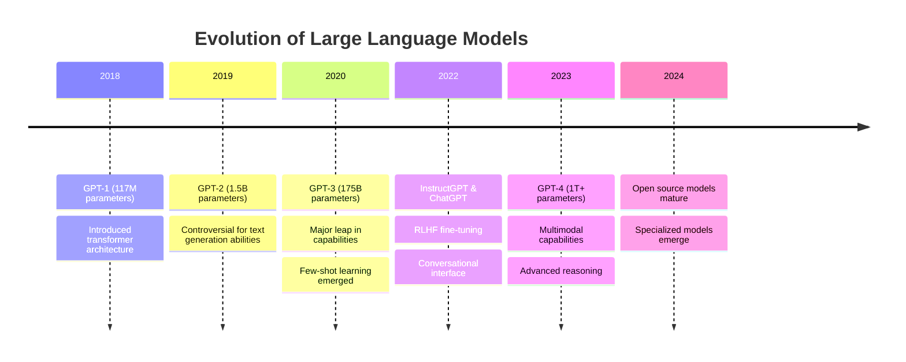
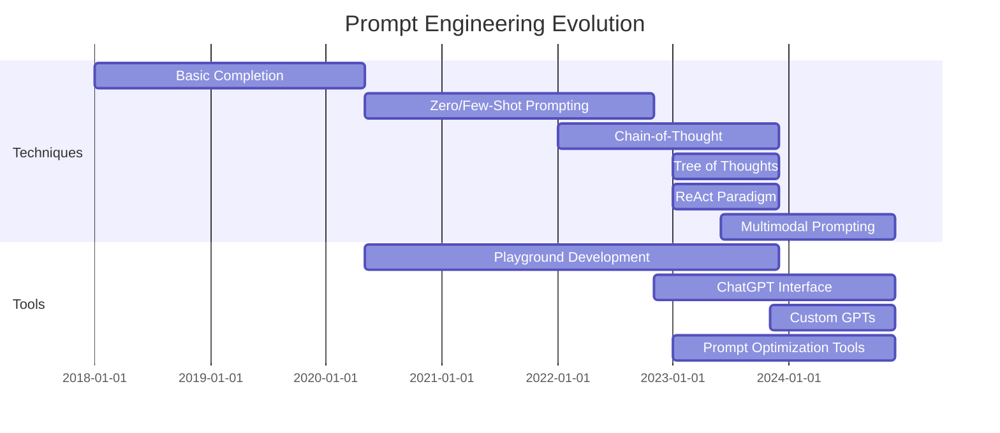

# The Evolution of LLMs and Prompting

Welcome to the first lesson of our Advanced Prompt Engineering course! Today, we'll explore the fascinating evolution of Large Language Models (LLMs) and how the art of prompting has developed alongside them.

## The Journey of Large Language Models

The development of Large Language Models represents one of the most significant advancements in artificial intelligence history. Understanding this evolution helps us appreciate the capabilities and limitations of the models we work with today.



## From Rule-Based to Neural Prompting

The way we interact with AI systems has changed dramatically over time:

### 1. Rule-Based Systems (1960s-2000s)
- Required specific command syntax
- Operated on predetermined rules
- Example: ELIZA, early chatbots
- Limited understanding of natural language

### 2. Early Neural Models (2010-2017)
- Basic word embeddings (Word2Vec, GloVe)
- Recurrent Neural Networks
- Improved but still fragile natural language understanding
- Required structured inputs

### 3. Early Transformer Models (2018-2020)
- Introduction of attention mechanisms
- Models like BERT focused on understanding context
- GPT-1 and GPT-2 showed improved generative capabilities
- Prompted with examples or simple instructions

### 4. Emergence of Few-Shot Learning (2020-2021)
- GPT-3 demonstrated ability to learn from minimal examples
- Introduction of "in-context learning"
- Prompt patterns emerged (zero-shot, one-shot, few-shot)
- Birth of prompt engineering as a discipline

### 5. Instruction Fine-Tuning Era (2022-Present)
- Models specifically trained to follow instructions
- ChatGPT popularized conversational interface
- RLHF (Reinforcement Learning from Human Feedback)
- System messages and role-based prompting

## The Prompt Engineering Timeline



## Key Paradigm Shifts in Prompting

The evolution of prompting techniques has seen several key shifts:

| Era | Primary Method | Example | Challenge |
|-----|---------------|---------|-----------|
| Pre-2020 | Direct Query | "Generate a poem about autumn" | Limited control over output |
| 2020-2021 | Few-Shot Examples | "Cat: Feline\nDog: Canine\nHorse: ?" | Required careful example selection |
| 2022 | Instruction-Based | "Translate the following English text to French" | Instructions could be misinterpreted |
| 2023 | Role + Process | "You are an expert translator. First analyze the text's tone, then translate preserving that tone." | Complexity in design |
| 2024 | Multi-agent & System Design | "You are part of a system of specialized agents..." | Orchestration complexity |

## Why Prompt Engineering Matters

As LLMs have evolved, prompt engineering has become increasingly important for several reasons:

1. **Model Capabilities**: Modern LLMs have vast knowledge and abilities, but accessing these capabilities requires proper prompting
2. **Output Control**: The difference between useful and useless outputs often lies in the prompt
3. **Cost Efficiency**: Well-engineered prompts can reduce token usage and processing time
4. **Safety & Alignment**: Proper prompting helps ensure outputs align with human values and expectations
5. **Specialized Applications**: Complex tasks require sophisticated prompting techniques

## Comparing Early vs. Modern Prompting

Let's examine how prompting has evolved through a practical example:

### Early Approach (2020) - Text Summarization
```
Summarize the following text:
[article content]
```

### Modern Approach (2024) - Text Summarization
```
You are an expert content analyst skilled in identifying key information.
For the article below:
1. First identify the main topic and intended audience
2. Extract 3-5 key points, focusing on [specific aspects]
3. Format your summary in bullet points, maintaining technical accuracy
4. Use terminology suitable for [audience type]
5. Keep the summary under 200 words

ARTICLE:
[article content]
```

## Experimental Evidence

Research has shown dramatic improvements in model performance with evolved prompting:

- Studies found up to 50% improvement in task accuracy with chain-of-thought prompting
- Zero-shot CoT (adding "Let's think step by step") improved reasoning by 10-30%
- Role-based prompting increased expert-level responses by 15-40%

## Looking Forward

The future of prompt engineering is likely to involve:

- **Automated Optimization**: AI systems that help design and refine prompts
- **Multimodal Integration**: Prompts spanning text, images, audio, and more
- **Specialization**: Domain-specific prompting techniques for different fields
- **Standardization**: Common frameworks and best practices
- **Abstraction Layers**: Higher-level interfaces that handle prompting behind the scenes

## Conclusion

Understanding the historical context of LLMs and prompt engineering gives us a stronger foundation for mastering advanced techniques. As we progress through this course, you'll learn to craft prompts that leverage the full capabilities of today's models while preparing for the innovations of tomorrow.

## Exercise

Before our next lesson:

1. Choose a task you regularly use an LLM for
2. Write down the prompt you currently use
3. Identify which "era" of prompting it belongs to
4. Try to update it using techniques from a more recent era
5. Compare the results and note any improvements

*Last updated: May 2024* 